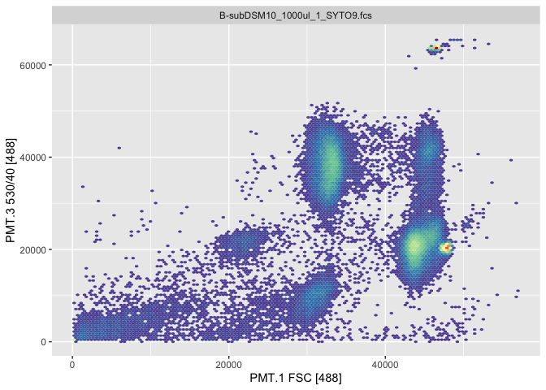
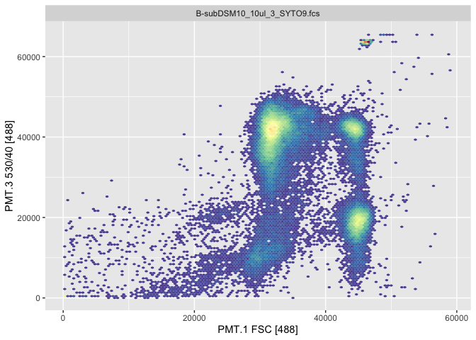
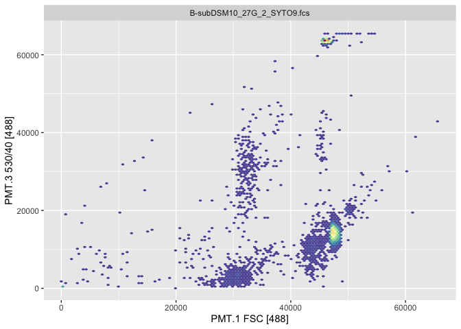

01-data
================
Compiled at 2023-10-25 21:38:56 UTC

The purpose of this document is to introduce three flow cytometry data
that we’ll use for clustering comparison. They are:

- The Z-project data

- The B-sub punch biopsy data

``` r
library("conflicted")
library(purrr)
library(dplyr)
library(flowCore)
library(flowWorkspace)
library(ggcyto)
library(tidyverse)
library(gridExtra)
library(knitr)
library(ggplot2)
library(RColorBrewer)
```

## Z-project

Z-project is focusing on a colony of Bacillus subtilis, lab exams the
sub-population structure at five different locations: inner zone, middle
zone, outer zone, surrounding and whole colony.

``` r
# import data
fcs.direction <- "~/Desktop/Z-Project_Bacillus_pretest/fcs/"
fcs.file.name <- list.files(fcs.direction,pattern = "\\.fcs$",full.names = T)
z_fs <- list()

for (i in fcs.file.name){
  data <- read.FCS(i,alter.names = T,transformation = F)
  new_name <- substr(i,start = 55,stop=nchar(i))
  z_fs[[new_name]] <- data
}
```

``` r
markernames(z_fs[[2]])
```

    ##          PMT.1        X.PMT.1          PMT.2        X.PMT.2          PMT.3 
    ##    "FSC [488]"    "FSC [488]"    "SSC [488]"    "SSC [488]" "530/40 [488]" 
    ##        X.PMT.3          PMT.4        X.PMT.4          PMT.5        X.PMT.5 
    ## "530/40 [488]" "580/30 [488]" "580/30 [488]" "616/23 [488]" "616/23 [488]" 
    ##          PMT.6        X.PMT.6          PMT.7        X.PMT.7          PMT.8 
    ## "780/60 [488]" "780/60 [488]" "670/30 [640]" "670/30 [640]" "730/45 [640]" 
    ##        X.PMT.8          PMT.9        X.PMT.9         PMT.10       X.PMT.10 
    ## "730/45 [640]" "460/50 [355]" "460/50 [355]"  "650LP [355]"  "650LP [355]" 
    ##         PMT.11       X.PMT.11         PMT.12       X.PMT.12         PMT.13 
    ## "460/50 [405]" "460/50 [405]" "520/35 [405]" "520/35 [405]" "605/40 [405]" 
    ##       X.PMT.13         PMT.14       X.PMT.14     PMT.1.Area    PMT.1.Width 
    ## "605/40 [405]"  "650LP [405]"  "650LP [405]"    "FSC [488]"    "FSC [488]" 
    ##     PMT.2.Area    PMT.2.Width 
    ##    "SSC [488]"    "SSC [488]"

DAPI, FDA are common fluorescent dyes which are excited with 488nm and
measured with 460/50nm, 530/40nm respectively.

Based on above table, the relationship between fluorescent dyes and
variables are: DAPI-PMT.9, FDA-PMT.3.

We regard cells with measurement results below 200 on interested
channels, namely FSC, SSC, DAPI/FDA_PI, as debris and remove them from
the data to ensure the accuracy of downstream analysis

``` r
location <- c("Inner_zone","Middle_zone","Outer_zone","Surrounding","Whole_colony")

# remove the debris
new_DAPI_fs <- list()
new_FDA_PI_fs <- list()

for (i in 1:5) {
  data_name <- paste0(location[i],"_DAPI.fcs")
  data <- z_fs[[data_name]]
  sub <- data@exprs %>% as.data.frame() %>% dplyr::filter(PMT.1>200) %>% dplyr::filter(PMT.2>200)  %>% dplyr::filter(PMT.9>200)
  sub <- as.matrix(sub)
  data@exprs <- sub
  new_DAPI_fs[[data_name]]<-data
}

for (i in 1:5) {
  data_name <- paste0(location[i],"_FDA_PI.fcs")
  data <- z_fs[[data_name]]
  sub <- data@exprs %>% as.data.frame() %>% dplyr::filter(PMT.1>200) %>% dplyr::filter(PMT.2>200) %>% dplyr::filter(PMT.3>200)
  sub <- as.matrix(sub)
  data@exprs <- sub
  new_FDA_PI_fs[[data_name]]<-data
}
```

``` r
write_rds(new_DAPI_fs,"~/Desktop/new_DAPI.rds")
write_rds(new_FDA_PI_fs,"~/Desktop/new_FDA_PI.rds")
```

Now, let’s have a look of cytograms from Z-project.

``` r
for (i in 1:5){
  data_name <- paste0(location[i],"_DAPI.fcs")
  data <- new_DAPI_fs[[data_name]]
  p <- ggcyto(data, aes(x = "PMT.1", y = "PMT.9")) + geom_hex(bins = 128)
  print(p)
}
```

<!-- --><!-- --><!-- --><!-- --><!-- -->

``` r
for (i in 1:5){
  data_name <- paste0(location[i],"_FDA_PI.fcs")
  data <- new_FDA_PI_fs[[data_name]]
  p <- ggcyto(data, aes(x = "PMT.1", y = "PMT.3")) + geom_hex(bins = 128)
  print(p)
}
```

<!-- --><!-- --><!-- --><!-- --><!-- -->

This is another visulization method offered by flowEMMI v2 packages.

``` r
# replace the fcsData and ch1/2
p <- plotDensityAndEllipses(fcsData = data, ch1="PMT.1", ch2="PMT.3",
                          logScale = F, title = data_name,
                          axis_size=10, axisLabeling_size=10,
                          xlab = "Forward Scatter", ylab = "Fluorescence", 
                          font = "Arial")
```

## B-sub punch biopsy

``` r
# import data
fcs.direction <- "~/Desktop/B-sub/"
fcs.file.name <- list.files(fcs.direction,pattern = "\\.fcs$",full.names = T)
B_punch_fs <- list()

for (i in fcs.file.name){
  data <- read.FCS(i,alter.names = T,transformation = F)
  new_name <- substr(i,start = 41,stop=nchar(i))
  B_punch_fs[[new_name]] <- data
}
```

The punch biopsy method uses 4 different-sized needles to sample
mono-species biofilms from the inside out. The stain is Syto9, which can
guarantee the cell viability. And this kind of stain is excited at
530/40 nm level, correlated to variable PMT.3.

``` r
new_B_punch_fs <- list()

for (i in 1:22) {
  data_name <- names(B_punch_fs)[i]
  data <- B_punch_fs[[data_name]]
  sub <- data@exprs %>% as.data.frame() %>% dplyr::filter(PMT.1>200) %>% dplyr::filter(PMT.2>200)  %>% dplyr::filter(PMT.3>200)
  sub <- as.matrix(sub)
  data@exprs <- sub
  new_B_punch_fs[[data_name]]<-data
}
```

``` r
for (i in 1:22){
  data_name <- names(new_B_punch_fs)[i]
  data <- new_B_punch_fs[[data_name]]
  p <- ggcyto(data, aes(x = "PMT.1", y = "PMT.3")) + geom_hex(bins = 128)
  print(p)
}
```

<!-- --><!-- --><!-- --><!-- --><!-- --><!-- --><!-- --><!-- --><!-- --><!-- --><!-- --><!-- --><!-- --><!-- --><!-- --><!-- --><!-- --><!-- --><!-- --><!-- --><!-- --><!-- -->

## Files written

These files have been written to the target directory, data/01-data:

``` r
projthis::proj_dir_info(path_target())
```

    ## # A tibble: 0 × 4
    ## # ℹ 4 variables: path <fs::path>, type <fct>, size <fs::bytes>,
    ## #   modification_time <dttm>
