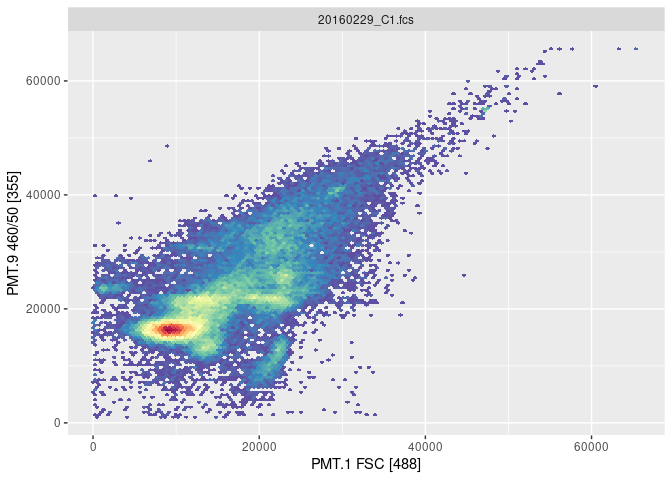
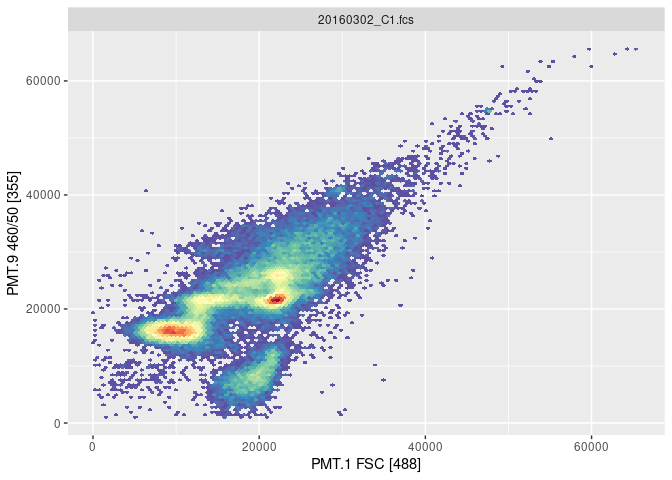
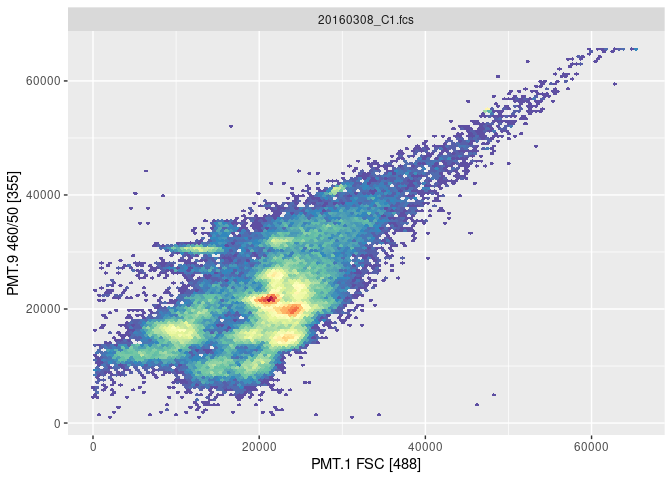

01-data
================
Compiled at 2023-08-14 12:06:34 UTC

The purpose of this document is to introduce three flow cytometry data
that we’ll use for clustering comparison. They are:

-   The Z-project data

-   The microbial community data

-   The seaflow data

``` r
library("conflicted")
library(readxl)
library(purrr)
library(dplyr)
library(flowCore)
library(flowmix)
```

    ## Warning: replacing previous import 'RcppArmadillo::fastLmPure' by
    ## 'RcppEigen::fastLmPure' when loading 'flowmix'

    ## Warning: replacing previous import 'RcppArmadillo::fastLm' by
    ## 'RcppEigen::fastLm' when loading 'flowmix'

``` r
library(flowWorkspace)
library(ggcyto)
library(tidyverse)
library(gridExtra)
library(knitr)
library(ggplot2)
library(RColorBrewer)
```

## Z-project

Z-project is focusing on a colony of Bacillus subtilis, lab exams the
sub-population structure at five different locations: inner zone, middle
zone, outer zone, surrounding and whole colony.

``` r
# import data
fcs.direction <- "~/Desktop/Z-Project Bacillus_pretest/fcs/"
fcs.file.name <- list.files(fcs.direction,pattern = "\\.fcs$",full.names = T)
z_fs <- list()

for (i in fcs.file.name){
  data <- read.FCS(i,alter.names = T,transformation = F)
  new_name <- substr(i,start = 55,stop=nchar(i))
  z_fs[[new_name]] <- data
}
```

``` r
markernames(z_fs[[2]])
```

    ##          PMT.1        X.PMT.1          PMT.2        X.PMT.2          PMT.3 
    ##    "FSC [488]"    "FSC [488]"    "SSC [488]"    "SSC [488]" "530/40 [488]" 
    ##        X.PMT.3          PMT.4        X.PMT.4          PMT.5        X.PMT.5 
    ## "530/40 [488]" "580/30 [488]" "580/30 [488]" "616/23 [488]" "616/23 [488]" 
    ##          PMT.6        X.PMT.6          PMT.7        X.PMT.7          PMT.8 
    ## "780/60 [488]" "780/60 [488]" "670/30 [640]" "670/30 [640]" "730/45 [640]" 
    ##        X.PMT.8          PMT.9        X.PMT.9         PMT.10       X.PMT.10 
    ## "730/45 [640]" "460/50 [355]" "460/50 [355]"  "650LP [355]"  "650LP [355]" 
    ##         PMT.11       X.PMT.11         PMT.12       X.PMT.12         PMT.13 
    ## "460/50 [405]" "460/50 [405]" "520/35 [405]" "520/35 [405]" "605/40 [405]" 
    ##       X.PMT.13         PMT.14       X.PMT.14     PMT.1.Area    PMT.1.Width 
    ## "605/40 [405]"  "650LP [405]"  "650LP [405]"    "FSC [488]"    "FSC [488]" 
    ##     PMT.2.Area    PMT.2.Width 
    ##    "SSC [488]"    "SSC [488]"

DAPI, FDA, PI are common fluorescent dyes which are excited with 488nm
and measured with 460/50nm, 530/40nm, 616/23nm respectively.

Based on above table, the relationship between fluorescent dyes and
variables are: DAPI-PMT.9, FDA-PMT.3, PI-PMT.5.

``` r
location <- c("Inner_zone","Middle_zone","Outer_zone","Surrounding","Whole_colony")

# remove the debris
new_DAPI_fs <- list()
new_FDA_PI_fs <- list()

for (i in 1:5) {
  data_name <- paste0(location[i],"_DAPI.fcs")
  data <- z_fs[[data_name]]
  sub <- data@exprs %>% as.data.frame() %>% dplyr::filter(PMT.1>200) %>% dplyr::filter(PMT.9>200)
  sub <- as.matrix(sub)
  data@exprs <- sub
  new_DAPI_fs[[data_name]]<-data
}

for (i in 1:5) {
  data_name <- paste0(location[i],"_FDA_PI.fcs")
  data <- z_fs[[data_name]]
  sub <- data@exprs %>% as.data.frame() %>% dplyr::filter(PMT.1>200) %>% dplyr::filter(PMT.3>200) %>% dplyr::filter(PMT.5>200)
  sub <- as.matrix(sub)
  data@exprs <- sub
  new_FDA_PI_fs[[data_name]]<-data
}
```

``` r
write.FCS(new_DAPI_fs,"~/Desktop/MScThesis/workflow/data/01-data/new_DAPI.fcs")
write.FCS(new_FDA_PI_fs,"~/Desktop/MScThesis/workflow/data/01-data/new_FDA_PI.fcs")
```

Now, let’s have a look of cytograms from Z-project.

``` r
for (i in 1:5){
  data_name <- paste0(location[i],"_DAPI.fcs")
  data <- new_DAPI_fs[[data_name]]
  p <- ggcyto(data, aes(x = "PMT.1", y = "PMT.9")) + geom_hex(bins = 128)
  print(p)
}
```

<!-- --><!-- --><!-- --><!-- --><!-- -->

``` r
for (i in 1:5){
  data_name <- paste0(location[i],"_FDA_PI.fcs")
  data <- new_FDA_PI_fs[[data_name]]
  p <- ggcyto(data, aes(x = "PMT.1", y = "PMT.3")) + geom_hex(bins = 128)
  print(p)
}
```

<!-- --><!-- --><!-- --><!-- --><!-- -->

This is another visulization method offered by flowEMMI v2 packages.

``` r
# replace the fcsData and ch1/2
p <- plotDensityAndEllipses(fcsData = data, ch1="PMT.1", ch2="PMT.x",
                          logScale = F, title = data_name,
                          axis_size=10, axisLabeling_size=10,
                          xlab = "Forward Scatter", ylab = "Fluorescence", 
                          font = "Arial")
```

## Microbial community

For this section, we have two datasets. The data from Liu et. al doesn’t
have mass transfer but it contains a abiotic parameter measurement.
Another is from Li et. al, by contrast, it has looped mass transfter but
no environment covariable records.

### Liu et. al

This flow cytometry data consists of 5 reactors data.

C1 and C2 are two control reactors in order to test for neutral
behaviour under undisturbed communities.

D1, D2 and D3 were disturbed by a repeated and soft temperature stressor
from 30 to 40 degrees.

Liu et. al sampled from all five reactors and analyzed them by flow
cytometry. All raw data can be accessed by flowRepository
(<https://flowrepository.org/>) under accession number: FR-FCM-ZYWX

``` r
reactor <- c("C1","C2","D1","D2","D3")
micro_data_list <- list()

# get file path for each reactor
for (i in reactor){
  path <- "~/Desktop/FlowRepository_Liu/"
  path <- paste0(path,i,"/")
  file_name <- list.files(path,pattern = ".fcs$",full.names = T)
  for (j in file_name){
    data <- read.FCS(j,alter.names=T,transformation=F)
    new_name <- substr(j,start=46,stop=60) # use nchar
    micro_data_list[[new_name]] <- data
  }
}

# optical data
abio_data <- read_excel("~/Desktop/osfstorage/Data sheet for abiotic parameters.xlsx")
```

``` r
markernames(micro_data_list[[1]])
```

In this case, we’re interested in the forwards scatter, indicated the
cell size, named as PMT.1, and fluorescence DAPI, named as PMT.9.

So we could remove the debris now.

``` r
# remove the debris
new_micro_data <- list()

n_data <- length(micro_data_list)

for (i in 1:n_data) {
  data_name <- names(micro_data_list)[i]
  data <- micro_data_list[[i]]
  sub <- data@exprs %>% as.data.frame() %>% dplyr::filter(PMT.1>200) %>% dplyr::filter(PMT.9>1000)
  sub <- as.matrix(sub)
  data@exprs <- sub
  new_micro_data[[data_name]]<-data
}
```

After removing the debris, we’d like to separate the whole dataset into
five subset, represented by the reactor names.

``` r
# separate by reactor
C1_data <- list()
C2_data <- list()
D1_data <- list()
D2_data <- list()
D3_data <- list()

for (i in names(micro_data_list)){
  data <- new_micro_data[[i]]
  idx <- substr(i,start = 10,stop=11)
  if(idx=="C1"){C1_data[[i]]<-data}
  else if(idx=="C2"){C2_data[[i]]<-data}
  else if(idx=="D1"){D1_data[[i]]<-data}
  else if(idx=="D2"){D2_data[[i]]<-data}
  else if(idx=="D3"){D3_data[[i]]<-data}
}
```

    ##           fcs file records variables
    ## 1  20160222_C1.fcs  257822        43
    ## 2  20160223_C1.fcs  255317        43
    ## 3  20160224_C1.fcs  276148        43
    ## 4  20160225_C1.fcs  332488        43
    ## 5  20160227_C1.fcs  331355        43
    ## 6  20160229_C1.fcs  740343        43
    ## 7  20160301_C1.fcs  553889        43
    ## 8  20160302_C1.fcs  221297        43
    ## 9  20160303_C1.fcs  219225        43
    ## 10 20160304_C1.fcs  217804        43
    ## 11 20160305_C1.fcs  221442        43
    ## 12 20160307_C1.fcs  225880        43
    ## 13 20160308_C1.fcs  223117        43
    ## 14 20160310_C1.fcs  219840        43
    ## 15 20160311_C1.fcs  221512        43
    ## 16 20160312_C1.fcs  220874        43
    ## 17 20160314_C1.fcs  217056        43
    ## 18 20160315_C1.fcs  214161        43
    ## 19 20160316_C1.fcs  213914        43
    ## 20 20160317_C1.fcs  214806        43
    ## 21 20160318_C1.fcs  213331        43
    ## 22 20160321_C1.fcs  211836        43
    ## 23 20160322_C1.fcs  218886        43
    ## 24 20160323_C1.fcs  227113        43
    ## 25 20160324_C1.fcs  219524        43
    ## 26 20160328_C1.fcs  225608        43
    ## 27 20160329_C1.fcs  232564        43
    ## 28 20160330_C1.fcs  275331        43
    ## 29 20160331_C1.fcs  272242        43
    ## 30 20160401_C1.fcs  250670        43
    ## 31 20160405_C1.fcs  260293        43
    ## 32 20160406_C1.fcs  260222        43
    ## 33 20160407_C1.fcs  266404        43
    ## 34 20160408_C1.fcs  257280        43
    ## 35 20160411_C1.fcs  278594        43
    ## 36 20160412_C1.fcs  244070        43
    ## 37 20160413_C1.fcs  251116        43
    ## 38 20160414_C1.fcs  237561        43
    ## 39 20160415_C1.fcs  243328        43
    ## 40 20160418_C1.fcs  222347        43
    ## 41 20160419_C1.fcs  221249        43
    ## 42 20160420_C1.fcs  219095        43
    ## 43 20160421_C1.fcs  222598        43
    ## 44 20160422_C1.fcs  223631        43
    ## 45 20160427_C1.fcs  218516        43
    ## 46 20160428_C1.fcs  220622        43
    ## 47 20160429_C1.fcs  220825        43
    ## 48 20160501_C1.fcs  224616        43
    ## 49 20160502_C1.fcs  230548        43
    ## 50 20160503_C1.fcs  228054        43
    ## 51 20160504_C1.fcs  232725        43
    ## 52 20160505_C1.fcs  224659        43
    ## 53 20160506_C1.fcs  233499        43
    ## 54 20160509_C1.fcs  235550        43
    ## 55 20160510_C1.fcs  238342        43
    ## 56 20160511_C1.fcs  231531        43
    ## 57 20160512_C1.fcs  231029        43
    ## 58 20160513_C1.fcs  232509        43
    ## 59 20160516_C1.fcs  226672        43
    ## 60 20160517_C1.fcs  226296        43
    ## 61 20160518_C1.fcs  228545        43
    ## 62 20160519_C1.fcs  223391        43
    ## 63 20160520_C1.fcs  222418        43
    ## 64 20160522_C1.fcs  228252        43
    ## 65 20160523_C1.fcs  228591        43

``` r
for (i in 1:15){
  data <- C1_data[[i]]
  p <- ggcyto(data, aes(x = "PMT.1", y = "PMT.9")) + geom_hex(bins = 128)
  print(p)
}
```

<!-- --><!-- --><!-- --><!-- --><!-- --><!-- --><!-- --><!-- --><!-- --><!-- --><!-- --><!-- --><!-- --><!-- --><!-- -->

The table reveals that this dataset is too costly for the downstream
analysis, so we’d like to bin the data first to reduce the complexity of
raw data.

Before doing the binning, we need to transfer the flowFrame to list
first.

``` r
set.seed(0)
micro_data_ylist <- list()
grid_micro_ylist <- list()
grid_micro_countslist <- list()

for (i in seq_along(new_micro_data)){
  micro_data_ylist[[i]] <- new_micro_data[[i]]@exprs[,c(11,13,27)] # PMT.1/2 for FSC/SSC, PMT.9 for fluorescence
  micro_data_ylist[[i]][,] <- as.double(micro_data_ylist[[i]][,])
  grid <- make_grid(micro_data_ylist[[i]],gridsize = 30)
  obj <- bin_many_cytograms(micro_data_ylist,grid,mc.cores = 4,verbose = F)
  grid_micro_ylist[[i]] <- obj$ybin_list
  grid_micro_countslist[[i]] <- obj$counts_list
}
```

``` r
write.FCS(new_micro_data,"~/Desktop/MScThesis/workflow/data/01-data/new_micro_data.fcs")
```

### Li et. al

Five local microbiomes were grown for over 114 generations and connected
by a loop. The flow cytometry raw data has been deposited in
FlowRepository (<https://flowrepository.org/>) with accession number:
FR-FCM-Z3MU

``` r
folder_path <- "~/Desktop/FlowRepo/"
file_name <- list.files(folder_path,pattern = "\\.fcs$",full.names = T)
MoFloA_Feb_data <- list()
MoFloA_Mar_data <- list()
MoFloA_Nov_data <- list()
MoFloA_Dec_data <- list()

# group files by the month
for (file_name in file_name){
  month <- substr(file_name,start = 46,stop = 48) # use nchar to locate
  new_name <- substr(file_name,start = 43, stop = 58)
  data <- read.FCS(file_name,alter.names = T,transformation=F)
  if (month=="Feb") { MoFloA_Feb_data[[new_name]] <- data}
  else if (month=="Mar") {MoFloA_Mar_data[[new_name]] <- data}
  else if (month=="Nov") {MoFloA_Nov_data[[new_name]] <- data}
  else if (month=="Dec") {MoFloA_Dec_data[[new_name]] <- data}
}
```

From the instrumental setup, we could tell that the DAPI fluorescenece
was measured at signal channel FL4.

``` r
markernames(MoFloA_Feb_data[[21]])
```

This is an example that the variable was wrongly recorded. Therefore,
before further analysis, we’d like to correct these mistakes.

``` r
# remove the debris
new_MoFloA_Feb <- list()

for (i in c(1:20,22:30)) {
  data_name <- names(MoFloA_Feb_data)[i]
  data <- MoFloA_Feb_data[[i]]
  sub <- data@exprs %>% as.data.frame() %>% dplyr::filter(FL.4.Log>200)
  sub <- as.matrix(sub)
  data@exprs <- sub
  new_MoFloA_Feb[[data_name]]<-data
}
```

``` r
for (i in 1:29){
  data <- new_MoFloA_Feb[[i]]
  p <- ggcyto(data, aes(x = "FS.Log", y = "FL.4.Log")) + geom_hex(bins = 128)
  print(p)
}
```

## Seaflow

``` r
seaflow <- readRDS(file="~/Desktop/paper-data/MGL1704-hourly-paper.RDS")
```

## Files written

These files have been written to the target directory, data/01-data:

``` r
projthis::proj_dir_info(path_target())
```

    ## # A tibble: 0 × 4
    ## # ℹ 4 variables: path <fs::path>, type <fct>, size <fs::bytes>,
    ## #   modification_time <dttm>
