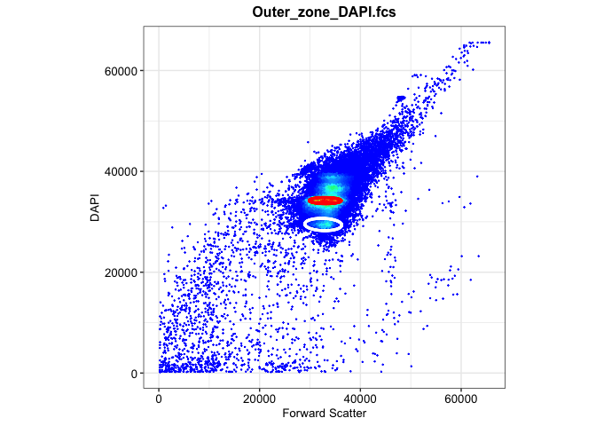
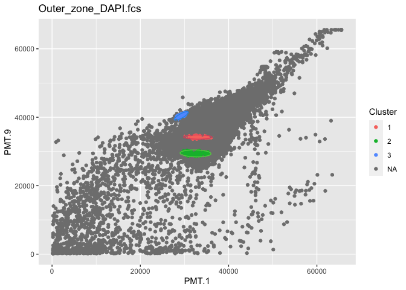
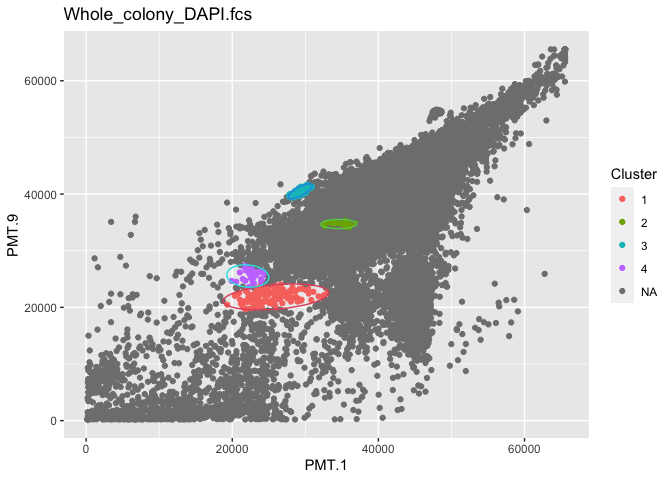

02a-flowEMMi for-Z-project
================
Compiled at 2023-10-01 14:00:31 UTC

``` r
here::i_am(paste0(params$name, ".Rmd"), uuid = "11675b32-9913-442e-9b4a-03cdc39afb65")
```

The purpose of this document is …

``` r
library("conflicted")
library(purrr)
library(dplyr)
library(mvtnorm)
library(flowEMMi)
```

    ## For detailed instructions please run browseVignettes('flowEMMi').
    ##   For an overview of available functions please run library(help='flowEMMi')

``` r
library(flowCore)
library(ggcyto)
```

    ## Loading required package: ggplot2

    ## Loading required package: ncdfFlow

    ## Loading required package: BH

    ## Loading required package: flowWorkspace

    ## As part of improvements to flowWorkspace, some behavior of
    ## GatingSet objects has changed. For details, please read the section
    ## titled "The cytoframe and cytoset classes" in the package vignette:
    ## 
    ##   vignette("flowWorkspace-Introduction", "flowWorkspace")

``` r
library(tidyverse)
```

    ## ── Attaching core tidyverse packages ──────────────────────── tidyverse 2.0.0 ──
    ## ✔ forcats   1.0.0     ✔ stringr   1.5.0
    ## ✔ lubridate 1.9.2     ✔ tibble    3.2.1
    ## ✔ readr     2.1.4     ✔ tidyr     1.3.0

``` r
library(RColorBrewer)
library(knitr)
library(ellipse)
library(ggforce)
```

``` r
# create or *empty* the target directory, used to write this file's data: 
projthis::proj_create_dir_target(params$name, clean = TRUE)

# function to get path to target directory: path_target("sample.csv")
path_target <- projthis::proj_path_target(params$name)

# function to get path to previous data: path_source("00-import", "sample.csv")
path_source <- projthis::proj_path_source(params$name)
```

## Z-project

### Import preprocessed data

``` r
DAPI <- readRDS("~/Desktop/MSc_new_data/new_DAPI.rds")
gating_DAPI <- readRDS("~/Desktop/MSc_new_data/gating_DAPI.rds")
```

### flowEMMI gating on DAPI

Based on the scatter plot in 01-data, we could tell that except for the
sample taken in the surrounding region, the cells of other region
samples are mostly concentrated in the range of 20000 to 60000.

Therefore, we will run the automated gating on surrounding region and
other regions respectively.

- Setting range for other regions: 20000-50000

- Setting range for Surrounding region: 1000-50000

``` r
set.seed(1)
location <- c("Inner_zone","Middle_zone","Outer_zone","Whole_colony","Surrounding")
gating_DAPI <- list()

for (i in 1:4){
  data_name <- paste0(location[i],"_DAPI.fcs")
  data <- DAPI[[i]]
  fdo <- mkFlowDataObject(data, xChannel="PMT.1", yChannel="PMT.9")
  gating <- flowEMMi( fdo=fdo, xMin=20000, xMax=50000, yMin=20000, yMax=50000
                      , initFraction=0.01
                      , finalFraction=1.0
                      , minClusters=5, maxClusters=15, clusterbracket=2
                      , numberOfInits=5
                      , verbose=TRUE
                      , parallel=FALSE
                      , convergenceEpsilon=0.01
                      , whenToRemoveOverlaps = 20
                      , mergeWhenCenter = FALSE
                      , mergeWhenTwoCenters = FALSE
                      , thresholdForDeletion = 0.2
                      , threshold = 0.9
                      , considerWeights=TRUE
                      , plot = FALSE
                      , alpha=0.9
                      , minMinor=500)
  gating_DAPI[[i]] <- gating$best
}

# DAPI surrounding
DAPI_sur <- DAPI[["Surrounding_DAPI.fcs"]] 
fdo_sur <- mkFlowDataObject(DAPI_sur, xChannel="PMT.1", yChannel="PMT.9")
gating_sur <- flowEMMi( fdo=fdo_sur, xMin=1000, xMax=50000, yMin=1000, yMax=50000
                      , initFraction=0.01
                      , finalFraction=1.0
                      , minClusters=5, maxClusters=15, clusterbracket=2
                      , numberOfInits=5
                      , verbose=TRUE
                      , parallel=FALSE
                      , convergenceEpsilon=0.01
                      , whenToRemoveOverlaps = 20
                      , mergeWhenCenter = FALSE
                      , mergeWhenTwoCenters = FALSE
                      , thresholdForDeletion = 0.2
                      , threshold = 0.9
                      , considerWeights=TRUE
                      , plot = FALSE
                      , alpha=0.9
                      , minMinor=500)
gating_DAPI[[5]] <- gating_sur$best
```

### Gating plots on DAPI

``` r
location <- c("Inner_zone","Middle_zone","Outer_zone","Whole_colony","Surrounding")
gating_DAPI_plot <- list()

for (i in 1:5){
  data_name <- paste0(location[i],"_DAPI.fcs")
  data <- DAPI[[i]]
  plots <- plotDensityAndEllipses(fcsData = data, ch1="PMT.1", ch2="PMT.9", alpha=0.9,
                            logScale = F, results = gating_DAPI[[i]],
                            title = data_name, plotRelevance = T,
                            ellipseDotSize = 0.5, axis_size=10, axisLabeling_size=10,
                            xlab = "Forward Scatter", ylab = "DAPI", font = "Arial")
  gating_DAPI_plot[[i]] <- plots$plot
}
```

    ## Warning in KernSmooth::bkde2D(x, bandwidth = bandwidth, gridsize = nbin, :
    ## Binning grid too coarse for current (small) bandwidth: consider increasing
    ## 'gridsize'

<!-- -->

    ## Warning in KernSmooth::bkde2D(x, bandwidth = bandwidth, gridsize = nbin, :
    ## Binning grid too coarse for current (small) bandwidth: consider increasing
    ## 'gridsize'

<!-- --><!-- --><!-- --><!-- -->

In the above graphs, the ellipses are colored according to their cluster
probability, high probability in red, medium probability in white, low
probability in blue.

### Mahalanobis distance

``` r
maha_result <- list()

for (x in 1:5){
  data <- DAPI[[x]]@exprs[,c(11,27)]
  
  mu <- gating_DAPI[[x]]@mu
  sigma <- gating_DAPI[[x]]@sigma
  
  n_cells <- nrow(data)
  n_cluster <- length(sigma)
  maha_data <- matrix(NA,nrow=n_cells,ncol=n_cluster)
  
  for (i in 1:n_cells){
    for (j in 1:n_cluster){
      maha_data[i,j] <- mahalanobis(data[i,],mu[,j],sigma[[j]])
    }
  }
  maha_result[[x]] <- maha_data
}


# rename distance matrix
for (i in 1:5){
  maha1 <- maha_result[[1]]
  coln <- ncol(maha1)
  maha <- maha1[,2:coln] %>% as.data.frame()
  
  threshold <- (-2*log(0.05))^2
  
  # set threshold as distance cutoff
  for (j in 1:nrow(maha)){
    rv <- maha[j,1:ncol(maha)-1]
    if(all(rv>threshold)) { maha$Min[j] <- NA}
    else {maha$Min[j] <- which.min(rv)}
  }

  maha_result[[i]] <- cbind(DAPI[[i]]@exprs[,c(11,27)],maha)
  
  mu <- gating_DAPI[[i]]@mu
  
  test <- table(maha[,ncol(maha)]) %>% as.data.frame()
  coordinates <- sprintf("(%.2f,%.2f)",mu[1,2:ncol(mu)],mu[2,2:ncol(mu)])
  test <- cbind(test,coordinates)
  
  
  table <-test %>% 
    kable(caption = paste0(location[i],"_DAPI"),
          col.names = c("Cluster","Cells","Ellipse Center"))
  
  print(table)
}
```

``` r
# plot
DAPI_maha_plot <- list()

for (i in 1:5){
  data1 <- DAPI[[i]]@exprs[,c(11,27)] 
  data2 <- maha_result[[i]]
  data <- cbind(data1,data2$Min) %>% as.data.frame()
  colnames(data)[3] <- "Cluster"
  data$Cluster <- as.factor(data$Cluster)
  
  #ellipses generated by 
  plot1 <- ggplot(data,aes(x=PMT.1,y=PMT.9))+
    geom_point(aes(color=Cluster))+
    ggtitle(paste0(location[i],"_DAPI"))
  
  #ellipses from flowEMMI result
  ellipses <- gating_DAPI[[i]]
  num_ellipse <- length(ellipses@sigma)
  
  for (j in 2:num_ellipse){
    mu <- ellipses@mu[,j]
    sigma <- ellipses@sigma[[j]]
    eli <- ellipse::ellipse(centre=mu,x=sigma,level=0.95,npoints=200) 
    eli <- as.data.frame(eli)
    colnames(eli)<- c("PMT.1","PMT.9")
    plot1 <- plot1+geom_path(data = eli,aes(x=PMT.1,y=PMT.9),color=j)
  }
  print(plot1)
}
```

## Mahalanobis distance function with flowEMMi

Following is the integrated function.

Given a preprocessed dataset and the gating result from above, it can
generate the:

- Mahalanobis distance matrix & Cluster result

- Parameter table: Number of cells in each cluster, Area of the
  clustering ellipse, and the Coordinates of center

- Gating plots

``` r
flowEMMi_mahalanobis <- function(data,data_name,gating_data,alpha){
  
  mu <- gating_data@mu
  sigma <- gating_data@sigma
  
  names <- colnames(data)
  
  n_cells <- nrow(data)
  n_clusters <- length(sigma)
  
  #generate mahalanobis matrix
  maha_data <- matrix(NA,nrow=n_cells,ncol=n_clusters)
  
  for (i in 1:n_cells){
    for(j in 1:n_clusters){
      maha_data[i,j] <- mahalanobis(data[i,],mu[,j],sigma[[j]])
    }
  }
  
  maha <- maha_data[,2:n_clusters] %>% as.data.frame()
  
  #set 95% quantile as cutoff value
  threshold <- -2*log(1-alpha)
  
  #determine cluster
  for (cell in 1:n_cells){
    rv <- maha[cell,1:n_clusters-1]
    if(all(rv>threshold)) { maha$Cluster[cell] <- NA}
    else { maha$Cluster[cell] <- which.min(rv)}
  }
  
  maha_data2 <- cbind(data,maha)
  
  test <- table(maha[,ncol(maha)]) %>% as.data.frame()
  coordinates <- sprintf("(%.2f,%.2f)",mu[1,2:ncol(mu)],mu[2,2:ncol(mu)])
  
  #Area of Ellipse
  eigen <- matrix(NA,nrow=length(sigma),ncol=2)
  for (i in 1:length(sigma)){
    eigen[i,] <- eigen(sigma[[i]])$values
  }
  eigen <- eigen[-1,]
  
  area <- matrix(NA,nrow=nrow(eigen),ncol=1)
  for (i in 1:nrow(eigen)){
    area[i,1] <- pi*sqrt(eigen[i,1]*eigen[i,2])*(-2*log(1-alpha))
  }
  
  area <- area %>% as.data.frame()
  test <- cbind(test,area,coordinates)
  table <- test %>% 
    kable(caption = data_name,
          col.names = c("Cluster","Cells","Area","Coordinate"))
   
  #plot
  maha_data2$Cluster <- as.factor(maha_data2$Cluster)
  
  plot1 <- ggplot(maha_data2,aes(x=!!sym(names[1]),y=!!sym(names[2]),color=Cluster))+
    geom_point()+
    ggtitle(data_name)
  
  num_ellipse <- length(gating_data@sigma)
  
  for (j in 2:num_ellipse){
    mu <- gating_data@mu[,j]
    sigma <- gating_data@sigma[[j]]
    eli <- ellipse::ellipse(centre=mu,x=sigma,level=alpha,npoints=200) 
    eli <- as.data.frame(eli)
    colnames(eli)<- names
    plot1 <- plot1+geom_path(data = eli,
                  aes(x=!!sym(names[1]),y=!!sym(names[2])),color=j)
  }
  
  maha_result <- list(maha_matrix=maha_data2,table_info=table,plot=plot1)
  return(maha_result)
}
```

``` r
flowemmi_DAPI <- list()

for (i in 1:5){
  data <- DAPI[[i]]@exprs[,c(11,27)]
  data_name <- names(DAPI)[i]
  gating_data <- gating_DAPI[[i]]
  flowemmi_DAPI[[data_name]] <-flowEMMi_mahalanobis(data,data_name,gating_data,0.95)
  print(flowemmi_DAPI[[i]]$table_info)
  print(flowemmi_DAPI[[i]]$plot)
}
```

    ## 
    ## 
    ## Table: Inner_zone_DAPI.fcs
    ## 
    ## |Cluster | Cells|     Area|Coordinate          |
    ## |:-------|-----:|--------:|:-------------------|
    ## |1       |  8545| 15175410|(30167.85,29230.80) |
    ## |2       |  1689| 48253516|(43911.46,23224.19) |

<!-- -->

    ## 
    ## 
    ## Table: Middle_zone_DAPI.fcs
    ## 
    ## |Cluster | Cells|     Area|Coordinate          |
    ## |:-------|-----:|--------:|:-------------------|
    ## |1       |  1155| 19151548|(36365.59,21846.61) |
    ## |2       | 15307|  7817008|(34085.22,34371.43) |
    ## |3       |  3082| 59173988|(45263.90,23994.94) |
    ## |4       |  4703| 20046310|(32839.19,30095.37) |

<!-- -->

    ## 
    ## 
    ## Table: Outer_zone_DAPI.fcs
    ## 
    ## |Cluster | Cells|     Area|Coordinate          |
    ## |:-------|-----:|--------:|:-------------------|
    ## |1       | 17819|  8081898|(33020.97,34213.14) |
    ## |2       |  4074| 14477303|(32506.72,29437.35) |
    ## |3       |   232|  4619751|(29304.09,40409.62) |

<!-- -->

    ## 
    ## 
    ## Table: Surrounding_DAPI.fcs
    ## 
    ## |Cluster | Cells|     Area|Coordinate          |
    ## |:-------|-----:|--------:|:-------------------|
    ## |1       |  4792| 63750583|(25975.69,21847.05) |
    ## |2       |  9255|  8083269|(34589.90,34715.69) |
    ## |3       |  1325|  5802544|(29311.44,40500.45) |
    ## |4       |  1426| 23038338|(22125.31,25532.17) |

<!-- -->

    ## 
    ## 
    ## Table: Whole_colony_DAPI.fcs
    ## 
    ## |Cluster | Cells|     Area|Coordinate          |
    ## |:-------|-----:|--------:|:-------------------|
    ## |1       |    21|  3957775|(3077.87,1911.78)   |
    ## |2       |    52| 34810353|(20203.14,25677.31) |
    ## |3       |  6624|  8060961|(34582.00,34716.91) |
    ## |4       |   275|  6071338|(29308.43,40497.37) |
    ## |5       |   244| 99713630|(24986.19,21556.94) |
    ## |6       |   126| 14874496|(9702.70,1635.15)   |

<!-- -->

## Files written

These files have been written to the target directory,
data/02a-flowEMMi-for-Z-project:

``` r
projthis::proj_dir_info(path_target())
```

    ## # A tibble: 0 × 4
    ## # ℹ 4 variables: path <fs::path>, type <fct>, size <fs::bytes>,
    ## #   modification_time <dttm>
