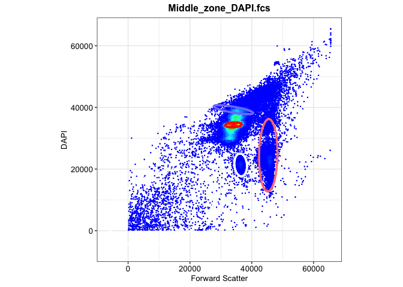
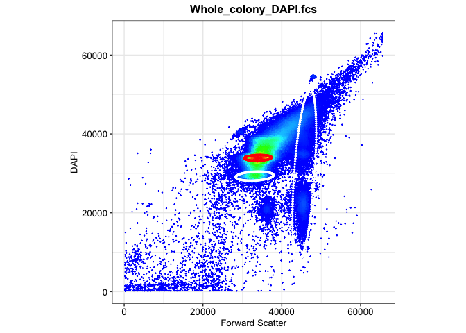
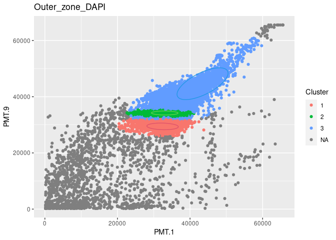
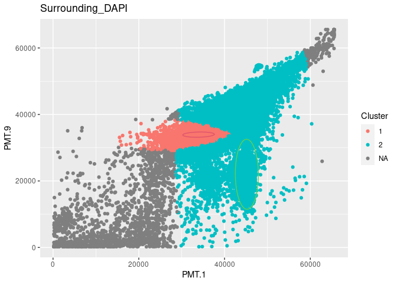

02a-flowEMMi for Z-project
================
Compiled at 2023-09-20 20:02:15 UTC

``` r
here::i_am(paste0(params$name, ".Rmd"), uuid = "11675b32-9913-442e-9b4a-03cdc39afb65")
```

The purpose of this document is …

``` r
library("conflicted")
library(purrr)
library(dplyr)
library(mvtnorm)
library(flowEMMi)
```

    ## For detailed instructions please run browseVignettes('flowEMMi').
    ##   For an overview of available functions please run library(help='flowEMMi')

``` r
library(flowCore)
library(flowWorkspace)
```

    ## As part of improvements to flowWorkspace, some behavior of
    ## GatingSet objects has changed. For details, please read the section
    ## titled "The cytoframe and cytoset classes" in the package vignette:
    ## 
    ##   vignette("flowWorkspace-Introduction", "flowWorkspace")

``` r
library(ggcyto)
```

    ## Loading required package: ggplot2

    ## Loading required package: ncdfFlow

    ## Loading required package: BH

``` r
library(tidyverse)
```

    ## ── Attaching core tidyverse packages ──────────────────────── tidyverse 2.0.0 ──
    ## ✔ forcats   1.0.0     ✔ stringr   1.5.0
    ## ✔ lubridate 1.9.2     ✔ tibble    3.2.1
    ## ✔ readr     2.1.4     ✔ tidyr     1.3.0

``` r
library(RColorBrewer)
library(knitr)
library(ellipse)
library(ggforce)
```

``` r
# create or *empty* the target directory, used to write this file's data: 
projthis::proj_create_dir_target(params$name, clean = TRUE)

# function to get path to target directory: path_target("sample.csv")
path_target <- projthis::proj_path_target(params$name)

# function to get path to previous data: path_source("00-import", "sample.csv")
path_source <- projthis::proj_path_source(params$name)
```

## Z-project

### Import preprocessed data

``` r
DAPI <- readRDS("~/MSc_new_data/new_DAPI.rds")

FDA_PI <- readRDS("~/MSc_new_data/new_FDA_PI.rds")

gating_DAPI<- readRDS("~/MSc_new_data/z_gating_list.rds")
```

### flowEMMI gating on DAPI

Based on the scatter plot in 01-data, we could tell that except for the
sample taken in the surrounding region, the cells of other region
samples are mostly concentrated in the range of 20000 to 60000.

Therefore, we will run the automated gating on surrounding region and
other regions respectively.

- Setting range for other regions: 20000-50000

- Setting range for Surrounding region: 1000-50000

``` r
set.seed(1)
location <- c("Inner_zone","Middle_zone","Outer_zone","Whole_colony","Surrounding")
gating_DAPI <- list()

for (i in 1:4){
  data_name <- paste0(location[i],"_DAPI.fcs")
  data <- DAPI[[i]]
  fdo <- mkFlowDataObject(data, xChannel="PMT.1", yChannel="PMT.9")
  gating <- flowEMMi( fdo=fdo, xMin=20000, xMax=50000, yMin=20000, yMax=50000
                      , initFraction=0.01
                      , finalFraction=1.0
                      , minClusters=5, maxClusters=15, clusterbracket=2
                      , numberOfInits=5
                      , verbose=TRUE
                      , parallel=FALSE
                      , convergenceEpsilon=0.01
                      , whenToRemoveOverlaps = 20
                      , mergeWhenCenter = FALSE
                      , mergeWhenTwoCenters = FALSE
                      , thresholdForDeletion = 0.2
                      , threshold = 0.9
                      , considerWeights=TRUE
                      , plot = FALSE
                      , alpha=0.9
                      , minMinor=500)
  gating_DAPI[[i]] <- gating$best
}

# DAPI surrounding
DAPI_sur <- DAPI[["Surrounding_DAPI.fcs"]] 
fdo_sur <- mkFlowDataObject(DAPI_sur, xChannel="PMT.1", yChannel="PMT.9")
gating_sur <- flowEMMi( fdo=fdo_sur, xMin=1000, xMax=50000, yMin=1000, yMax=50000
                      , initFraction=0.01
                      , finalFraction=1.0
                      , minClusters=5, maxClusters=15, clusterbracket=2
                      , numberOfInits=5
                      , verbose=TRUE
                      , parallel=FALSE
                      , convergenceEpsilon=0.01
                      , whenToRemoveOverlaps = 20
                      , mergeWhenCenter = FALSE
                      , mergeWhenTwoCenters = FALSE
                      , thresholdForDeletion = 0.2
                      , threshold = 0.9
                      , considerWeights=TRUE
                      , plot = FALSE
                      , alpha=0.9
                      , minMinor=500)
gating_DAPI[[5]] <- gating_sur$best
```

### Gating plots on DAPI

``` r
location <- c("Inner_zone","Middle_zone","Outer_zone","Whole_colony","Surrounding")
gating_DAPI_plot <- list()

for (i in 1:5){
  data_name <- paste0(location[i],"_DAPI.fcs")
  data <- DAPI[[i]]
  plots <- plotDensityAndEllipses(fcsData = data, ch1="PMT.1", ch2="PMT.9", alpha=0.9,
                            logScale = F, results = gating_DAPI[[i]],
                            title = data_name, plotRelevance = T,
                            ellipseDotSize = 0.5, axis_size=10, axisLabeling_size=10,
                            xlab = "Forward Scatter", ylab = "DAPI", font = "Arial")
  gating_DAPI_plot[[i]] <- plots$plot
}
```

    ## Warning in KernSmooth::bkde2D(x, bandwidth = bandwidth, gridsize = nbin, :
    ## Binning grid too coarse for current (small) bandwidth: consider increasing
    ## 'gridsize'

<!-- -->

    ## Warning in KernSmooth::bkde2D(x, bandwidth = bandwidth, gridsize = nbin, :
    ## Binning grid too coarse for current (small) bandwidth: consider increasing
    ## 'gridsize'

<!-- --><!-- --><!-- --><!-- -->

In the above graphs, the ellipses are colored according to their cluster
probability, high probability in red, medium probability in white, low
probability in blue.

### Mahalanobis distance

``` r
maha_result <- list()

for (x in 1:5){
  data <- DAPI[[x]]@exprs[,c(11,27)]
  
  mu <- gating_DAPI[[x]]@mu
  sigma <- gating_DAPI[[x]]@sigma
  
  n_cells <- nrow(data)
  n_cluster <- length(sigma)
  maha_data <- matrix(NA,nrow=n_cells,ncol=n_cluster)
  
  for (i in 1:n_cells){
    for (j in 1:n_cluster){
      maha_data[i,j] <- mahalanobis(data[i,],mu[,j],sigma[[j]])
    }
  }
  maha_result[[x]] <- maha_data
}


# rename distance matrix
for (i in 1:5){
  maha1 <- maha_result[[i]]
  coln <- ncol(maha1)
  maha <- maha1[,2:coln] %>% as.data.frame()
  
  threshold <- c()
  
  for (col in 1:coln-1){
    quantile <- quantile(as.numeric(maha[,col]),0.95)
    threshold <- c(threshold,quantile)
  }
  
  threshold <- min(threshold[-1])
  
  # set threshold as distance cutoff
  for (j in 1:nrow(maha)){
    rv <- maha[j,1:ncol(maha)-1]
    if(all(rv>threshold)) { maha$Min[j] <- NA}
    else {maha$Min[j] <- which.min(rv)}
  }

  maha_result[[i]] <- cbind(DAPI[[i]]@exprs[,c(11,27)],maha)
  
  mu <- gating_DAPI[[i]]@mu
  
  test <- table(maha[,ncol(maha)]) %>% as.data.frame()
  coordinates <- sprintf("(%.2f,%.2f)",mu[1,2:ncol(mu)],mu[2,2:ncol(mu)])
  test <- cbind(test,coordinates)
  
  
  table <-test %>% 
    kable(caption = paste0(location[i],"_DAPI"),
          col.names = c("Cluster","Cells","Ellipse Center"))
  
  print(table)
  print(paste0("For dataset ",location[i],"_DAPI, the threshold for mahalanobis distance is ",round(threshold,2)))
}
```

    ## 
    ## 
    ## Table: Inner_zone_DAPI
    ## 
    ## |Cluster | Cells|Ellipse Center      |
    ## |:-------|-----:|:-------------------|
    ## |1       |  1527|(28643.76,29223.22) |
    ## |2       |  8893|(30501.61,29286.30) |
    ## |3       |  8434|(34464.78,37187.99) |
    ## |4       |  5813|(44075.53,22164.24) |
    ## |5       | 25124|(32221.87,33886.38) |
    ## [1] "For dataset Inner_zone_DAPI, the threshold for mahalanobis distance is 176.4"
    ## 
    ## 
    ## Table: Middle_zone_DAPI
    ## 
    ## |Cluster | Cells|Ellipse Center      |
    ## |:-------|-----:|:-------------------|
    ## |1       |  1537|(45924.83,21291.97) |
    ## |2       |  1798|(7760.03,6873.05)   |
    ## |3       |  1919|(45580.01,36122.68) |
    ## |4       | 21793|(34039.12,34394.37) |
    ## |5       |  1883|(44693.51,24243.41) |
    ## |6       |  6753|(32247.01,29787.40) |
    ## |7       |  1611|(36404.83,21368.67) |
    ## |8       | 13972|(44792.59,44473.96) |
    ## [1] "For dataset Middle_zone_DAPI, the threshold for mahalanobis distance is 128.19"
    ## 
    ## 
    ## Table: Outer_zone_DAPI
    ## 
    ## |Cluster | Cells|Ellipse Center      |
    ## |:-------|-----:|:-------------------|
    ## |1       |  7676|(32438.31,29446.64) |
    ## |2       | 24677|(33022.40,34211.25) |
    ## |3       | 17210|(43440.71,44630.44) |
    ## [1] "For dataset Outer_zone_DAPI, the threshold for mahalanobis distance is 50.26"
    ## 
    ## 
    ## Table: Whole_colony_DAPI
    ## 
    ## |Cluster | Cells|Ellipse Center      |
    ## |:-------|-----:|:-------------------|
    ## |1       | 32740|(34421.77,3491.33)  |
    ## |2       | 12261|(24522.01,21377.52) |
    ## |3       |  1455|(29308.42,40498.47) |
    ## |4       | 26677|(34748.38,34888.12) |
    ## |5       |  9746|(7285.92,2064.41)   |
    ## [1] "For dataset Whole_colony_DAPI, the threshold for mahalanobis distance is 467.34"
    ## 
    ## 
    ## Table: Surrounding_DAPI
    ## 
    ## |Cluster | Cells|Ellipse Center      |
    ## |:-------|-----:|:-------------------|
    ## |1       | 22234|(33941.44,33940.93) |
    ## |2       | 27325|(45197.43,22018.91) |
    ## [1] "For dataset Surrounding_DAPI, the threshold for mahalanobis distance is 227.25"

``` r
# plot
DAPI_maha_plot <- list()

for (i in 1:5){
  data1 <- DAPI[[i]]@exprs[,c(11,27)] 
  data2 <- maha_result[[i]]
  data <- cbind(data1,data2$Min) %>% as.data.frame()
  colnames(data)[3] <- "Cluster"
  data$Cluster <- as.factor(data$Cluster)
  
  #ellipses generated by 
  plot1 <- ggplot(data,aes(x=PMT.1,y=PMT.9))+
    geom_point(aes(color=Cluster))+
    ggtitle(paste0(location[i],"_DAPI"))
  
  #ellipses from flowEMMI result
  ellipses <- gating_DAPI[[i]]
  num_ellipse <- length(ellipses@sigma)
  
  for (j in 2:num_ellipse){
    mu <- ellipses@mu[,j]
    sigma <- ellipses@sigma[[j]]
    eli <- ellipse::ellipse(centre=mu,x=sigma,level=0.95,npoints=200) 
    eli <- as.data.frame(eli)
    colnames(eli)<- c("PMT.1","PMT.9")
    plot1 <- plot1+geom_path(data = eli,aes(x=PMT.1,y=PMT.9),color=j)
  }
  print(plot1)
}
```

<!-- --><!-- --><!-- --><!-- --><!-- -->

## Files written

These files have been written to the target directory,
`data/02a-flowEMMi for Z-project`:

``` r
projthis::proj_dir_info(path_target())
```

    ## # A tibble: 0 × 4
    ## # ℹ 4 variables: path <fs::path>, type <fct>, size <fs::bytes>,
    ## #   modification_time <dttm>
