02a-flowEMMi for-Z-project
================
Compiled at 2023-10-24 23:25:08 UTC

``` r
here::i_am(paste0(params$name, ".Rmd"), uuid = "11675b32-9913-442e-9b4a-03cdc39afb65")
```

The purpose of this document is …

``` r
library("conflicted")
library(purrr)
library(dplyr)
library(mvtnorm)
library(flowEMMi)
library(flowCore)
library(ggcyto)
library(tidyverse)
library(RColorBrewer)
library(knitr)
library(ellipse)
library(ggforce)
library(ggplot2)
library(ggpubr)
```

``` r
# create or *empty* the target directory, used to write this file's data: 
projthis::proj_create_dir_target(params$name, clean = TRUE)

# function to get path to target directory: path_target("sample.csv")
path_target <- projthis::proj_path_target(params$name)

# function to get path to previous data: path_source("00-import", "sample.csv")
path_source <- projthis::proj_path_source(params$name)
```

## Import preprocessed data

``` r
DAPI <- readRDS("~/Desktop/MSc_new_data/new_DAPI.rds")
FDA_PI <- readRDS("~/Desktop/MSc_new_data/new_FDA_PI.rds")
```

## DAPI

Based on the scatter plot in 01-data, after removing the debris, the
channels for automated gating are between 200 and 65535. Therefore, we
will run the flowEMMI v2 at \[0,70000\].

This is a complete code on how to perform clustering using flowEMMI. You
can obtain gating results for interested variables by changing the
“channel”.

- PMT.1 stands for FSC, reveals cell size and shape

- PMT.2 stands for SSC, reveals intracellular complexity

- PMT.3 stands for FDA_PI stain

- PMT.9 stands for DAPI stain

### flowEMMI gating on individual region

For the samples dyed by DAPI, we would like to mainly focus on the
gating results based on FSC and DAPI, namely PMT.1 and PMT.9.

``` r
set.seed(1)
location <- c("Inner_zone","Middle_zone","Outer_zone","Surrounding","Whole_colony")
gating_DAPI <- list()

for (i in 1:5){
  data_name <- paste0(location[i],"_DAPI.fcs")
  data <- DAPI[[i]]
  fdo <- mkFlowDataObject(data, xChannel="PMT.1", yChannel="PMT.9")
  gating <- flowEMMi( fdo=fdo, xMin=0, xMax=70000, yMin=0, yMax=70000
                      , initFraction=0.01
                      , finalFraction=1.0
                      , minClusters=5, maxClusters=15, clusterbracket=2
                      , numberOfInits=5
                      , verbose=FALSE
                      , parallel=FALSE
                      , convergenceEpsilon=0.01
                      , whenToRemoveOverlaps = 20
                      , mergeWhenCenter = FALSE
                      , mergeWhenTwoCenters = FALSE
                      , thresholdForDeletion = 0.2
                      , threshold = 0.9
                      , considerWeights=TRUE
                      , plot = FALSE
                      , alpha=0.9
                      , minMinor=500)
  gating_DAPI[[data_name]] <- gating$best
}
```

### Gating plots

``` r
gating_DAPI_plot <- list()

for (i in 1:5){
  data_name <- names(DAPI)[i]
  data <- DAPI[[i]]
  plots <- plotDensityAndEllipses(fcsData = data, ch1="PMT.1", ch2="PMT.9", alpha=0.9,
                            logScale = F, results = gating_DAPI[[i]],
                            title = data_name, plotRelevance = T,
                            ellipseDotSize = 0.5, axis_size=10, axisLabeling_size=10,
                            xlab = "Forward Scatter", ylab = "DAPI", font = "Arial")
  gating_DAPI_plot[[i]] <- plots$plot
}
```

    ## Warning in KernSmooth::bkde2D(x, bandwidth = bandwidth, gridsize = nbin, :
    ## Binning grid too coarse for current (small) bandwidth: consider increasing
    ## 'gridsize'

<!-- -->

    ## Warning in KernSmooth::bkde2D(x, bandwidth = bandwidth, gridsize = nbin, :
    ## Binning grid too coarse for current (small) bandwidth: consider increasing
    ## 'gridsize'

<!-- --><!-- --><!-- --><!-- -->

In the above graphs, the ellipses are colored according to their cluster
probability, high probability in red, medium probability in white, low
probability in blue.

## Metaclustering

In order to get meta-clustering results, we merge all gating results
regardless of regions, then run the flowEMMI v2 to remove the overlap
ellipses.

``` r
#PMT.1--Forward Scatter--col11
#PMT.9--Fluor. DAPI--col27

all_data <- DAPI[[1]]@exprs[,c(11,27)]
all_gate <- gating_DAPI[[1]]

  for (i in 2:5){
    mu <- gating_DAPI[[i]]@mu[,-1]
    sigma <- gating_DAPI[[i]]@sigma[-1]
    prob <- gating_DAPI[[i]]@clusterProbs[-1]
    all_gate@mu <- cbind(all_gate@mu,mu)
    all_gate@sigma <- c(all_gate@sigma,sigma)
    all_gate@clusterProbs <- c(all_gate@clusterProbs,prob)
    
    data <- DAPI[[i]]@exprs[,c(11,27)]
    all_data <- rbind(all_data,data)
}

Gating_DAPI_meta <- removeOverlaps(em=all_gate, alpha=0.9
                                  , mergeWhenCenter = FALSE
                                  , mergeWhenTwoCenters = FALSE
                                  , thresholdForDeletion = 0.2
                                  , threshold = 0.9
                                  , shrinkingFunction=shrinkEllipses
                                  , considerWeights=TRUE
                                  , plot = FALSE
                                  , minMinor = 500)
```

### Meta-gating plots

Now, we’d like to illustrate the meta-clustering effects on different
regions.

``` r
gating_DAPI_meta_plot <- list()

for (i in 1:5){
  data_name <- names(DAPI)[i]
  data <- DAPI[[i]]
  plots <- plotDensityAndEllipses(fcsData = data, ch1="PMT.1", ch2="PMT.9", alpha=0.9,
                            logScale = F, results = Gating_DAPI_meta,
                            title = paste0("Meta-clustering on ",data_name), 
                            plotRelevance = T,
                            ellipseDotSize = 0.5, axis_size=10, axisLabeling_size=10,
                            xlab = "Forward Scatter", ylab = "DAPI", font = "Arial")
  gating_DAPI_meta_plot[[i]] <- plots$plot
}
```

    ## Warning in KernSmooth::bkde2D(x, bandwidth = bandwidth, gridsize = nbin, :
    ## Binning grid too coarse for current (small) bandwidth: consider increasing
    ## 'gridsize'

<!-- -->

    ## Warning in KernSmooth::bkde2D(x, bandwidth = bandwidth, gridsize = nbin, :
    ## Binning grid too coarse for current (small) bandwidth: consider increasing
    ## 'gridsize'

<!-- --><!-- --><!-- -->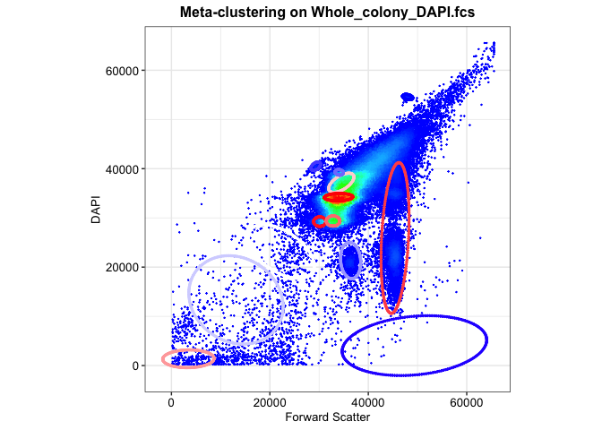<!-- -->

## Mahalanobis distance function with flowEMMi

Following is the integrated function.

Given a preprocessed dataset and the gating result from above, it can
generate the:

- Mahalanobis distance matrix & Cluster result

- Parameter table: Number of cells in each cluster, Area of the
  clustering ellipse, and the Coordinates of center

- Gating plots

``` r
flowEMMi_mahalanobis <- function(data,data_name,gating_data,alpha){
  
  mu <- gating_data@mu
  sigma <- gating_data@sigma
  
  names <- colnames(data)
  
  n_cells <- nrow(data)
  n_clusters <- length(sigma)
  
  #generate mahalanobis matrix
  maha_data <- matrix(NA,nrow=n_cells,ncol=n_clusters)
  
  for (i in 1:n_cells){
    for(j in 1:n_clusters){
      maha_data[i,j] <- mahalanobis(data[i,],mu[,j],sigma[[j]])
    }
  }
  
  maha <- maha_data[,2:n_clusters] %>% as.data.frame()
  
  #set 95% quantile as cutoff value
  threshold <- -2*log(1-alpha)
  
  #determine cluster
  for (cell in 1:n_cells){
    rv <- maha[cell,1:n_clusters-1]
    if(all(rv>threshold)) { maha$Cluster[cell] <- NA}
    else { maha$Cluster[cell] <- which.min(rv)}
  }
  
  maha_data2 <- cbind(data,maha)
  
  test <- table(maha[,ncol(maha)]) %>% as.data.frame()
  coordinates <- sprintf("(%.2f,%.2f)",mu[1,2:ncol(mu)],mu[2,2:ncol(mu)])
  
  #Area of Ellipse
  eigen <- matrix(NA,nrow=length(sigma),ncol=2)
  for (i in 1:length(sigma)){
    eigen[i,] <- eigen(sigma[[i]])$values
  }
  eigen <- eigen[-1,]
  
  area <- matrix(NA,nrow=nrow(eigen),ncol=1)
  for (i in 1:nrow(eigen)){
    area[i,1] <- pi*sqrt(eigen[i,1]*eigen[i,2])*(-2*log(1-alpha))
  }
  
  area <- area %>% as.data.frame()
  test <- cbind(test,area,coordinates)
  colnames(test) <- c("Cluster","Cells","Area","Coordinate")

  #table <- gt(test) %>%
    #tab_header(title = data_name) %>%
    #tab_spanner(label="Cell",columns = c(Local,Meta)) %>%
    #tab_spanner(label="Area",columns = c(Local,Meta))
   
  #plot
  maha_data2$Cluster <- as.factor(maha_data2$Cluster)
  
  plot1 <- ggplot(maha_data2,aes(x=!!sym(names[1]),y=!!sym(names[2]),color=Cluster))+
    geom_point(alpha=1/5)+
    ggtitle(data_name)
  
  num_ellipse <- length(gating_data@sigma)
  
  for (j in 2:num_ellipse){
    mu <- gating_data@mu[,j]
    sigma <- gating_data@sigma[[j]]
    eli <- ellipse::ellipse(centre=mu,x=sigma,level=alpha,npoints=200) 
    eli <- as.data.frame(eli)
    colnames(eli)<- names
    plot1 <- plot1+geom_path(data = eli,
                  aes(x=!!sym(names[1]),y=!!sym(names[2])),color=j)
  }
  
  maha_result <- list(maha_matrix=maha_data2,table_info=test,plot=plot1)
  return(maha_result)
}
```

### Maha-dist tables and plots

Based on the above functions, we substitute preprocessed dataset and
gating results to generate tables and images for different regions. The
tables list the number of cells in each cluster and the size of the
ellipses for each cluster.

``` r
# FSC vs. DAPI
flowemmi_DAPI <- list()
flowemmi_meta_DAPI <- list()

for (i in 1:5){
  data_name <- names(DAPI)[i]
  data <- DAPI[[i]]@exprs[,c(11,27)]
  gating_data <- gating_DAPI[[i]]
  flowemmi_DAPI[[data_name]] <-flowEMMi_mahalanobis(data,data_name,gating_data,0.9)
  
  dname <- paste0("Meta_",data_name)
  flowemmi_meta_DAPI[[data_name]] <- flowEMMi_mahalanobis(data,dname,Gating_DAPI_meta,0.9)
  
  
  # visualization
  table <- flowemmi_DAPI[[data_name]]$table_info %>% 
    kable(caption = data_name,
          col.names = c("Cluster","Cells","Area","Coordinate"))
  print(table)
  print(flowemmi_DAPI[[data_name]]$plot)
}
```

    ## 
    ## 
    ## Table: Inner_zone_DAPI.fcs
    ## 
    ## |Cluster | Cells|      Area|Coordinate          |
    ## |:-------|-----:|---------:|:-------------------|
    ## |1       |  1924|  64940976|(44068.67,22214.89) |
    ## |2       |  5745|  28517326|(34508.86,37132.78) |
    ## |3       |  7301|   9118643|(30135.10,29239.51) |
    ## |4       |   287| 266969505|(13113.82,13340.39) |

<!-- -->

    ## 
    ## 
    ## Table: Middle_zone_DAPI.fcs
    ## 
    ## |Cluster | Cells|      Area|Coordinate          |
    ## |:-------|-----:|---------:|:-------------------|
    ## |1       |  4040| 109598151|(45341.40,24468.17) |
    ## |2       |  3114|  19361723|(34078.42,39261.36) |
    ## |3       |  1252|  23677489|(36406.85,21350.10) |
    ## |4       |  1279| 630732384|(10804.55,7450.08)  |
    ## |5       | 14523|   6447073|(34090.24,34336.18) |

<!-- -->

    ## 
    ## 
    ## Table: Outer_zone_DAPI.fcs
    ## 
    ## |Cluster | Cells|     Area|Coordinate          |
    ## |:-------|-----:|--------:|:-------------------|
    ## |1       |  4100| 14034849|(32629.73,29461.09) |
    ## |2       | 16245|  6100359|(33022.67,34199.10) |

<!-- -->

    ## 
    ## 
    ## Table: Surrounding_DAPI.fcs
    ## 
    ## |Cluster | Cells|      Area|Coordinate          |
    ## |:-------|-----:|---------:|:-------------------|
    ## |1       |  6423|  97911164|(22301.25,23160.50) |
    ## |2       |   769|   1657887|(47995.42,54558.40) |
    ## |3       |  6187|  20486355|(3293.45,1339.81)   |
    ## |4       |  1274|   4689991|(29312.96,40500.45) |
    ## |5       |  1625| 275461724|(49369.61,4051.60)  |
    ## |6       | 10579|  10701222|(34685.62,34728.35) |

<!-- -->

    ## 
    ## 
    ## Table: Whole_colony_DAPI.fcs
    ## 
    ## |Cluster | Cells|      Area|Coordinate          |
    ## |:-------|-----:|---------:|:-------------------|
    ## |1       |  9310|   7848511|(33986.65,33933.71) |
    ## |2       |  6797| 179194231|(45715.23,29438.35) |
    ## |3       |  3745|  16960857|(33105.32,29302.90) |

<!-- -->

## ROC

In the following section, we will ues the ROC-like curves to reflect the
relationship between the number of cells contained in each cluster and
their corresponding ellipse sizes, involving comparisons between
different sampling positions.

``` r
flowroc <- function(data,gating_data,ci){
  data1 <- data[,-c(1,2,ncol(data))]
  ncells <- nrow(data1)
  
  roc.points <- data.frame(cell=NA,volume=NA)
  
  for (alpha in ci){
    threshold <- -2*log(1-alpha)
  
    for (cell in 1:ncells){
      rv <- data1[cell,1:ncol(data1)-1]
      if(all(rv>threshold)) {data1$Cluster[cell] <- NA}
      else {data1$Cluster[cell] <- which.min(rv)}
    }
  
    result <- table(data1$Cluster) %>% as.data.frame()
    sum1 <- sum(result$Freq)
  
    sigma <- gating_data@sigma
  
    eigen <- matrix(NA,nrow=length(sigma),ncol=2)
    for (i in 1:length(sigma)){
      eigen[i,] <- eigen(sigma[[i]])$values
    }
    eigen <- eigen[-1,]
  
    area <- matrix(NA,nrow=nrow(eigen),ncol=1)
    for (i in 1:nrow(eigen)){
      area[i,1] <- pi*sqrt(eigen[i,1]*eigen[i,2])*(-2*log(1-alpha))
    }
    area <- as.data.frame(area)
    sum2 <- sum(area)
    sum.roc <- cbind(cell=sum1,volume=sum2)
    
    roc.points <- rbind(roc.points,sum.roc)
  }
  return(roc.table=roc.points)
}
```

Calculate ellipse sizes and included cell numbers at different alpha
levels.

``` r
roc.result <- list()
roc.meta.result <- list()

# FSC vs. DAPI
# using gating results on each region
for (i in 1:5){
  data_name <- names(DAPI)[i]
  data <- flowemmi_DAPI[[data_name]]$maha_matrix
  
  gating_data <- gating_DAPI[[data_name]]
  alpha <- seq(0.01,0.99,0.01)
  
  roc.result[[data_name]] <- flowroc(data,gating_data,alpha)
}

# using meta-gating on each region
for (i in 1:5){
  data_name <- names(DAPI)[i]
  data <- flowemmi_meta_DAPI[[data_name]]$maha_matrix
  alpha <- seq(0.01,0.99,0.01)
  
  roc.meta.result[[data_name]] <- flowroc(data,Gating_DAPI_meta,alpha)
}
```

After computing the sum of cells’ number and the ellipse volume at
different confidence intervals, we can now plot the ROC-like curves to
compare the trade-off tendency for different locations.

``` r
# plot
plot_point <- function(roc_result){
  
  plot.points <- data.frame()
  plot.scale <- data.frame()
  plot.scale.points <- data.frame()

  for (i in 1:5){
    data <- roc_result[[i]]
    data[1,] <- c(0,0)
  
  # No Scaling
  data$location <- substr(names(DAPI)[i],1,nchar(names(DAPI)[i])-9) %>% as.factor()
  plot.points <- rbind(plot.points,data)
  
  # Scaled by regional maximum
  max <- data[100,]
  for (j in 1:100){
    data[j,1] <- data[j,1]/max[1,1]
    data[j,2] <- data[j,2]/max[1,2]
  }
  plot.scale <- rbind(plot.scale,data)
  
  
  # Scaled by the max number among all regions
  plot.scale.points <- plot.points
  
  for (j in 1:nrow(plot.points)){
    plot.scale.points[j,1]<- plot.scale.points[j,1]/max(plot.scale.points[,1])
    plot.scale.points[j,2]<- plot.scale.points[j,2]/max(plot.scale.points[,2])
   }
  }
  
  points <- list(raw.point=plot.points,regional.scaled=plot.scale,all.scaled=plot.scale.points)
  return(points)
}
```

### Different regions

``` r
# FSC vs. DAPI as example
p1 <- plot_point(roc_19)

ggplot(p1$raw.point,aes(x=volume,y=cell,color=location))+
  geom_line()+labs(x="volume",y="cell",title="FSC vs. DAPI",subtitle = "Without Scaling")+
  theme_minimal()
```

<!-- -->

``` r
ggplot(p1$regional.scaled,aes(x=volume,y=cell,color=location))+
  geom_line()+labs(x="volume",y="cell",title="FSC vs. DAPI",subtitle = "Regional maximum scaling")+
  theme_minimal()
```

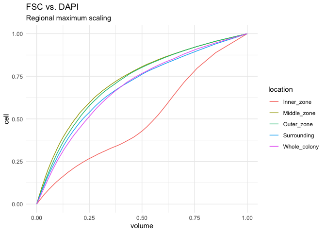<!-- -->

``` r
ggplot(p1$all.scaled,aes(x=volume,y=cell,color=location))+
  geom_line()+labs(x="volume",y="cell",title="FSC vs. DAPI",subtitle = "Global maximum scaling")+
  theme_minimal()
```

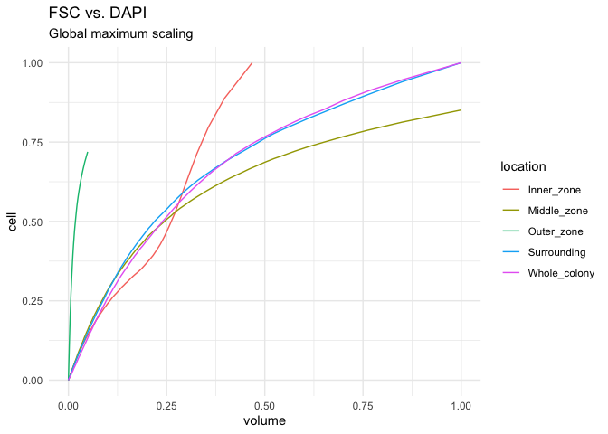<!-- -->

### Different channels

``` r
channels <- c("roc_12","roc_19","roc_29")
names<-c("FSC vs. SSC","FSC vs. DAPI","SSC vs. DAPI")
points <- list()

for (i in 1:3){
  data <- get(channels[i])
  roc <- plot_point(data)
  name <- names[i]
  
  print(ggplot(roc$raw.point,aes(x=volume,y=cell,color=location))+
    geom_line()+labs(x="volume",y="cell",title=name,subtitle = "Without Scaling")+
    theme_minimal())
}
```

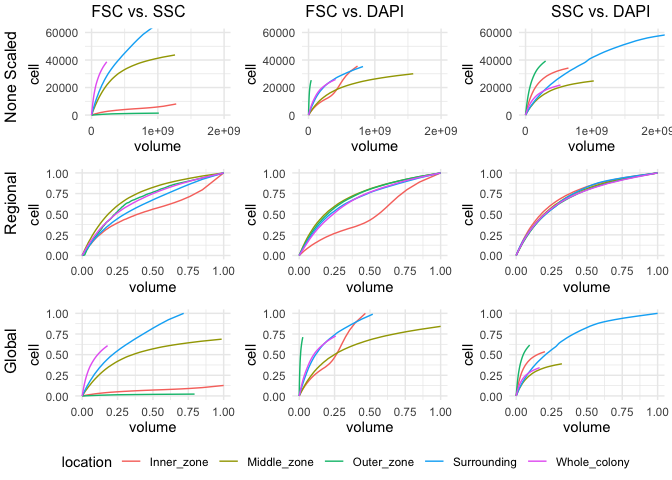<!-- -->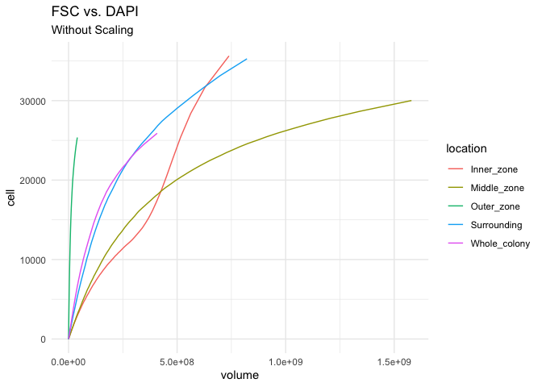<!-- -->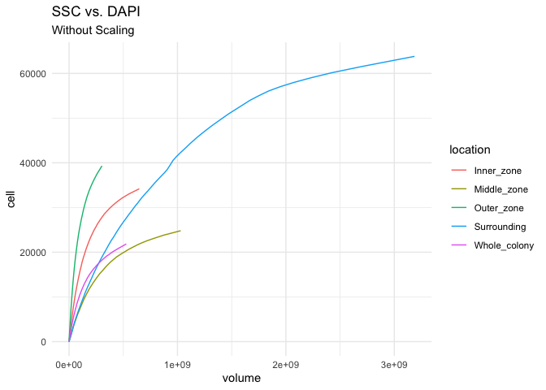<!-- -->

### Gating vs. meta-clustering

``` r
location <- c("Inner_zone","Middle_zone","Outer_zone","Surrounding","Whole_colony")
point <- list()

p1 <- plot_point(roc_19)
p2 <- plot_point(roc_meta_19)

for (i in location){
  data1 <- p1$raw.point %>% dplyr::filter(location==i)
  data2 <- p2$raw.point %>% dplyr::filter(location==i)
  
  data1$type <- "gating"
  data2$type <- "meta-clustering"
  
  data <- rbind(data1,data2)
  
  print(ggplot(data,aes(x=volume,y=cell,color=type))+
    geom_line()+labs(x="volume",y="cell",title=i,
                     subtitle = "FSC vs. DAPI \nWithout Scaling")+
    theme_minimal())
}
```

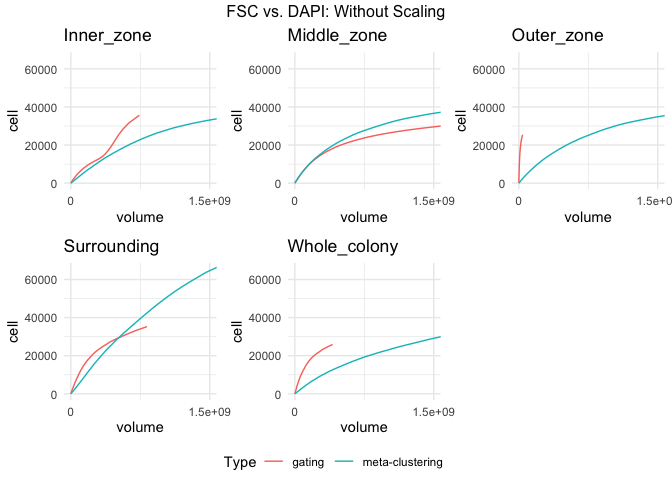<!-- -->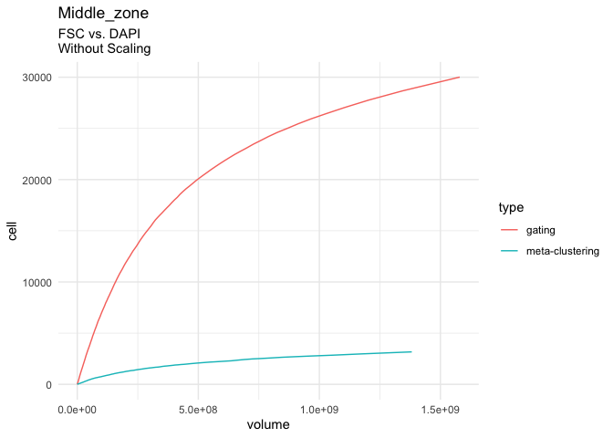<!-- -->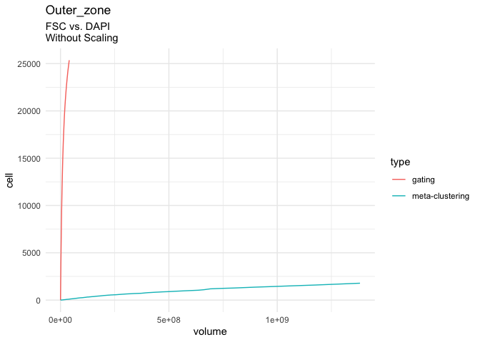<!-- -->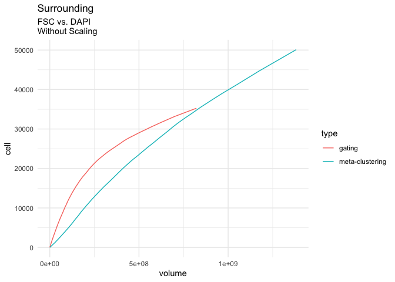<!-- -->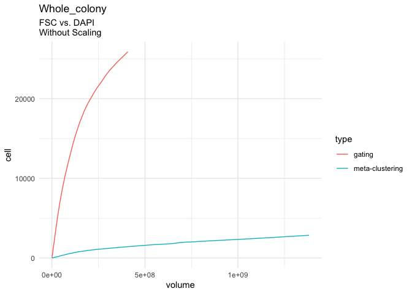<!-- -->

## Files written

These files have been written to the target directory,
data/02a-flowEMMi-for-Z-project:

``` r
projthis::proj_dir_info(path_target())
```

    ## # A tibble: 0 × 4
    ## # ℹ 4 variables: path <fs::path>, type <fct>, size <fs::bytes>,
    ## #   modification_time <dttm>
