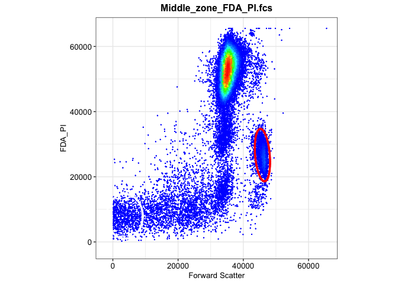
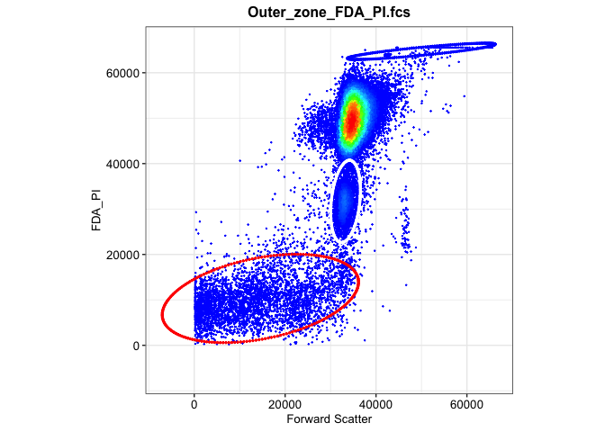
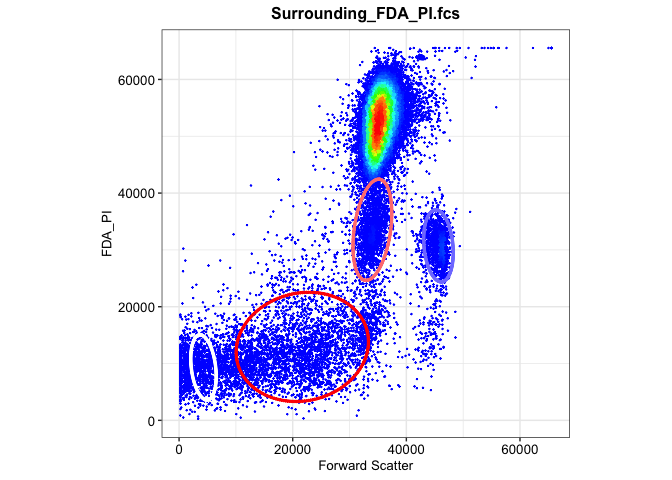
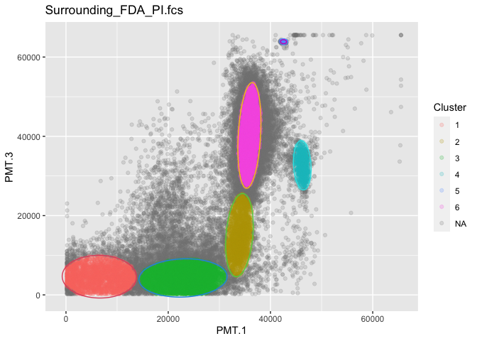

02b-flowEMMI on FDA_PI from Z-project
================
Compiled at 2023-10-26 10:15:28 UTC

``` r
here::i_am(paste0(params$name, ".Rmd"), uuid = "ce529353-7643-4521-8dc9-35a25f812de1")
```

``` r
library("conflicted")
library(purrr)
library(dplyr)
library(mvtnorm)
library(flowEMMi)
```

    ## For detailed instructions please run browseVignettes('flowEMMi').
    ##   For an overview of available functions please run library(help='flowEMMi')

``` r
library(flowCore)
library(flowWorkspace)
```

    ## As part of improvements to flowWorkspace, some behavior of
    ## GatingSet objects has changed. For details, please read the section
    ## titled "The cytoframe and cytoset classes" in the package vignette:
    ## 
    ##   vignette("flowWorkspace-Introduction", "flowWorkspace")

``` r
library(ggcyto)
```

    ## Loading required package: ggplot2

    ## Loading required package: ncdfFlow

    ## Loading required package: BH

``` r
library(tidyverse)
```

    ## ── Attaching core tidyverse packages ──────────────────────── tidyverse 2.0.0 ──
    ## ✔ forcats   1.0.0     ✔ stringr   1.5.0
    ## ✔ lubridate 1.9.3     ✔ tibble    3.2.1
    ## ✔ readr     2.1.4     ✔ tidyr     1.3.0

``` r
library(RColorBrewer)
library(knitr)
library(ellipse)
library(ggforce)
```

``` r
# create or *empty* the target directory, used to write this file's data: 
projthis::proj_create_dir_target(params$name, clean = TRUE)

# function to get path to target directory: path_target("sample.csv")
path_target <- projthis::proj_path_target(params$name)

# function to get path to previous data: path_source("00-import", "sample.csv")
path_source <- projthis::proj_path_source(params$name)
```

## Z-project

### Import preprocessed data

``` r
FDA_PI <- readRDS("~/Desktop/MSc_new_data/new_FDA_PI.rds")
gating_FDA_PI <- readRDS("~/Desktop/MSc_new_data/gating_FDA_PI.rds")
```

### flowEMMI gating on FDAPI

Based on the scatter plot in 01-data, we would like to set arrange,

- Setting range for x axis: 1000-60000

- Setting range for y axis: 1000-60000

``` r
set.seed(1)
location <- c("Inner_zone","Middle_zone","Outer_zone","Surrounding","Whole_colony")
gating_FDA_PI <- list()

for (i in 1:5){
  data_name <- paste0(location[i],"_FDA_PI.fcs")
  data <- FDA_PI[[i]]
  fdo <- mkFlowDataObject(data, xChannel="PMT.1", yChannel="PMT.3")
  gating <- flowEMMi( fdo=fdo, xMin=1000, xMax=60000, yMin=1000, yMax=60000
                      , initFraction=0.01
                      , finalFraction=1.0
                      , minClusters=5, maxClusters=15, clusterbracket=2
                      , numberOfInits=5
                      , verbose=TRUE
                      , parallel=FALSE
                      , convergenceEpsilon=0.01
                      , whenToRemoveOverlaps = 20
                      , mergeWhenCenter = FALSE
                      , mergeWhenTwoCenters = FALSE
                      , thresholdForDeletion = 0.2
                      , threshold = 0.9
                      , considerWeights=TRUE
                      , plot = FALSE
                      , alpha=0.9
                      , minMinor=500)
  gating_FDA_PI[[i]] <- gating$best
}
```

### Gating plots on FDA_PI

``` r
location <- c("Inner_zone","Middle_zone","Outer_zone","Whole_colony","Surrounding")
gating_FDA_PI_plot <- list()

for (i in 1:5){
  data_name <- paste0(location[i],"_FDA_PI.fcs")
  data <- FDA_PI[[i]]
  plots <- plotDensityAndEllipses(fcsData = data, ch1="PMT.1", ch2="PMT.3", alpha=0.9,
                            logScale = F, results = gating_FDA_PI[[i]],
                            title = data_name, plotRelevance = T,
                            ellipseDotSize = 0.5, axis_size=10, axisLabeling_size=10,
                            xlab = "Forward Scatter", ylab = "FDA_PI", font = "Arial")
  gating_FDA_PI_plot[[i]] <- plots$plot
}
```

    ## Warning in KernSmooth::bkde2D(x, bandwidth = bandwidth, gridsize = nbin, :
    ## Binning grid too coarse for current (small) bandwidth: consider increasing
    ## 'gridsize'

    ## Warning in KernSmooth::bkde2D(x, bandwidth = bandwidth, gridsize = nbin, :
    ## Binning grid too coarse for current (small) bandwidth: consider increasing
    ## 'gridsize'

<!-- --><!-- --><!-- -->

    ## Warning in KernSmooth::bkde2D(x, bandwidth = bandwidth, gridsize = nbin, :
    ## Binning grid too coarse for current (small) bandwidth: consider increasing
    ## 'gridsize'

<!-- --><!-- -->

## Mahalanobis distance function with flowEMMi

Following is the integrated function.

Given a preprocessed dataset and the gating result from above, it can
generate the:

- Mahalanobis distance matrix & Cluster result

- Parameter table: Number of cells in each cluster, Area of the
  clustering ellipse, and the Coordinates of center

- Gating plots

``` r
flowEMMi_mahalanobis <- function(data,data_name,gating_data,alpha){
  
  mu <- gating_data@mu
  sigma <- gating_data@sigma
  
  names <- colnames(data)
  
  n_cells <- nrow(data)
  n_clusters <- length(sigma)
  
  #generate mahalanobis matrix
  maha_data <- matrix(NA,nrow=n_cells,ncol=n_clusters)
  
  for (i in 1:n_cells){
    for(j in 1:n_clusters){
      maha_data[i,j] <- mahalanobis(data[i,],mu[,j],sigma[[j]])
    }
  }
  
  maha <- maha_data[,2:n_clusters] %>% as.data.frame()
  
  #set 95% quantile as cutoff value
  threshold <- -2*log(1-alpha)
  
  #determine cluster
  for (cell in 1:n_cells){
    rv <- maha[cell,1:n_clusters-1]
    if(all(rv>threshold)) { maha$Cluster[cell] <- NA}
    else { maha$Cluster[cell] <- which.min(rv)}
  }
  
  maha_data2 <- cbind(data,maha)
  
  test <- table(maha[,ncol(maha)]) %>% as.data.frame()
  coordinates <- sprintf("(%.2f,%.2f)",mu[1,2:ncol(mu)],mu[2,2:ncol(mu)])
  
  #Area of Ellipse
  eigen <- matrix(NA,nrow=length(sigma),ncol=2)
  for (i in 1:length(sigma)){
    eigen[i,] <- eigen(sigma[[i]])$values
  }
  eigen <- eigen[-1,]
  
  area <- matrix(NA,nrow=nrow(eigen),ncol=1)
  for (i in 1:nrow(eigen)){
    area[i,1] <- pi*sqrt(eigen[i,1]*eigen[i,2])*(-2*log(1-alpha))
  }
  
  area <- area %>% as.data.frame()
  test <- cbind(test,area,coordinates)
  colnames(test) <- c("Cluster","Cells","Area","Coordinate")

  #table <- gt(test) %>%
    #tab_header(title = data_name) %>%
    #tab_spanner(label="Cell",columns = c(Local,Meta)) %>%
    #tab_spanner(label="Area",columns = c(Local,Meta))
   
  #plot
  maha_data2$Cluster <- as.factor(maha_data2$Cluster)
  
  plot1 <- ggplot(maha_data2,aes(x=!!sym(names[1]),y=!!sym(names[2]),color=Cluster))+
    geom_point(alpha=1/5)+
    ggtitle(data_name)
  
  num_ellipse <- length(gating_data@sigma)
  
  for (j in 2:num_ellipse){
    mu <- gating_data@mu[,j]
    sigma <- gating_data@sigma[[j]]
    eli <- ellipse::ellipse(centre=mu,x=sigma,level=alpha,npoints=200) 
    eli <- as.data.frame(eli)
    colnames(eli)<- names
    plot1 <- plot1+geom_path(data = eli,
                  aes(x=!!sym(names[1]),y=!!sym(names[2])),color=j)
  }
  
  maha_result <- list(maha_matrix=maha_data2,table_info=test,plot=plot1)
  return(maha_result)
}
```

``` r
flowemmi_FDA_PI <- list()

for (i in 1:5){
  data_name <- names(FDA_PI)[i]
  data <- FDA_PI[[i]]@exprs[,c(11,15)]
  gating_data <- gating_FDA_PI[[i]]
  flowemmi_FDA_PI[[data_name]] <-flowEMMi_mahalanobis(data,data_name,gating_data,0.9)
  
  # visualization
  table <- flowemmi_FDA_PI[[data_name]]$table_info %>% 
    kable(caption = data_name,
          col.names = c("Cluster","Cells","Area","Coordinate"))
  print(table)
  print(flowemmi_FDA_PI[[data_name]]$plot)
}
```

    ## 
    ## 
    ## Table: Inner_zone_FDA_PI.fcs
    ## 
    ## |Cluster | Cells|      Area|Coordinate          |
    ## |:-------|-----:|---------:|:-------------------|
    ## |1       |  3594| 818442864|(19595.59,10728.79) |
    ## |2       |  1838|  46335074|(44870.52,31676.26) |

<!-- -->

    ## 
    ## 
    ## Table: Middle_zone_FDA_PI.fcs
    ## 
    ## |Cluster | Cells|      Area|Coordinate          |
    ## |:-------|-----:|---------:|:-------------------|
    ## |1       |   823| 119368442|(3654.85,7891.90)   |
    ## |2       |  1987|  57042626|(45868.74,26659.03) |

<!-- -->

    ## 
    ## 
    ## Table: Outer_zone_FDA_PI.fcs
    ## 
    ## |Cluster | Cells|      Area|Coordinate          |
    ## |:-------|-----:|---------:|:-------------------|
    ## |1       |  2901|  89808795|(33293.04,31672.00) |
    ## |2       |  3818| 613252482|(14550.96,10313.60) |
    ## |3       |   166|  45374181|(49959.64,64711.82) |

<!-- -->

    ## 
    ## 
    ## Table: Surrounding_FDA_PI.fcs
    ## 
    ## |Cluster | Cells|      Area|Coordinate          |
    ## |:-------|-----:|---------:|:-------------------|
    ## |1       |  2733| 122975439|(6520.79,4595.34)   |
    ## |2       |  2515|  86495516|(33928.36,15075.46) |
    ## |3       |  5914| 130709184|(22894.67,4270.12)  |
    ## |4       |  1140|  33343277|(46219.07,32694.19) |
    ## |5       |   486|    928291|(42552.05,63872.88) |
    ## |6       | 29557|  91484506|(35879.59,40226.52) |

<!-- -->

    ## 
    ## 
    ## Table: Whole_colony_FDA_PI.fcs
    ## 
    ## |Cluster | Cells|      Area|Coordinate          |
    ## |:-------|-----:|---------:|:-------------------|
    ## |1       |   621|  38838127|(4293.53,9312.76)   |
    ## |2       |  2649| 349730746|(21691.09,12926.14) |
    ## |3       |  1329|  50895394|(45652.54,30710.34) |
    ## |4       |  1676|  90290360|(34023.77,33535.60) |

<!-- -->

## Files written

These files have been written to the target directory,
`data/02b-flowEMMI on FDA_PI from Z-project`:

``` r
projthis::proj_dir_info(path_target())
```

    ## # A tibble: 0 × 4
    ## # ℹ 4 variables: path <fs::path>, type <fct>, size <fs::bytes>,
    ## #   modification_time <dttm>
