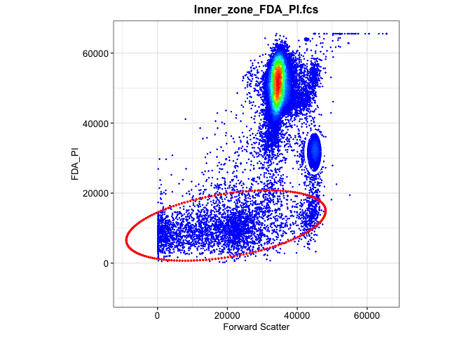
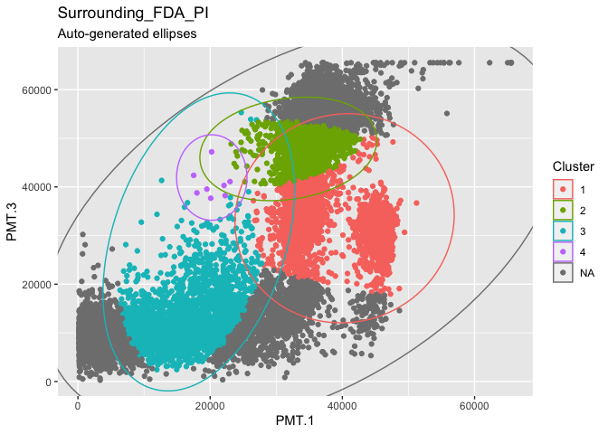

02b-flowEMMI on FDA_PI from Z-project
================
Compiled at 2023-08-22 11:01:35 UTC

``` r
here::i_am(paste0(params$name, ".Rmd"), uuid = "ce529353-7643-4521-8dc9-35a25f812de1")
```

``` r
library("conflicted")
library(purrr)
library(dplyr)
library(mvtnorm)
library(flowEMMi)
```

    ## For detailed instructions please run browseVignettes('flowEMMi').
    ##   For an overview of available functions please run library(help='flowEMMi')

``` r
library(flowCore)
library(flowWorkspace)
```

    ## As part of improvements to flowWorkspace, some behavior of
    ## GatingSet objects has changed. For details, please read the section
    ## titled "The cytoframe and cytoset classes" in the package vignette:
    ## 
    ##   vignette("flowWorkspace-Introduction", "flowWorkspace")

``` r
library(ggcyto)
```

    ## Loading required package: ggplot2

    ## Loading required package: ncdfFlow

    ## Loading required package: RcppArmadillo

    ## Loading required package: BH

``` r
library(tidyverse)
```

    ## ── Attaching core tidyverse packages ──────────────────────── tidyverse 2.0.0 ──
    ## ✔ forcats   1.0.0     ✔ stringr   1.5.0
    ## ✔ lubridate 1.9.2     ✔ tibble    3.2.1
    ## ✔ readr     2.1.4     ✔ tidyr     1.3.0

``` r
library(RColorBrewer)
library(knitr)
library(ellipse)
library(ggforce)
```

``` r
# create or *empty* the target directory, used to write this file's data: 
projthis::proj_create_dir_target(params$name, clean = TRUE)

# function to get path to target directory: path_target("sample.csv")
path_target <- projthis::proj_path_target(params$name)

# function to get path to previous data: path_source("00-import", "sample.csv")
path_source <- projthis::proj_path_source(params$name)
```

## Z-project

### Import preprocessed data

``` r
DAPI <- readRDS("~/Desktop/MScThesis/workflow/data/new_DAPI.rds")
FDA_PI <- readRDS("~/Desktop/MScThesis/workflow/data/new_FDA_PI.rds")
```

### flowEMMI gating on FDAPI

Based on the scatter plot in 01-data, we would like to set arrange,

-   Setting range for x axis: 10000-50000

-   Setting range for y axis: 10000-65000

``` r
set.seed(1)
location <- c("Inner_zone","Middle_zone","Outer_zone","Surrounding","Whole_colony")
gating_FDA_PI <- list()

for (i in 5){
  data_name <- paste0(location[i],"_FDA_PI.fcs")
  data <- FDA_PI[[i]]
  fdo <- mkFlowDataObject(data, xChannel="PMT.1", yChannel="PMT.3")
  gating <- flowEMMi( fdo=fdo, xMin=10000, xMax=50000, yMin=10000, yMax=65000
                      , initFraction=0.01
                      , finalFraction=1.0
                      , minClusters=5, maxClusters=15, clusterbracket=2
                      , numberOfInits=5
                      , verbose=TRUE
                      , parallel=FALSE
                      , convergenceEpsilon=0.01
                      , whenToRemoveOverlaps = 20
                      , mergeWhenCenter = FALSE
                      , mergeWhenTwoCenters = FALSE
                      , thresholdForDeletion = 0.2
                      , threshold = 0.9
                      , considerWeights=TRUE
                      , plot = FALSE
                      , alpha=0.9
                      , minMinor=500)
  gating_FDA_PI[[i]] <- gating$best
}
```

### Gating plots on DAPI

``` r
location <- c("Inner_zone","Middle_zone","Outer_zone","Whole_colony","Surrounding")
gating_FDA_PI_plot <- list()

for (i in 1:5){
  data_name <- paste0(location[i],"_FDA_PI.fcs")
  data <- FDA_PI[[i]]
  plots <- plotDensityAndEllipses(fcsData = data, ch1="PMT.1", ch2="PMT.3", alpha=0.9,
                            logScale = F, results = gating_FDA_PI[[i]],
                            title = data_name, plotRelevance = T,
                            ellipseDotSize = 0.5, axis_size=10, axisLabeling_size=10,
                            xlab = "Forward Scatter", ylab = "FDA_PI", font = "Arial")
  gating_FDA_PI_plot[[i]] <- plots$plot
}
```

    ## Warning in KernSmooth::bkde2D(x, bandwidth = bandwidth, gridsize = nbin, :
    ## Binning grid too coarse for current (small) bandwidth: consider increasing
    ## 'gridsize'

    ## Warning in KernSmooth::bkde2D(x, bandwidth = bandwidth, gridsize = nbin, :
    ## Binning grid too coarse for current (small) bandwidth: consider increasing
    ## 'gridsize'

<!-- --><!-- --><!-- -->

    ## Warning in KernSmooth::bkde2D(x, bandwidth = bandwidth, gridsize = nbin, :
    ## Binning grid too coarse for current (small) bandwidth: consider increasing
    ## 'gridsize'

<!-- --><!-- -->

### Mahalanobis distance

``` r
maha_result <- list()

for (x in 1:5){
  data <- FDA_PI[[x]]@exprs[,c(11,15)]
  
  mu <- split(gating_FDA_PI[[x]]@mu,seq_len(ncol(gating_FDA_PI[[x]]@mu)))
  sigma <- gating_FDA_PI[[x]]@sigma
  
  n_cells <- nrow(data)
  n_cluster <- length(sigma)
  maha_data <- matrix(NA,nrow=n_cells,ncol=n_cluster)
  
  for (i in 1:n_cells){
    for (j in 1:n_cluster){
      maha_data[i,j] <- mahalanobis(data[i,],mu[[j]],sigma[[j]])
    }
  }
  maha_result[[x]] <- maha_data
}


# rename distance matrix
for (i in 1:5){
  maha1 <- maha_result[[i]]
  coln <- ncol(maha1)
  maha <- maha1[,2:coln] %>% as.data.frame()
  
  # set 50 as distance cutoff
  for (j in 1:nrow(maha)){
    rv <- maha[j,1:ncol(maha)-1]
    if(all(rv>50)) { maha$Min[j] <- NA}
    else {maha$Min[j] <- which.min(rv)}
  }

  maha_result[[i]] <- maha
  
  table <-table(maha[,ncol(maha)]) %>% 
    kable(caption = paste0(location[i],"_FDA_PI"),
          col.names = c("No. of Cluster","Number of Cells"))
  
  print(table)
}
```

    ## 
    ## 
    ## Table: Inner_zone_FDA_PI
    ## 
    ## |No. of Cluster | Number of Cells|
    ## |:--------------|---------------:|
    ## |1              |           45291|
    ## |2              |             231|
    ## |3              |               3|
    ## 
    ## 
    ## Table: Middle_zone_FDA_PI
    ## 
    ## |No. of Cluster | Number of Cells|
    ## |:--------------|---------------:|
    ## |1              |              15|
    ## |2              |           17958|
    ## 
    ## 
    ## Table: Outer_zone_FDA_PI
    ## 
    ## |No. of Cluster | Number of Cells|
    ## |:--------------|---------------:|
    ## |1              |           50017|
    ## 
    ## 
    ## Table: Whole_colony_FDA_PI
    ## 
    ## |No. of Cluster | Number of Cells|
    ## |:--------------|---------------:|
    ## |1              |              35|
    ## |2              |           27137|
    ## |3              |              12|
    ## 
    ## 
    ## Table: Surrounding_FDA_PI
    ## 
    ## |No. of Cluster | Number of Cells|
    ## |:--------------|---------------:|
    ## |1              |            3504|
    ## |2              |           23997|
    ## |3              |            2435|
    ## |4              |               8|

# mahalanobis visulization

``` r
# plot
FDA_PI_maha_plot <- list()

for (i in 1:5){
  data1 <- FDA_PI[[i]]@exprs[,c(11,15)] 
  data2 <- maha_result[[i]]
  data <- cbind(data1,data2$Min) %>% as.data.frame()
  colnames(data)[3] <- "Cluster"
  data$Cluster <- as.factor(data$Cluster)
  
  #ellipses generated by 
  plot1 <- ggplot(data,aes(x=PMT.1,y=PMT.3))+
    geom_point(aes(color=Cluster))+geom_mark_ellipse(aes(color=Cluster))+
    ggtitle(paste0(location[i],"_FDA_PI"),subtitle = "Auto-generated ellipses")
  
  print(plot1)
  
  #ellipses from flowEMMI result
  ellipses <- gating_FDA_PI[[i]]
  num_ellipse <- length(ellipses@sigma)
  
  p <- plot(NULL,type="n",xlim=c(0,70000),ylim=c(0,70000),xlab="PMT.1",ylab="PMT.3")
  
  for (j in 2:num_ellipse){
    mu <- ellipses@mu[,j]
    sigma <- ellipses@sigma[[j]]
    eli <- ellipse::ellipse(centre=mu,x=sigma,level=0.95,npoints=200) 
    p <- p+lines(eli,type="l",col=j)
  }
}
```

    ## Warning: Using the `size` aesthetic in this geom was deprecated in ggplot2 3.4.0.
    ## ℹ Please use `linewidth` in the `default_aes` field and elsewhere instead.
    ## This warning is displayed once every 8 hours.
    ## Call `lifecycle::last_lifecycle_warnings()` to see where this warning was
    ## generated.

<!-- --><!-- --><!-- --><!-- --><!-- --><!-- --><!-- --><!-- --><!-- --><!-- -->

## Files written

These files have been written to the target directory,
`data/02b-flowEMMI on FDA_PI from Z-project`:

``` r
projthis::proj_dir_info(path_target())
```

    ## # A tibble: 0 × 4
    ## # ℹ 4 variables: path <fs::path>, type <fct>, size <fs::bytes>,
    ## #   modification_time <dttm>
