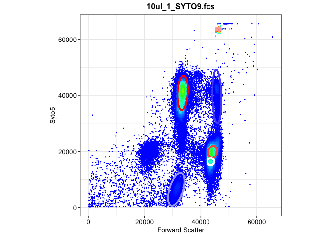
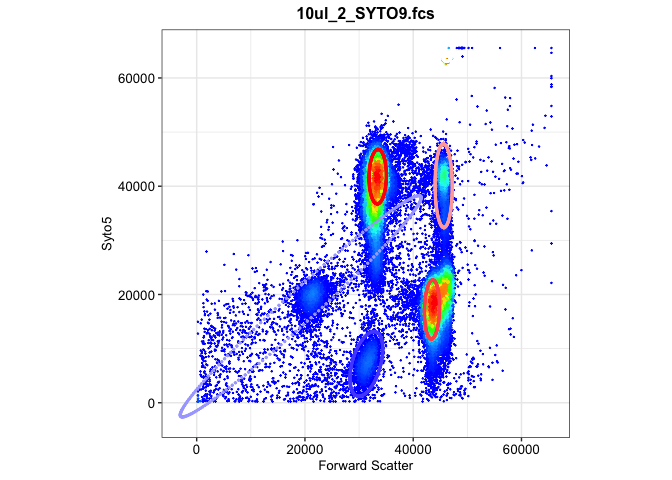
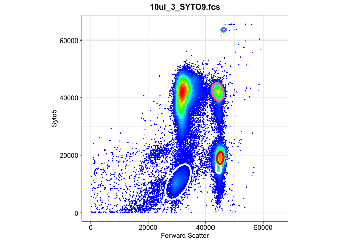
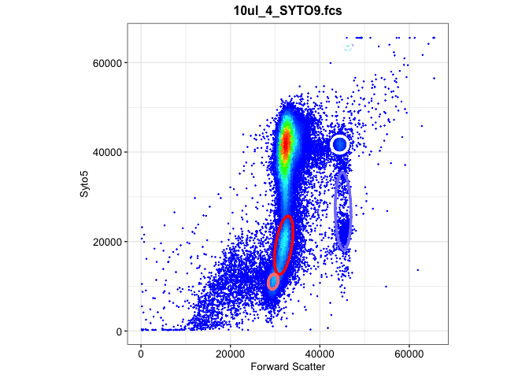
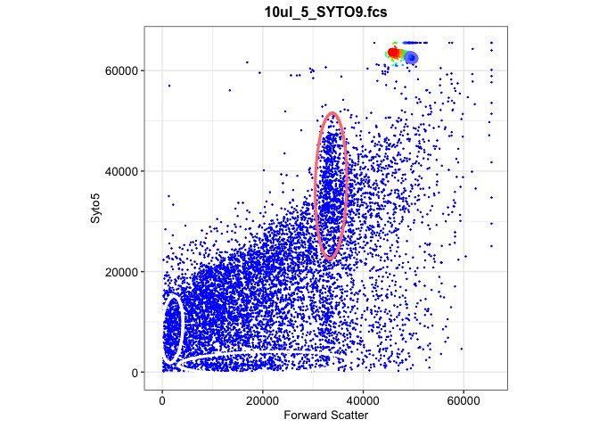
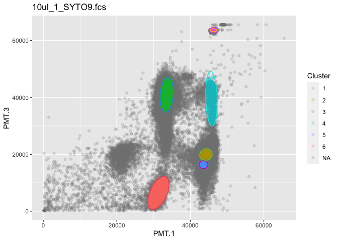
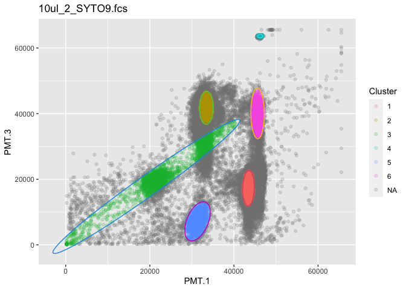
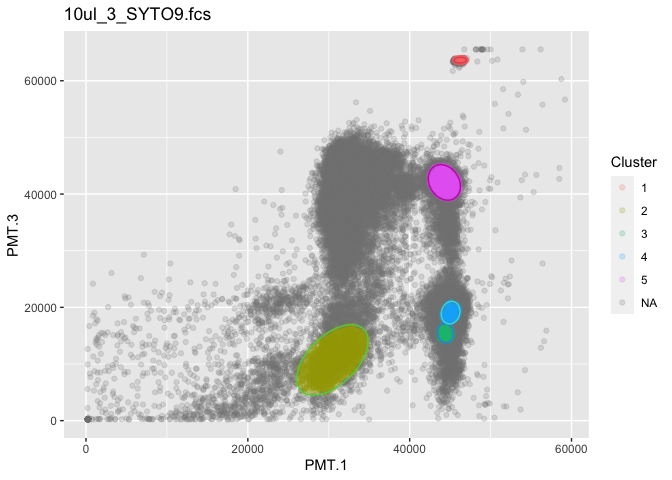
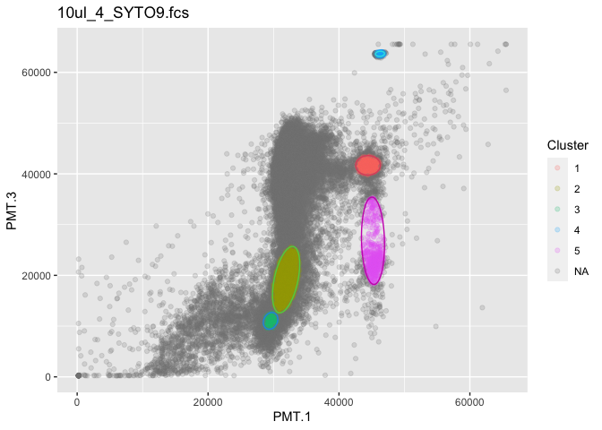
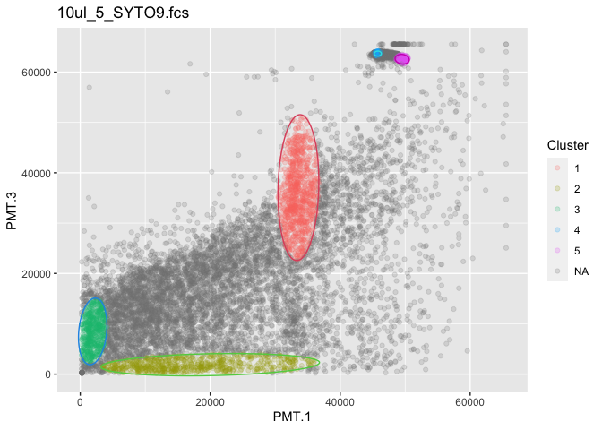

02c-flowEMMI for B-sub punch
================
Compiled at 2023-10-26 10:08:16 UTC

``` r
here::i_am(paste0(params$name, ".Rmd"), uuid = "692cb0d2-fab9-4152-9100-dfc8a9c4181a")
```

The purpose of this document is …

``` r
library("conflicted")
library(purrr)
library(dplyr)
library(mvtnorm)
library(flowEMMi)
```

    ## For detailed instructions please run browseVignettes('flowEMMi').
    ##   For an overview of available functions please run library(help='flowEMMi')

``` r
library(flowCore)
library(ggcyto)
```

    ## Loading required package: ggplot2

    ## Loading required package: ncdfFlow

    ## Loading required package: BH

    ## Loading required package: flowWorkspace

    ## As part of improvements to flowWorkspace, some behavior of
    ## GatingSet objects has changed. For details, please read the section
    ## titled "The cytoframe and cytoset classes" in the package vignette:
    ## 
    ##   vignette("flowWorkspace-Introduction", "flowWorkspace")

``` r
library(tidyverse)
```

    ## ── Attaching core tidyverse packages ──────────────────────── tidyverse 2.0.0 ──
    ## ✔ forcats   1.0.0     ✔ stringr   1.5.0
    ## ✔ lubridate 1.9.3     ✔ tibble    3.2.1
    ## ✔ readr     2.1.4     ✔ tidyr     1.3.0

``` r
library(knitr)
library(ellipse)
library(ggforce)
library(ggplot2)
library(ggpubr)
```

``` r
# create or *empty* the target directory, used to write this file's data: 
projthis::proj_create_dir_target(params$name, clean = TRUE)

# function to get path to target directory: path_target("sample.csv")
path_target <- projthis::proj_path_target(params$name)

# function to get path to previous data: path_source("00-import", "sample.csv")
path_source <- projthis::proj_path_source(params$name)
```

## Import preprocessed data

``` r
B_punch <- readRDS("~/Desktop/MSc_new_data/new_B_punch.rds")
gating_B_punch <- readRDS("~/Desktop/MSc_new_data/gating_B_punch.rds")
```

### flowEMMI gating

``` r
set.seed(1)
gating_B_punch <- list()

for (i in 10){
  data_name <- names(B_punch)[i]
  data <- B_punch[[i]]
  fdo <- mkFlowDataObject(data, xChannel="PMT.1", yChannel="PMT.3")
  gating <- flowEMMi( fdo=fdo, xMin=0, xMax=65535, yMin=0, yMax=65535
                      , initFraction=0.01
                      , finalFraction=1.0
                      , minClusters=5, maxClusters=15, clusterbracket=2
                      , numberOfInits=5
                      , verbose=FALSE
                      , parallel=FALSE
                      , convergenceEpsilon=0.01
                      , whenToRemoveOverlaps = 20
                      , mergeWhenCenter = FALSE
                      , mergeWhenTwoCenters = FALSE
                      , thresholdForDeletion = 0.2
                      , threshold = 0.9
                      , considerWeights=TRUE
                      , plot = FALSE
                      , alpha=0.9
                      , minMinor=500)
  gating_B_punch[[data_name]] <- gating$best
}

#write_rds(gating_B_punch,"~/Desktop/MSc_new_data/gating_B_punch.rds")
```

### Gating plots

``` r
gating_B_punch_plot <- list()

for (i in 1:5){
  data_name <- names(B_punch)[i+5]
  data <- B_punch[[data_name]]
  plots <- plotDensityAndEllipses(fcsData = data, ch1="PMT.1", ch2="PMT.3", alpha=0.9,
                            logScale = F, results = gating_B_punch[[data_name]],
                            title = data_name, plotRelevance = T,
                            ellipseDotSize = 0.5, axis_size=10, axisLabeling_size=10,
                            xlab = "Forward Scatter", ylab = "Syto5", font = "Arial")
  gating_B_punch_plot[[data_name]] <- plots$plot
}
```

<!-- --><!-- -->

    ## Warning in KernSmooth::bkde2D(x, bandwidth = bandwidth, gridsize = nbin, :
    ## Binning grid too coarse for current (small) bandwidth: consider increasing
    ## 'gridsize'

<!-- --><!-- --><!-- -->

## Mahalanobis distance

``` r
flowEMMi_mahalanobis <- function(data,data_name,gating_data,alpha){
  
  mu <- gating_data@mu
  sigma <- gating_data@sigma
  
  names <- colnames(data)
  
  n_cells <- nrow(data)
  n_clusters <- length(sigma)
  
  #generate mahalanobis matrix
  maha_data <- matrix(NA,nrow=n_cells,ncol=n_clusters)
  
  for (i in 1:n_cells){
    for(j in 1:n_clusters){
      maha_data[i,j] <- mahalanobis(data[i,],mu[,j],sigma[[j]])
    }
  }
  
  maha <- maha_data[,2:n_clusters] %>% as.data.frame()
  
  #set 95% quantile as cutoff value
  threshold <- -2*log(1-alpha)
  
  #determine cluster
  for (cell in 1:n_cells){
    rv <- maha[cell,1:n_clusters-1]
    if(all(rv>threshold)) { maha$Cluster[cell] <- NA}
    else { maha$Cluster[cell] <- which.min(rv)}
  }
  
  maha_data2 <- cbind(data,maha)
  
  test <- table(maha[,ncol(maha)]) %>% as.data.frame()
  coordinates <- sprintf("(%.2f,%.2f)",mu[1,2:ncol(mu)],mu[2,2:ncol(mu)])
  
  #Area of Ellipse
  eigen <- matrix(NA,nrow=length(sigma),ncol=2)
  for (i in 1:length(sigma)){
    eigen[i,] <- eigen(sigma[[i]])$values
  }
  eigen <- eigen[-1,]
  
  area <- matrix(NA,nrow=nrow(eigen),ncol=1)
  for (i in 1:nrow(eigen)){
    area[i,1] <- pi*sqrt(eigen[i,1]*eigen[i,2])*(-2*log(1-alpha))
  }
  
  area <- area %>% as.data.frame()
  test <- cbind(test,area,coordinates)
  colnames(test) <- c("Cluster","Cells","Area","Coordinate")

  #table <- gt(test) %>%
    #tab_header(title = data_name) %>%
    #tab_spanner(label="Cell",columns = c(Local,Meta)) %>%
    #tab_spanner(label="Area",columns = c(Local,Meta))
   
  #plot
  maha_data2$Cluster <- as.factor(maha_data2$Cluster)
  
  plot1 <- ggplot(maha_data2,aes(x=!!sym(names[1]),y=!!sym(names[2]),color=Cluster))+
    geom_point(alpha=1/5)+
    ggtitle(data_name)
  
  num_ellipse <- length(gating_data@sigma)
  
  for (j in 2:num_ellipse){
    mu <- gating_data@mu[,j]
    sigma <- gating_data@sigma[[j]]
    eli <- ellipse::ellipse(centre=mu,x=sigma,level=alpha,npoints=200) 
    eli <- as.data.frame(eli)
    colnames(eli)<- names
    plot1 <- plot1+geom_path(data = eli,
                  aes(x=!!sym(names[1]),y=!!sym(names[2])),color=j)
  }
  
  maha_result <- list(maha_matrix=maha_data2,table_info=test,plot=plot1)
  return(maha_result)
}
```

``` r
# FSC vs. DAPI
flowemmi_B_punch <- list()

for (i in 1:5){
  data_name <- names(B_punch)[i+5]
  data <- B_punch[[data_name]]@exprs[,c(11,15)]
  gating_data <- gating_B_punch[[data_name]]
  flowemmi_B_punch[[data_name]] <-flowEMMi_mahalanobis(data,data_name,gating_data,0.9)
  
  
  # visualization
  table <- flowemmi_B_punch[[data_name]]$table_info %>% 
    kable(caption = data_name,
          col.names = c("Cluster","Cells","Area","Coordinate"))
  print(table)
  print(flowemmi_B_punch[[data_name]]$plot)
}
```

    ## 
    ## 
    ## Table: 10ul_1_SYTO9.fcs
    ## 
    ## |Cluster | Cells|     Area|Coordinate          |
    ## |:-------|-----:|--------:|:-------------------|
    ## |1       |  2503| 45889415|(31330.89,6450.10)  |
    ## |2       |  5933| 10682453|(44257.13,19885.98) |
    ## |3       | 16317| 34260848|(33577.59,40919.17) |
    ## |4       |  1908| 47233659|(45752.48,39560.89) |
    ## |5       |  2353|  5153578|(43570.82,16362.65) |
    ## |6       |  9867|  1463643|(46310.96,63660.65) |

<!-- -->

    ## 
    ## 
    ## Table: 10ul_2_SYTO9.fcs
    ## 
    ## |Cluster | Cells|      Area|Coordinate          |
    ## |:-------|-----:|---------:|:-------------------|
    ## |1       | 11518|  23865026|(43469.05,17228.34) |
    ## |2       | 11708|  25249815|(33441.62,41767.96) |
    ## |3       |  3656| 270177989|(19213.57,17815.29) |
    ## |4       |  2304|   1009891|(46251.04,63626.60) |
    ## |5       |  1552|  50588140|(31346.64,7175.98)  |
    ## |6       |  2481|  38467340|(45622.53,40091.90) |

<!-- -->

    ## 
    ## 
    ## Table: 10ul_3_SYTO9.fcs
    ## 
    ## |Cluster | Cells|     Area|Coordinate          |
    ## |:-------|-----:|--------:|:-------------------|
    ## |1       |  1771|  1196877|(46244.49,63643.62) |
    ## |2       |  2673| 72850328|(30453.76,10717.60) |
    ## |3       |  1101|  5361097|(44423.76,15453.97) |
    ## |4       |  3875|  7186571|(45055.35,19072.17) |
    ## |5       |  4453| 19042074|(44276.81,42053.82) |

<!-- -->

    ## 
    ## 
    ## Table: 10ul_4_SYTO9.fcs
    ## 
    ## |Cluster | Cells|     Area|Coordinate          |
    ## |:-------|-----:|--------:|:-------------------|
    ## |1       |   959| 11330044|(44442.98,41676.10) |
    ## |2       |  5274| 37714306|(31923.69,19155.79) |
    ## |3       |   981|  5647378|(29548.48,11024.99) |
    ## |4       |   999|  1088573|(46267.63,63652.79) |
    ## |5       |   585| 47403708|(45196.23,26810.41) |

<!-- -->

    ## 
    ## 
    ## Table: 10ul_5_SYTO9.fcs
    ## 
    ## |Cluster | Cells|        Area|Coordinate          |
    ## |:-------|-----:|-----------:|:-------------------|
    ## |1       |   861| 142483008.3|(33573.09,37056.25) |
    ## |2       |   611| 114634957.7|(20018.62,1876.86)  |
    ## |3       |   550|  44827990.3|(1919.69,8489.28)   |
    ## |4       |  3543|    858839.8|(45788.46,63679.00) |
    ## |5       |   241|   3271343.0|(49543.76,62565.96) |

<!-- -->

## Files written

These files have been written to the target directory,
`data/02c-flowEMMI for B-sub punch`:

``` r
projthis::proj_dir_info(path_target())
```

    ## # A tibble: 0 × 4
    ## # ℹ 4 variables: path <fs::path>, type <fct>, size <fs::bytes>,
    ## #   modification_time <dttm>
