02c-flowEMMi on Liu data
================
Compiled at 2023-09-27 23:31:46 UTC

``` r
here::i_am(paste0(params$name, ".Rmd"), uuid = "74bd9a1a-7741-4945-bc8d-ad454cf63e94")
```

The purpose of this document is …

``` r
library("conflicted")
library(purrr)
library(dplyr)
library(flowEMMi)
```

    ## For detailed instructions please run browseVignettes('flowEMMi').
    ##   For an overview of available functions please run library(help='flowEMMi')

``` r
library(flowWorkspace)
```

    ## As part of improvements to flowWorkspace, some behavior of
    ## GatingSet objects has changed. For details, please read the section
    ## titled "The cytoframe and cytoset classes" in the package vignette:
    ## 
    ##   vignette("flowWorkspace-Introduction", "flowWorkspace")

``` r
library(flowCore)
library(ggcyto)
```

    ## Loading required package: ggplot2

    ## Loading required package: ncdfFlow

    ## Loading required package: BH

``` r
library(tidyverse)
```

    ## ── Attaching core tidyverse packages ──────────────────────── tidyverse 2.0.0 ──
    ## ✔ forcats   1.0.0     ✔ stringr   1.5.0
    ## ✔ lubridate 1.9.2     ✔ tibble    3.2.1
    ## ✔ readr     2.1.4     ✔ tidyr     1.3.0

``` r
library(RColorBrewer)
library(knitr)
library(ellipse)
library(ggforce)
```

``` r
# create or *empty* the target directory, used to write this file's data: 
projthis::proj_create_dir_target(params$name, clean = TRUE)

# function to get path to target directory: path_target("sample.csv")
path_target <- projthis::proj_path_target(params$name)

# function to get path to previous data: path_source("00-import", "sample.csv")
path_source <- projthis::proj_path_source(params$name)
```

## Microbial community data from Liu’s team

### Import preprocessed data

``` r
C1 <- readRDS("~/Desktop/MSc_new_data/C1.rds")
gating_C1 <- readRDS("~/Desktop/MSc_new_data/gating_C1.rds")
```

### flowEMMI gating on Liu’s data

Based on the scatter plot in 01-data, we could tell that except for the
sample taken in the surrounding region, the cells of other region
samples are mostly concentrated in the range of 1000 to 60000.

``` r
set.seed(1)
gating_C1 <- list()

for (i in 1:length(C1)){
  data_name <- names(C1)[i]
  data <- C1[[i]]
  fdo <- mkFlowDataObject(data, xChannel="PMT.1", yChannel="PMT.9")
  gating <- flowEMMi( fdo=fdo, xMin=1000, xMax=60000, yMin=1000, yMax=60000
                      , initFraction=0.01
                      , finalFraction=1.0
                      , minClusters=3, maxClusters=20, clusterbracket=2
                      , numberOfInits=5
                      , verbose=TRUE
                      , parallel=FALSE
                      , convergenceEpsilon=0.01
                      , whenToRemoveOverlaps = 20
                      , mergeWhenCenter = FALSE
                      , mergeWhenTwoCenters = FALSE
                      , thresholdForDeletion = 0.2
                      , threshold = 0.9
                      , considerWeights=TRUE
                      , plot = FALSE
                      , alpha=0.9
                      , minMinor=500)
  gating_C1[[i]] <- gating$best
}
```

### Gating plots on Liu data

``` r
gating_C1_plot <- list()

for (i in 1:15){
  data_name <- names(C1)[i]
  data <- C1[[i]]
  plots <- plotDensityAndEllipses(fcsData = data, ch1="PMT.1", ch2="PMT.9", alpha=0.9,
                            logScale = F, results = gating_C1[[i]],
                            title = data_name, plotRelevance = T,
                            ellipseDotSize = 0.5, axis_size=10, axisLabeling_size=10,
                            xlab = "Forward Scatter", ylab = "DAPI", font = "Arial")
  gating_C1_plot[[i]] <- plots$plot
}
```

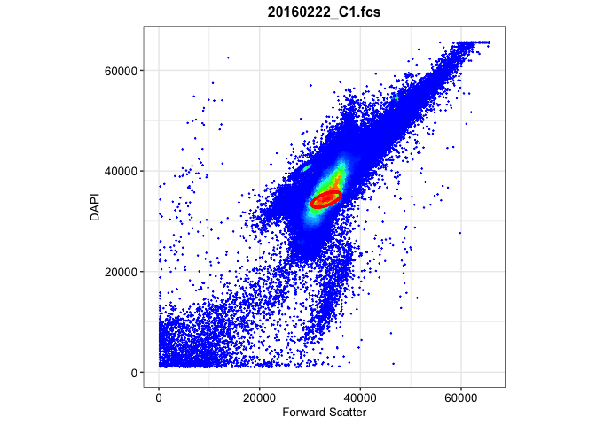<!-- -->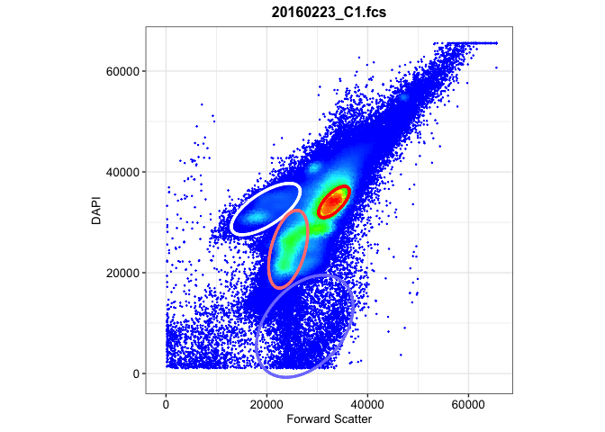<!-- -->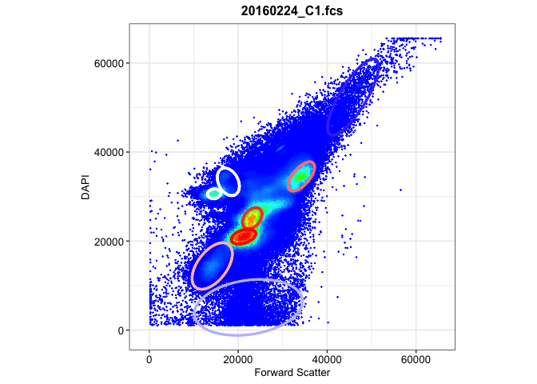<!-- -->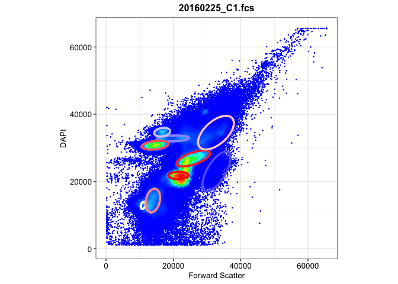<!-- -->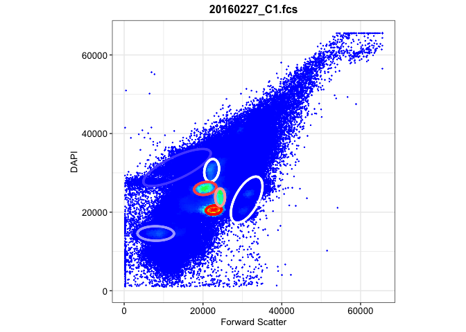<!-- -->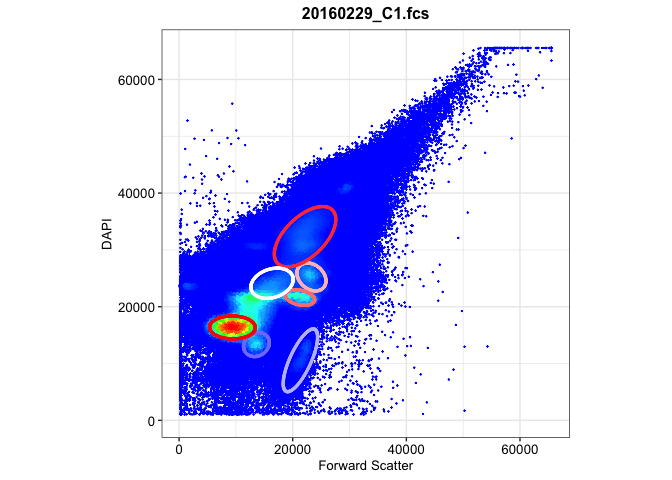<!-- -->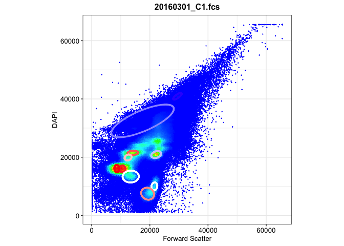<!-- -->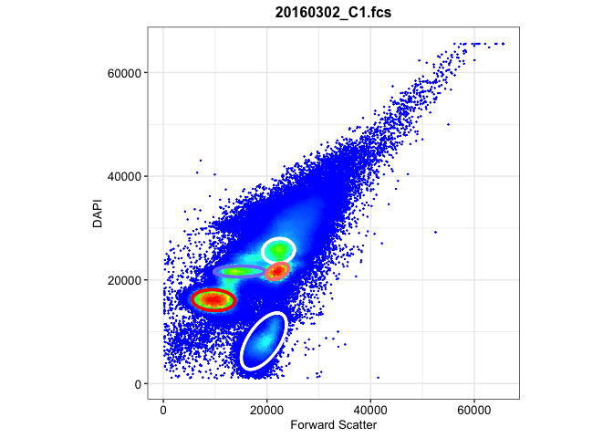<!-- -->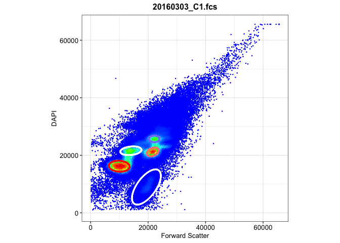<!-- -->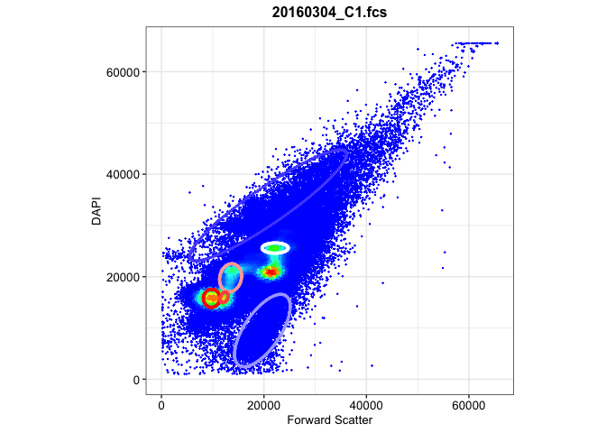<!-- -->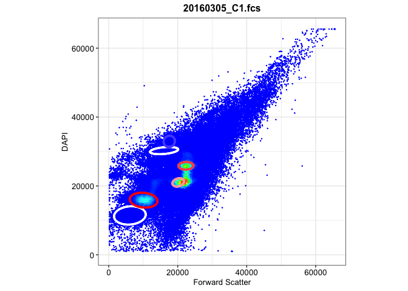<!-- -->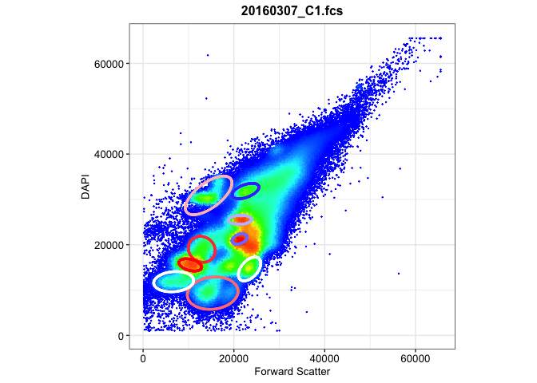<!-- -->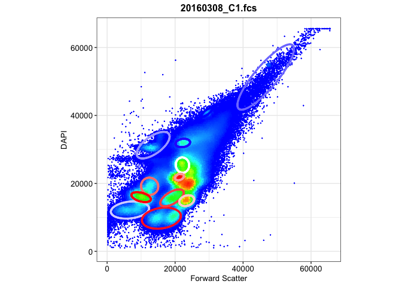<!-- -->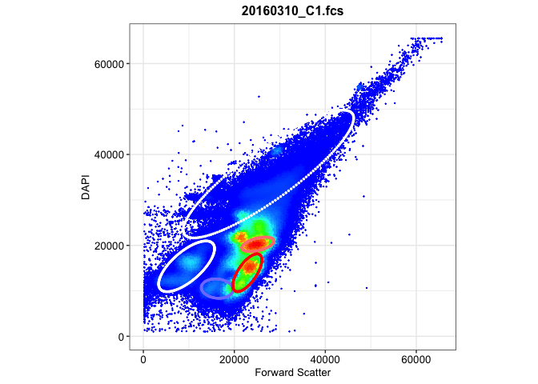<!-- -->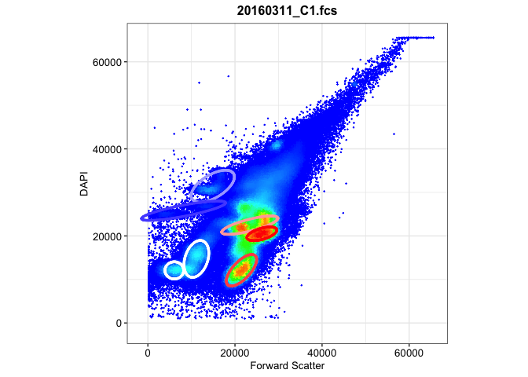<!-- -->

## Mahalanobis distance function with flowEMMi

Following is the integrated function.

Given a preprocessed dataset and the gating result from above, it can
generate the:

- Mahalanobis distance matrix & Cluster result

- Parameter table: Number of cells in each cluster, Area of the
  clustering ellipse, and the Coordinates of center

- Gating plots

``` r
flowEMMi_mahalanobis <- function(data,data_name,gating_data,alpha){
  
  mu <- gating_data@mu
  sigma <- gating_data@sigma
  
  names <- colnames(data)
  
  n_cells <- nrow(data)
  n_clusters <- length(sigma)
  
  #generate mahalanobis matrix
  maha_data <- matrix(NA,nrow=n_cells,ncol=n_clusters)
  
  for (i in 1:n_cells){
    for(j in 1:n_clusters){
      maha_data[i,j] <- mahalanobis(data[i,],mu[,j],sigma[[j]])
    }
  }
  
  maha <- maha_data[,2:n_clusters] %>% as.data.frame()
  
  #set 95% quantile as cutoff value
  threshold <- (-2*log(1-alpha))^2
  
  #determine cluster
  for (cell in 1:n_cells){
    rv <- maha[cell,1:n_clusters-1]
    if(all(rv>threshold)) { maha$Cluster[cell] <- NA}
    else { maha$Cluster[cell] <- which.min(rv)}
  }
  
  maha_data2 <- cbind(data,maha)
  
  test <- table(maha[,ncol(maha)]) %>% as.data.frame()
  coordinates <- sprintf("(%.2f,%.2f)",mu[1,2:ncol(mu)],mu[2,2:ncol(mu)])
  
  #Area of Ellipse
  eigen <- matrix(NA,nrow=length(sigma),ncol=2)
  for (i in 1:length(sigma)){
    eigen[i,] <- eigen(sigma[[i]])$values
  }
  eigen <- eigen[-1,]
  
  area <- matrix(NA,nrow=nrow(eigen),ncol=1)
  for (i in 1:nrow(eigen)){
    area[i,1] <- pi*sqrt(eigen[i,1]*eigen[i,2])
  }
  
  area <- area %>% as.data.frame()
  test <- cbind(test,area,coordinates)
  table <- test %>% 
    kable(caption = data_name,
          col.names = c("Cluster","Cells","Area","Coordinate"))
   
  #plot
  maha_data2$Cluster <- as.factor(maha_data2$Cluster)
  
  plot1 <- ggplot(maha_data2,aes(x=!!sym(names[1]),y=!!sym(names[2]),color=Cluster))+
    geom_point()+
    ggtitle(data_name)
  
  num_ellipse <- length(gating_data@sigma)
  
  for (j in 2:num_ellipse){
    mu <- gating_data@mu[,j]
    sigma <- gating_data@sigma[[j]]
    eli <- ellipse::ellipse(centre=mu,x=sigma,level=0.95,npoints=200) 
    eli <- as.data.frame(eli)
    colnames(eli)<- names
    plot1 <- plot1+geom_path(data = eli,
                  aes(x=!!sym(names[1]),y=!!sym(names[2])),color=j)
  }
  
  maha_result <- list(maha_matrix=maha_data2,table_info=table,plot=plot1)
  return(maha_result)
}
```

## Application on Liu data

``` r
flowemmi_C1 <- list()

for (i in 1:15){
  data <- C1[[i]]@exprs[,c(11,27)]
  data_name <- names(C1)[i]
  gating_data <- gating_C1[[i]]
  flowemmi_C1[[data_name]] <-flowEMMi_mahalanobis(data,data_name,gating_data,0.95)
  print(flowemmi_C1[[i]]$table_info)
  print(flowemmi_C1[[i]]$plot)
}
```

    ## 
    ## 
    ## Table: 20160222_C1.fcs
    ## 
    ## |Cluster |  Cells|      Area|Coordinate          |
    ## |:-------|------:|---------:|:-------------------|
    ## |1       | 136259| 2384198.6|(33206.24,34324.41) |
    ## |2       |   5261|  885764.7|(29195.01,40519.99) |

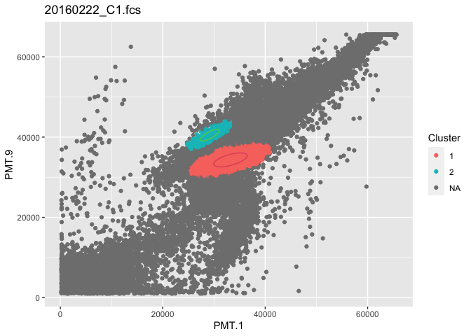<!-- -->

    ## 
    ## 
    ## Table: 20160223_C1.fcs
    ## 
    ## |Cluster | Cells|     Area|Coordinate          |
    ## |:-------|-----:|--------:|:-------------------|
    ## |1       | 81241|  4737844|(33323.40,34026.79) |
    ## |2       | 37226| 17241605|(19779.68,32630.73) |
    ## |3       | 65435| 18264938|(24232.35,24658.04) |
    ## |4       | 15708| 61057604|(27515.91,9379.75)  |

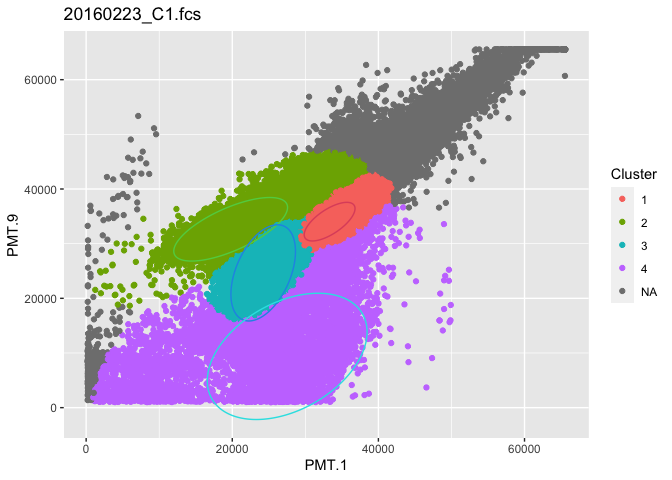<!-- -->

    ## 
    ## 
    ## Table: 20160224_C1.fcs
    ## 
    ## |Cluster | Cells|       Area|Coordinate          |
    ## |:-------|-----:|----------:|:-------------------|
    ## |1       | 10024| 50905629.1|(22295.99,5104.01)  |
    ## |2       | 13708|  4962279.8|(17781.48,33304.74) |
    ## |3       | 54303|  3303799.3|(23149.78,25119.14) |
    ## |4       |  7182| 20105646.6|(45829.49,52345.63) |
    ## |5       | 19822| 13693499.6|(14153.22,14402.56) |
    ## |6       | 39721|  5095443.8|(34206.07,34524.90) |
    ## |7       |  7846|  1082073.5|(14569.00,30624.90) |
    ## |8       |  2965|   791947.9|(29436.99,40849.99) |
    ## |9       | 64960|  2850982.5|(21193.66,21008.33) |

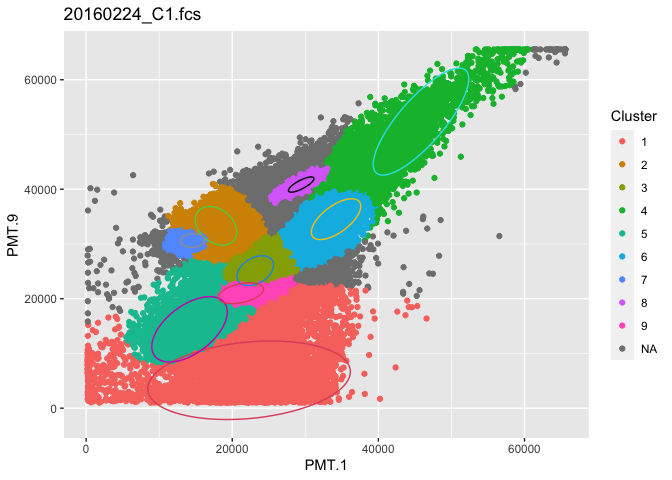<!-- -->

    ## 
    ## 
    ## Table: 20160225_C1.fcs
    ## 
    ## |Cluster | Cells|       Area|Coordinate          |
    ## |:-------|-----:|----------:|:-------------------|
    ## |1       | 11101|  2781102.8|(19890.17,32803.56) |
    ## |2       | 80661|  2207291.9|(21508.04,21791.96) |
    ## |3       |  7670|  2026762.3|(16679.23,34670.45) |
    ## |4       |  2434|   479997.8|(11011.03,12875.32) |
    ## |5       | 26825|  3367858.4|(14539.24,30788.09) |
    ## |6       | 53114|  6253058.2|(25923.69,26843.32) |
    ## |7       | 33653|  4977078.5|(13905.75,14330.91) |
    ## |8       | 37742| 15015740.4|(32652.97,34520.26) |
    ## |9       |   605|   170547.0|(47171.67,54721.58) |
    ## |10      |  8313| 12413036.5|(32806.96,23006.51) |

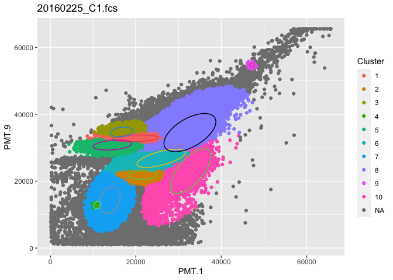<!-- -->

    ## 
    ## 
    ## Table: 20160227_C1.fcs
    ## 
    ## |Cluster | Cells|     Area|Coordinate          |
    ## |:-------|-----:|--------:|:-------------------|
    ## |1       | 28965| 17843622|(13415.06,31352.48) |
    ## |2       | 19619|  3651147|(22199.71,30612.22) |
    ## |3       | 31326|  5803817|(8012.39,14573.94)  |
    ## |4       | 39153|  3096782|(20572.13,26049.23) |
    ## |5       | 71320|  1533788|(22737.13,20536.84) |
    ## |6       | 26479| 13030125|(31083.89,23171.92) |
    ## |7       | 26519|  1877563|(24348.69,23786.33) |

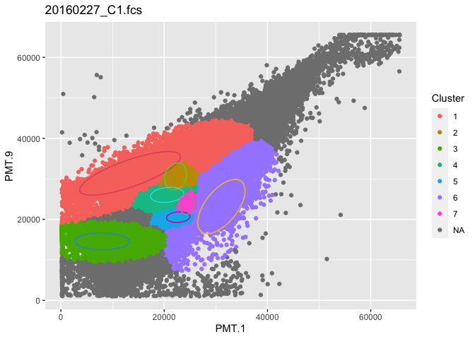<!-- -->

    ## 
    ## 
    ## Table: 20160229_C1.fcs
    ## 
    ## |Cluster |  Cells|     Area|Coordinate          |
    ## |:-------|------:|--------:|:-------------------|
    ## |1       |   6754|  1674993|(2281.49,23650.56)  |
    ## |2       |  21238|  7647267|(21353.56,10564.10) |
    ## |3       |  32900|  4103798|(23297.84,25238.05) |
    ## |4       | 113672| 16056215|(22170.48,32321.53) |
    ## |5       |  25281|  3233824|(13617.49,13338.57) |
    ## |6       | 227465|  5556609|(9398.10,16357.73)  |
    ## |7       |  30115|  2299286|(21275.35,21613.73) |
    ## |8       |  94175|  6543182|(16359.43,24129.97) |

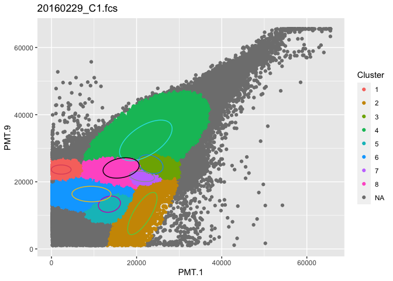<!-- -->

    ## 
    ## 
    ## Table: 20160301_C1.fcs
    ## 
    ## |Cluster |  Cells|       Area|Coordinate          |
    ## |:-------|------:|----------:|:-------------------|
    ## |1       |  41858|   890797.4|(14184.69,21504.35) |
    ## |2       | 127510| 27805848.8|(17483.61,32457.86) |
    ## |3       |  48641|   822433.5|(10595.32,15973.42) |
    ## |4       |  49764|  3890662.8|(13420.13,13356.08) |
    ## |5       |  13780|   939193.4|(21554.48,9972.49)  |
    ## |6       |  51433|  1332008.9|(22191.95,20894.12) |
    ## |7       |  22544|   824168.9|(12517.47,19886.56) |
    ## |8       |    413|   170547.0|(47250.35,54913.85) |
    ## |9       |   1555|   743694.6|(29493.31,40930.06) |
    ## |10      |  26334|  3083920.7|(19248.75,7450.61)  |
    ## |11      |  58992|   737461.8|(8667.82,16117.60)  |

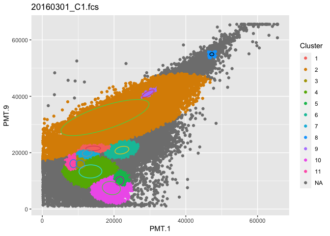<!-- -->

    ## 
    ## 
    ## Table: 20160302_C1.fcs
    ## 
    ## |Cluster | Cells|     Area|Coordinate          |
    ## |:-------|-----:|--------:|:-------------------|
    ## |1       | 26402|  3560434|(14732.60,21615.72) |
    ## |2       | 46939|  5006637|(22211.10,25576.45) |
    ## |3       | 29620|  2080196|(22040.07,21636.95) |
    ## |4       | 64578|  5650920|(9701.31,16090.15)  |
    ## |5       | 19138| 13072620|(19389.03,8183.88)  |

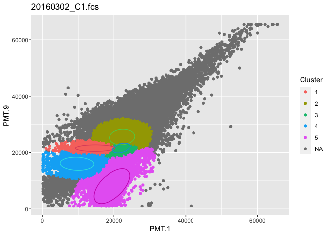<!-- -->

    ## 
    ## 
    ## Table: 20160303_C1.fcs
    ## 
    ## |Cluster | Cells|     Area|Coordinate          |
    ## |:-------|-----:|--------:|:-------------------|
    ## |1       | 15762| 16275357|(19414.17,8973.95)  |
    ## |2       | 37082|  1979346|(21613.63,21165.87) |
    ## |3       | 80529|  4704773|(9957.85,16191.74)  |
    ## |4       | 30070|  3701227|(14009.39,21567.39) |
    ## |5       | 20171|  1442424|(22132.70,25683.66) |

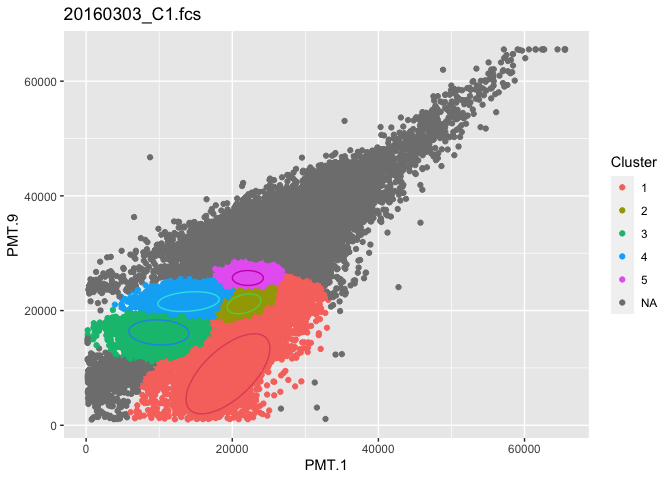<!-- -->

    ## 
    ## 
    ## Table: 20160304_C1.fcs
    ## 
    ## |Cluster | Cells|       Area|Coordinate          |
    ## |:-------|-----:|----------:|:-------------------|
    ## |1       | 61843| 19626271.8|(19691.05,9502.68)  |
    ## |2       | 23422|  1739255.0|(22181.24,25584.08) |
    ## |3       | 30969|  3983709.3|(13483.05,19781.00) |
    ## |4       | 23585| 44122775.0|(20823.67,33920.50) |
    ## |5       | 48363|  1932323.0|(9792.65,15788.33)  |
    ## |6       | 13147|   528681.6|(12227.74,15950.29) |

<!-- -->

    ## 
    ## 
    ## Table: 20160305_C1.fcs
    ## 
    ## |Cluster | Cells|      Area|Coordinate          |
    ## |:-------|-----:|---------:|:-------------------|
    ## |1       |  6266| 8288007.0|(6133.08,11434.59)  |
    ## |2       | 70162| 1340111.6|(20159.07,21023.97) |
    ## |3       | 10713| 2719099.6|(16046.51,30260.05) |
    ## |4       |  2134| 1834881.7|(17552.49,32940.60) |
    ## |5       |  1040|  831706.3|(29332.42,40709.27) |
    ## |6       | 38772| 1628127.5|(22371.74,25851.65) |
    ## |7       | 40910| 5905881.3|(10107.91,15879.23) |

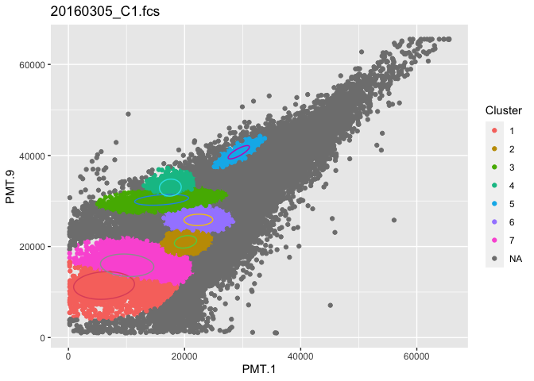<!-- -->

    ## 
    ## 
    ## Table: 20160307_C1.fcs
    ## 
    ## |Cluster | Cells|     Area|Coordinate          |
    ## |:-------|-----:|--------:|:-------------------|
    ## |1       | 18683|  5763301|(12913.59,18987.48) |
    ## |2       | 19405| 13523371|(15323.57,9322.29)  |
    ## |3       | 22578|  1743820|(21339.28,25484.06) |
    ## |4       | 15685|  2148740|(10397.23,15548.88) |
    ## |5       | 15330| 11374488|(14434.12,30878.51) |
    ## |6       | 25870|  3872492|(23446.92,14644.39) |
    ## |7       | 19485|  2963034|(22558.97,31843.27) |
    ## |8       | 25198|  1214264|(21249.46,21268.33) |
    ## |9       | 10106|  6650228|(6735.92,11844.96)  |

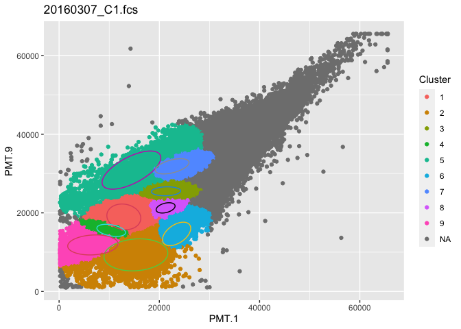<!-- -->

    ## 
    ## 
    ## Table: 20160308_C1.fcs
    ## 
    ## |Cluster | Cells|       Area|Coordinate          |
    ## |:-------|-----:|----------:|:-------------------|
    ## |1       |  7994|  1794857.0|(22269.53,31888.11) |
    ## |2       | 11070|  9521261.4|(6722.05,12166.70)  |
    ## |3       | 12514|  4331505.8|(12512.33,19154.33) |
    ## |4       | 31900|  3021200.3|(22163.06,25387.17) |
    ## |5       | 16187| 11860262.2|(15975.37,9768.21)  |
    ## |6       | 40722|  4629939.1|(19104.38,15752.30) |
    ## |7       | 15331|  2317201.6|(23422.33,14914.63) |
    ## |8       | 10221|  9915733.4|(13535.59,31260.77) |
    ## |9       | 11739|  2569909.2|(10002.33,15961.20) |
    ## |10      | 19192|   814131.8|(21274.02,21866.74) |
    ## |11      | 21544| 28156834.0|(46657.86,51305.72) |
    ## |12      |  1824|   885884.0|(29344.13,40941.97) |

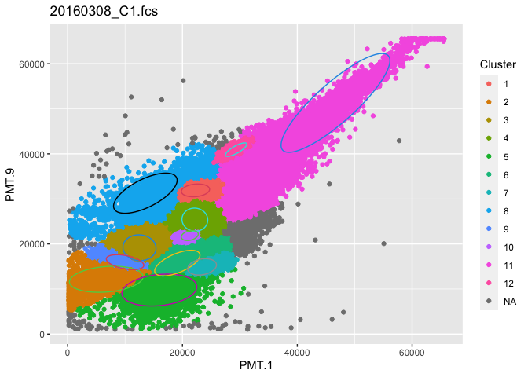<!-- -->

    ## 
    ## 
    ## Table: 20160310_C1.fcs
    ## 
    ## |Cluster | Cells|     Area|Coordinate          |
    ## |:-------|-----:|--------:|:-------------------|
    ## |1       | 68131| 86756529|(27496.06,35689.35) |
    ## |2       | 50441|  3365133|(25196.36,20224.43) |
    ## |3       | 11807|  5039379|(16237.59,10490.64) |
    ## |4       | 20921| 16774876|(9500.77,15387.24)  |
    ## |5       | 51413|  6683745|(22855.21,13975.42) |

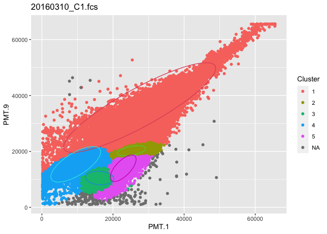<!-- -->

    ## 
    ## 
    ## Table: 20160311_C1.fcs
    ## 
    ## |Cluster | Cells|     Area|Coordinate          |
    ## |:-------|-----:|--------:|:-------------------|
    ## |1       |  6795|  2888595|(6069.56,12083.48)  |
    ## |2       | 11870| 10065295|(14904.98,31413.20) |
    ## |3       | 17188|  7825943|(11141.86,14717.32) |
    ## |4       | 47830|  6104304|(23402.29,22465.73) |
    ## |5       | 20730|  8524154|(8197.24,25788.89)  |
    ## |6       | 40773|  3086190|(26182.28,20484.53) |
    ## |7       | 40388|  6298162|(21497.76,12107.70) |

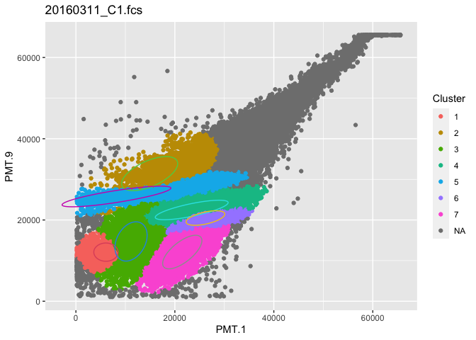<!-- -->

## Files written

These files have been written to the target directory,
`data/02c-flowEMMi-on-Liu-data`:

``` r
projthis::proj_dir_info(path_target())
```

    ## # A tibble: 0 × 4
    ## # ℹ 4 variables: path <fs::path>, type <fct>, size <fs::bytes>,
    ## #   modification_time <dttm>
