02d-flowEMMi on Li data
================
Compiled at 2023-09-28 07:38:47 UTC

``` r
here::i_am(paste0(params$name, ".Rmd"), uuid = "d3e0af79-f065-4177-b253-96103317f2cb")
```

The purpose of this document is …

``` r
library("conflicted")
library(purrr)
library(dplyr)
library(flowEMMi)
```

    ## For detailed instructions please run browseVignettes('flowEMMi').
    ##   For an overview of available functions please run library(help='flowEMMi')

``` r
library(flowWorkspace)
```

    ## As part of improvements to flowWorkspace, some behavior of
    ## GatingSet objects has changed. For details, please read the section
    ## titled "The cytoframe and cytoset classes" in the package vignette:
    ## 
    ##   vignette("flowWorkspace-Introduction", "flowWorkspace")

``` r
library(flowCore)
library(ggcyto)
```

    ## Loading required package: ggplot2

    ## Loading required package: ncdfFlow

    ## Loading required package: BH

``` r
library(tidyverse)
```

    ## ── Attaching core tidyverse packages ──────────────────────── tidyverse 2.0.0 ──
    ## ✔ forcats   1.0.0     ✔ stringr   1.5.0
    ## ✔ lubridate 1.9.2     ✔ tibble    3.2.1
    ## ✔ readr     2.1.4     ✔ tidyr     1.3.0

``` r
library(RColorBrewer)
library(knitr)
library(ellipse)
library(ggforce)
```

``` r
# create or *empty* the target directory, used to write this file's data: 
projthis::proj_create_dir_target(params$name, clean = TRUE)

# function to get path to target directory: path_target("sample.csv")
path_target <- projthis::proj_path_target(params$name)

# function to get path to previous data: path_source("00-import", "sample.csv")
path_source <- projthis::proj_path_source(params$name)
```

## Microbial data from Li’s team

### Import preprocessed data

``` r
Nov <- readRDS("~/Desktop/MSc_new_data/Nov.rds")
gating_Nov <- readRDS("~/Desktop/MSc_new_data/gating_Nov.rds")
```

### flowEMMI gating on Li’s data

Based on the scatter plot in 01-data, we could tell that except for the
sample taken in the surrounding region, the cells of other region
samples are mostly concentrated in the range of 500 to 4000.

``` r
set.seed(1)
gating_Nov <- list()

for (i in 1:length(Nov)){
  data_name <- names(Nov)[i]
  data <- Nov[[i]]
  fdo <- mkFlowDataObject(data, xChannel="FS.Log", yChannel="FL.4.Log")
  gating <- flowEMMi( fdo=fdo, xMin=500, xMax=4000, yMin=500, yMax=4000
                      , initFraction=0.01
                      , finalFraction=1.0
                      , minClusters=3, maxClusters=20, clusterbracket=2
                      , numberOfInits=5
                      , verbose=TRUE
                      , parallel=FALSE
                      , convergenceEpsilon=0.01
                      , whenToRemoveOverlaps = 20
                      , mergeWhenCenter = FALSE
                      , mergeWhenTwoCenters = FALSE
                      , thresholdForDeletion = 0.2
                      , threshold = 0.9
                      , considerWeights=TRUE
                      , plot = FALSE
                      , alpha=0.9
                      , minMinor=500)
  gating_Nov[[i]] <- gating$best
}
```

### Gating plots on Li data

``` r
gating_Nov_plot <- list()

for (i in 1:9){
  data_name <- names(Nov)[i]
  data <- Nov[[i]]
  plots <- plotDensityAndEllipses(fcsData = data, ch1="FS.Log", ch2="FL.4.Log", alpha=0.9,
                            logScale = F, results = gating_Nov[[i]],
                            title = data_name, plotRelevance = T,
                            ellipseDotSize = 0.5, axis_size=10, axisLabeling_size=10,
                            xlab = "Forward Scatter", ylab = "DAPI", font = "Arial")
  gating_Nov_plot[[i]] <- plots$plot
}
```

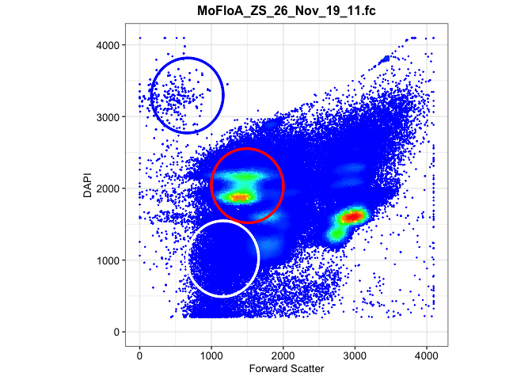<!-- -->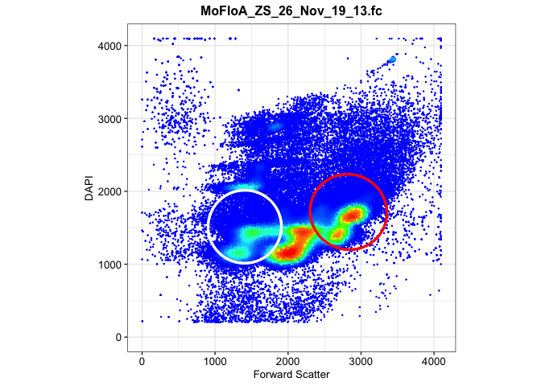<!-- -->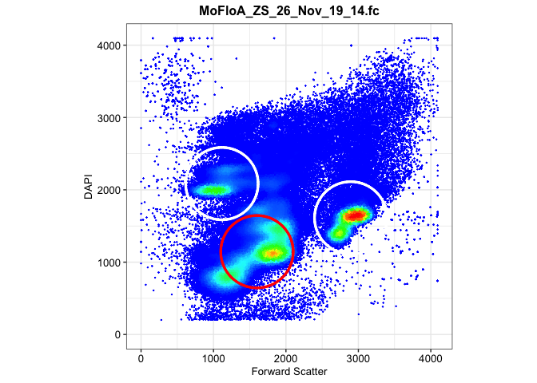<!-- -->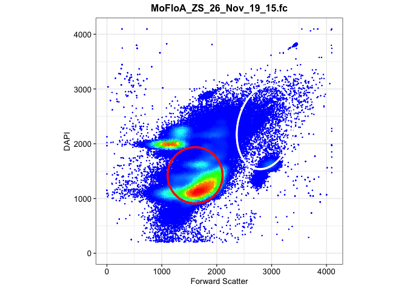<!-- -->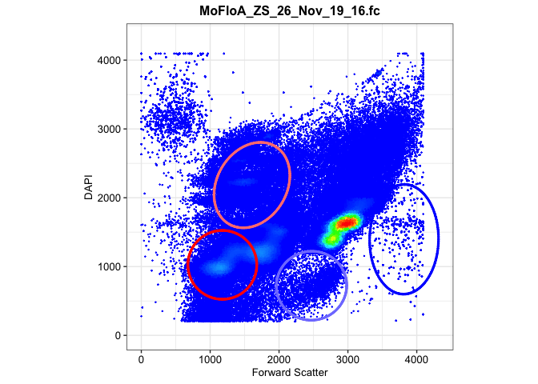<!-- -->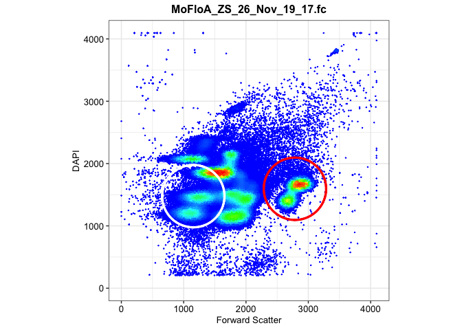<!-- -->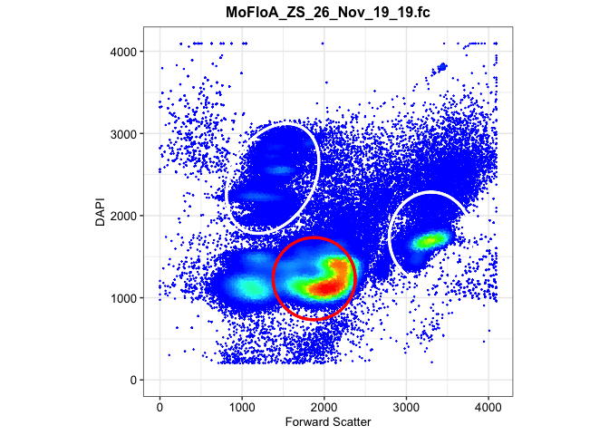<!-- -->

    ## Warning in KernSmooth::bkde2D(x, bandwidth = bandwidth, gridsize = nbin, :
    ## Binning grid too coarse for current (small) bandwidth: consider increasing
    ## 'gridsize'

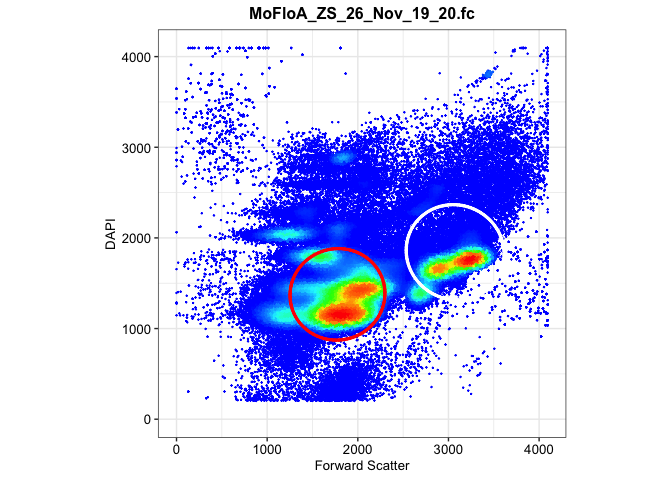<!-- -->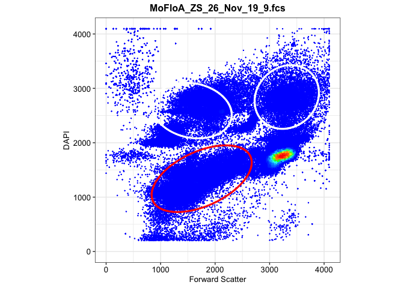<!-- -->

## Mahalanobis distance function with flowEMMi

Following is the integrated function.

Given a preprocessed dataset and the gating result from above, it can
generate the:

- Mahalanobis distance matrix & Cluster result

- Parameter table: Number of cells in each cluster, Area of the
  clustering ellipse, and the Coordinates of center

- Gating plots

``` r
flowEMMi_mahalanobis <- function(data,data_name,gating_data,alpha){
  
  mu <- gating_data@mu
  sigma <- gating_data@sigma
  
  names <- colnames(data)
  
  n_cells <- nrow(data)
  n_clusters <- length(sigma)
  
  #generate mahalanobis matrix
  maha_data <- matrix(NA,nrow=n_cells,ncol=n_clusters)
  
  for (i in 1:n_cells){
    for(j in 1:n_clusters){
      maha_data[i,j] <- mahalanobis(data[i,],mu[,j],sigma[[j]])
    }
  }
  
  maha <- maha_data[,2:n_clusters] %>% as.data.frame()
  
  #set 95% quantile as cutoff value
  threshold <- (-2*log(1-alpha))^2
  
  #determine cluster
  for (cell in 1:n_cells){
    rv <- maha[cell,1:n_clusters-1]
    if(all(rv>threshold)) { maha$Cluster[cell] <- NA}
    else { maha$Cluster[cell] <- which.min(rv)}
  }
  
  maha_data2 <- cbind(data,maha)
  
  test <- table(maha[,ncol(maha)]) %>% as.data.frame()
  coordinates <- sprintf("(%.2f,%.2f)",mu[1,2:ncol(mu)],mu[2,2:ncol(mu)])
  
  #Area of Ellipse
  eigen <- matrix(NA,nrow=length(sigma),ncol=2)
  for (i in 1:length(sigma)){
    eigen[i,] <- eigen(sigma[[i]])$values
  }
  eigen <- eigen[-1,]
  
  area <- matrix(NA,nrow=nrow(eigen),ncol=1)
  for (i in 1:nrow(eigen)){
    area[i,1] <- pi*sqrt(eigen[i,1]*eigen[i,2])
  }
  
  area <- area %>% as.data.frame()
  test <- cbind(test,area,coordinates)
  table <- test %>% 
    kable(caption = data_name,
          col.names = c("Cluster","Cells","Area","Coordinate"))
   
  #plot
  maha_data2$Cluster <- as.factor(maha_data2$Cluster)
  
  plot1 <- ggplot(maha_data2,aes(x=!!sym(names[1]),y=!!sym(names[2]),color=Cluster))+
    geom_point()+
    ggtitle(data_name)
  
  num_ellipse <- length(gating_data@sigma)
  
  for (j in 2:num_ellipse){
    mu <- gating_data@mu[,j]
    sigma <- gating_data@sigma[[j]]
    eli <- ellipse::ellipse(centre=mu,x=sigma,level=0.95,npoints=200) 
    eli <- as.data.frame(eli)
    colnames(eli)<- names
    plot1 <- plot1+geom_path(data = eli,
                  aes(x=!!sym(names[1]),y=!!sym(names[2])),color=j)
  }
  
  maha_result <- list(maha_matrix=maha_data2,table_info=table,plot=plot1)
  return(maha_result)
}
```

## Application on Li data

``` r
flowemmi_Nov <- list()

for (i in 1:9){
  data <- Nov[[i]]@exprs[,c(2,7)]
  data_name <- names(Nov)[i]
  gating_data <- gating_Nov[[i]]
  flowemmi_Nov[[data_name]] <-flowEMMi_mahalanobis(data,data_name,gating_data,0.95)
  print(flowemmi_Nov[[i]]$table_info)
  print(flowemmi_Nov[[i]]$plot)
}
```

    ## 
    ## 
    ## Table: MoFloA_ZS_26_Nov_19_11.fc
    ## 
    ## |Cluster |  Cells|     Area|Coordinate        |
    ## |:-------|------:|--------:|:-----------------|
    ## |1       |  24356| 180348.3|(1156.23,1019.02) |
    ## |2       |   1115| 178307.6|(662.84,3293.94)  |
    ## |3       | 117590| 176806.3|(1499.72,2036.60) |

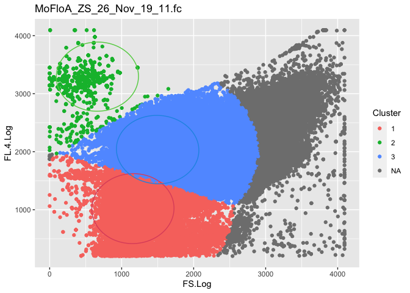<!-- -->

    ## 
    ## 
    ## Table: MoFloA_ZS_26_Nov_19_13.fc
    ## 
    ## |Cluster |  Cells|     Area|Coordinate        |
    ## |:-------|------:|--------:|:-----------------|
    ## |1       |  98427| 171464.7|(1406.21,1514.85) |
    ## |2       | 102486| 185540.0|(2828.21,1716.79) |

<!-- -->

    ## 
    ## 
    ## Table: MoFloA_ZS_26_Nov_19_14.fc
    ## 
    ## |Cluster | Cells|   Area|Coordinate        |
    ## |:-------|-----:|------:|:-----------------|
    ## |1       | 42748| 170547|(1115.94,2085.91) |
    ## |2       | 62614| 170547|(2895.12,1612.51) |
    ## |3       | 94491| 170547|(1600.04,1144.37) |

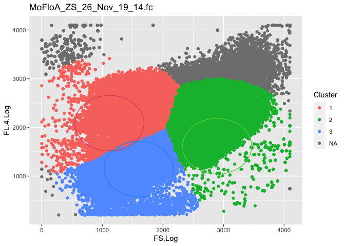<!-- -->

    ## 
    ## 
    ## Table: MoFloA_ZS_26_Nov_19_15.fc
    ## 
    ## |Cluster |  Cells|     Area|Coordinate        |
    ## |:-------|------:|--------:|:-----------------|
    ## |1       |  17680| 264425.6|(2878.80,2301.98) |
    ## |2       | 184394| 175100.0|(1606.24,1423.11) |

<!-- -->

    ## 
    ## 
    ## Table: MoFloA_ZS_26_Nov_19_16.fc
    ## 
    ## |Cluster | Cells|     Area|Coordinate        |
    ## |:-------|-----:|--------:|:-----------------|
    ## |1       | 47415| 174352.1|(2471.82,721.46)  |
    ## |2       | 79969| 271858.5|(3815.71,1396.13) |
    ## |3       | 43074| 170547.0|(1176.52,1024.70) |
    ## |4       | 38420| 227029.5|(1606.82,2183.78) |

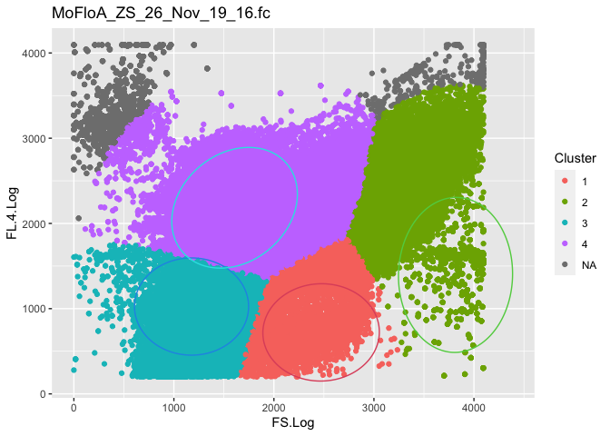<!-- -->

    ## 
    ## 
    ## Table: MoFloA_ZS_26_Nov_19_17.fc
    ## 
    ## |Cluster |  Cells|   Area|Coordinate        |
    ## |:-------|------:|------:|:-----------------|
    ## |1       |  57450| 170547|(2785.49,1595.44) |
    ## |2       | 143292| 170547|(1154.74,1477.16) |

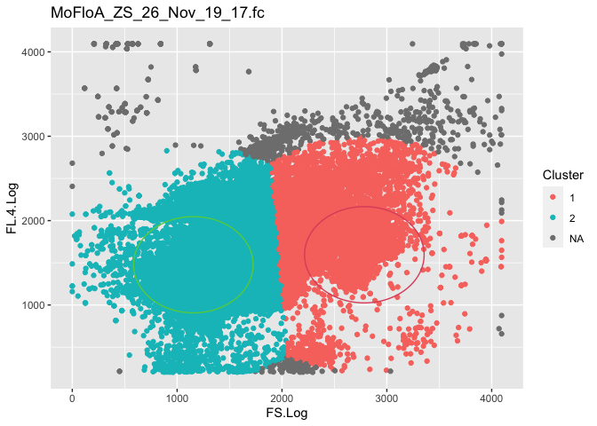<!-- -->

    ## 
    ## 
    ## Table: MoFloA_ZS_26_Nov_19_19.fc
    ## 
    ## |Cluster |  Cells|     Area|Coordinate        |
    ## |:-------|------:|--------:|:-----------------|
    ## |1       |  22771| 244495.7|(1371.75,2451.41) |
    ## |2       |  28461| 189680.0|(3293.95,1732.63) |
    ## |3       | 152496| 170547.0|(1877.35,1232.44) |

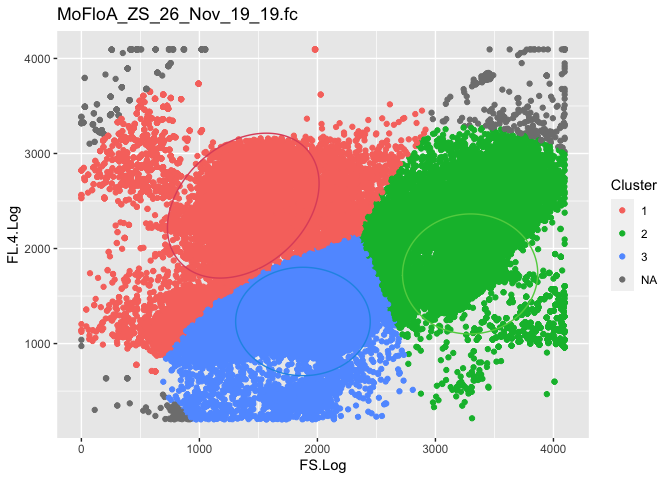<!-- -->

    ## 
    ## 
    ## Table: MoFloA_ZS_26_Nov_19_20.fc
    ## 
    ## |Cluster |  Cells|     Area|Coordinate        |
    ## |:-------|------:|--------:|:-----------------|
    ## |1       |  61168| 193685.2|(3074.53,1841.13) |
    ## |2       | 140806| 180192.5|(1775.66,1377.35) |

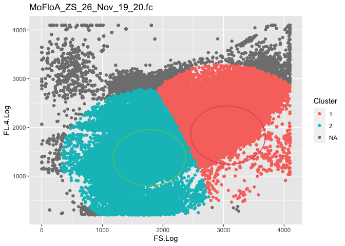<!-- -->

    ## 
    ## 
    ## Table: MoFloA_ZS_26_Nov_19_9.fcs
    ## 
    ## |Cluster |  Cells|     Area|Coordinate        |
    ## |:-------|------:|--------:|:-----------------|
    ## |1       |  24491| 233463.9|(3314.98,2841.08) |
    ## |2       | 157144| 335590.6|(1753.49,1339.24) |
    ## |3       |  24377| 250705.1|(1578.02,2592.63) |

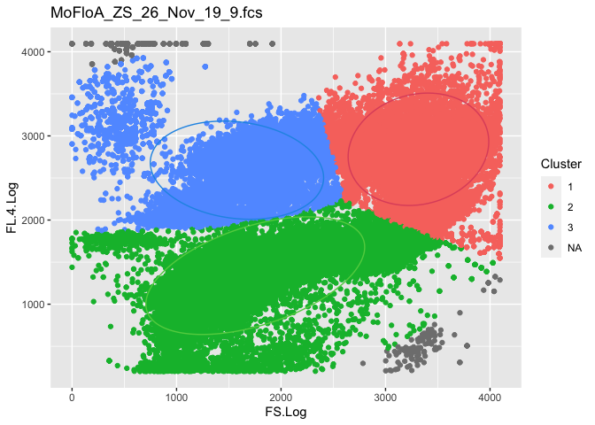<!-- -->

## Files written

These files have been written to the target directory,
`data/02d-flowEMMi on Li data`:

``` r
projthis::proj_dir_info(path_target())
```

    ## # A tibble: 0 × 4
    ## # ℹ 4 variables: path <fs::path>, type <fct>, size <fs::bytes>,
    ## #   modification_time <dttm>
