04a-GMM for Z-project
================
Compiled at 2023-09-27 15:51:35 UTC

``` r
here::i_am(paste0(params$name, ".Rmd"), uuid = "9d6a84ea-ebe8-4073-bfe1-9e2529a9d667")
```

The purpose of this document is …

``` r
library("conflicted")
library(purrr)
library(dplyr)
library(flowCore)
library(mclust)
```

    ## Package 'mclust' version 6.0.0
    ## Type 'citation("mclust")' for citing this R package in publications.

``` r
# create or *empty* the target directory, used to write this file's data: 
projthis::proj_create_dir_target(params$name, clean = TRUE)

# function to get path to target directory: path_target("sample.csv")
path_target <- projthis::proj_path_target(params$name)

# function to get path to previous data: path_source("00-import", "sample.csv")
path_source <- projthis::proj_path_source(params$name)
```

## Import data

``` r
DAPI <- readRDS("~/Desktop/MSc_new_data/new_DAPI.rds")
FDA_PI <- readRDS("~/Desktop/MSc_new_data/new_FDA_PI.rds")
gating_DAPI <- readRDS("~/Desktop/MSc_new_data/gating_DAPI.rds")
gating_FDA_PI <- readRDS("~/Desktop/MSc_new_data/gating_FDA_PI.rds")
```

Generate function body.

``` r
flowGMM <- function(data,n_cluster){
  model1 <- Mclust(data,G=n_cluster,modelNames = "VVV")
  summary(model1)

  clusters1 <- predict(model1)
  result1 <- cbind(data,Cluster=clusters1$classification)
  result1 <- as.data.frame(result1)
  result1$Cluster <- as.factor(result1$Cluster)
  
  result <- list(model=model1,parameter=model1$parameters,class_result=result1)
  return(result)
}
```

## DAPI

In the first part, we don’t specify the number of clusters, the best
results will be determined by cross validation.

``` r
DAPI_GMM <- list()

for (i in 1:5){
  data <- DAPI[[i]]@exprs[,c(11,27)]
  data_name <- names(DAPI)[i]
  DAPI_GMM[[data_name]]<-flowGMM(data,NULL)
  
  par(mar = c(3,3,1,1))
  plot(DAPI_GMM[[i]]$model,what="classification",main=data_name,xlab="PMT.1",ylab="PMT.9")
  plot(DAPI_GMM[[i]]$model,what="BIC")
}
```

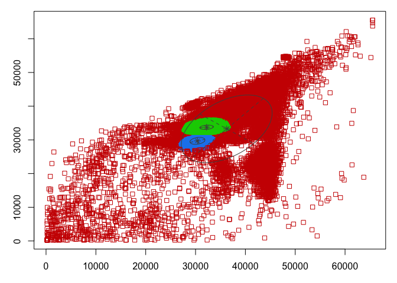<!-- -->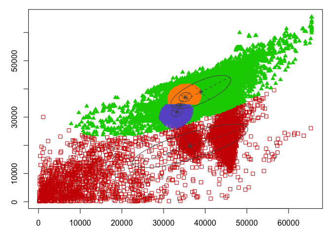<!-- -->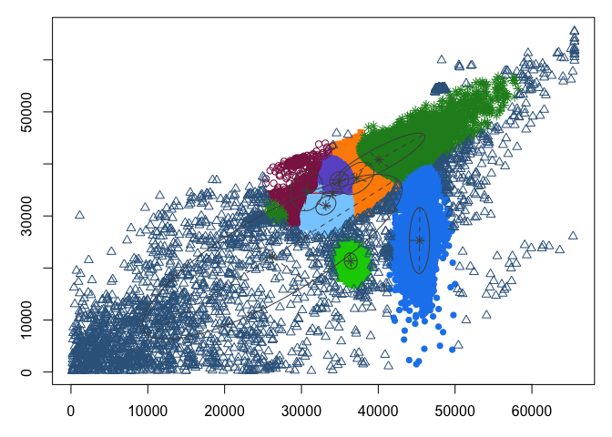<!-- -->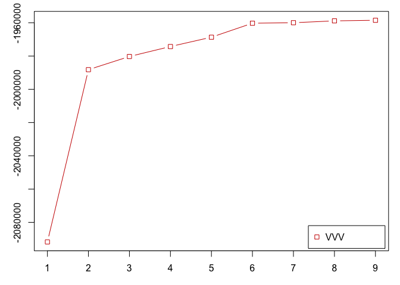<!-- -->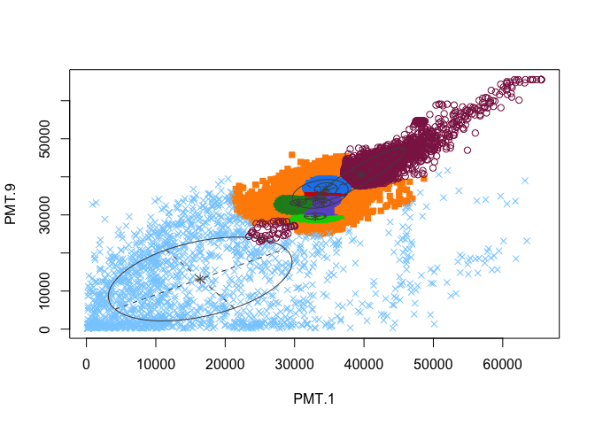<!-- -->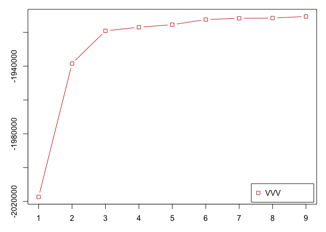<!-- -->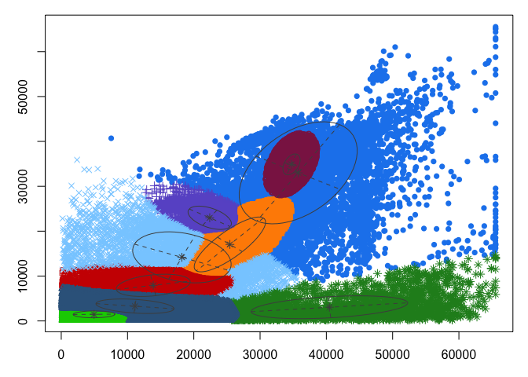<!-- -->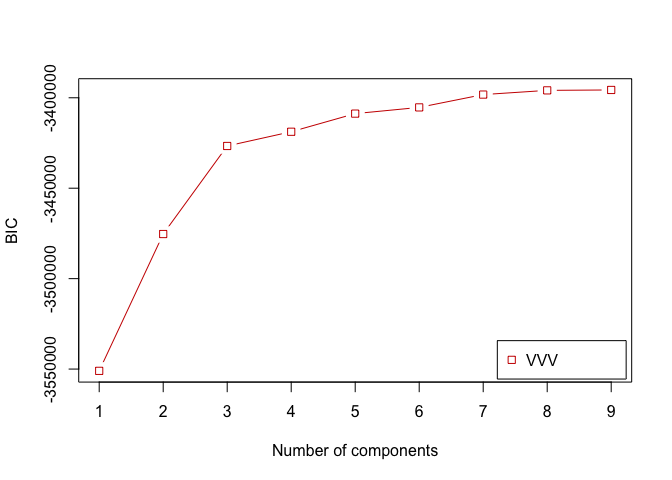<!-- -->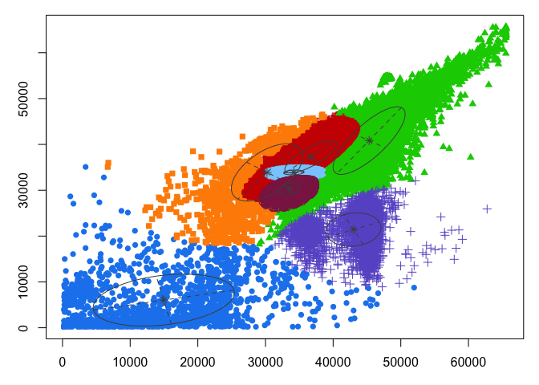<!-- -->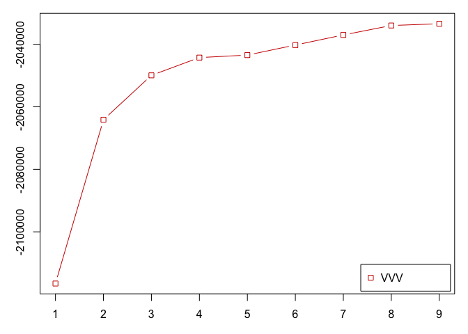<!-- -->

Next, we’d like to fix the cluster number to be the same as it generates
by flowEMMi.

``` r
DAPI_GMM_flowemmi <- list()

for (i in 1:5){
  data <- DAPI[[i]]@exprs[,c(11,27)]
  data_name <- names(DAPI)[i]
  n_cluster <- length(gating_DAPI[[i]]@sigma)
  DAPI_GMM_flowemmi[[data_name]]<-flowGMM(data,n_cluster)
  
  par(mar = c(3,3,1,1))
  plot(DAPI_GMM_flowemmi[[i]]$model,what="classification",main=data_name,xlab="PMT.1",ylab="PMT.9")
}
```

<!-- -->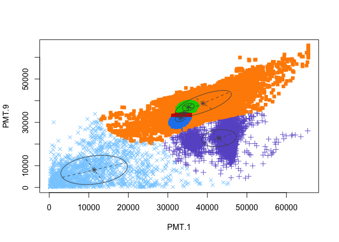<!-- -->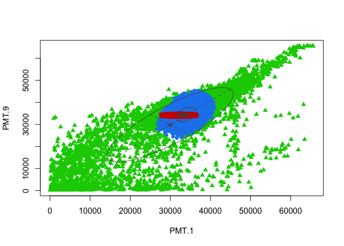<!-- -->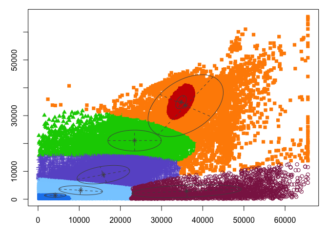<!-- -->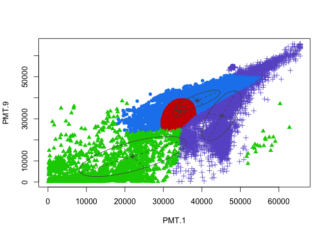<!-- -->

The same procedure for FDA_PI dataset.

## FDA_PI

``` r
FDA_PI_GMM <- list()

for (i in 1:5){
  data <- FDA_PI[[i]]@exprs[,c(11,15)]
  data_name <- names(FDA_PI)[i]
  FDA_PI_GMM[[data_name]]<-flowGMM(data,NULL)
  
  par(mar = c(3,3,1,1))
  plot(FDA_PI_GMM[[i]]$model,what="classification",main=data_name,xlab="PMT.1",ylab="PMT.3")
  plot(FDA_PI_GMM[[i]]$model,what="BIC",main=data_name,xlab="PMT.1",ylab="PMT.3")
}
```

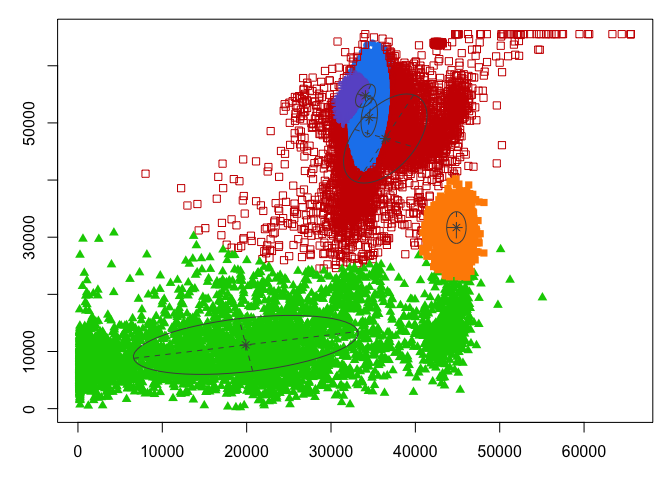<!-- -->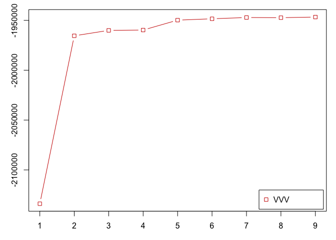<!-- -->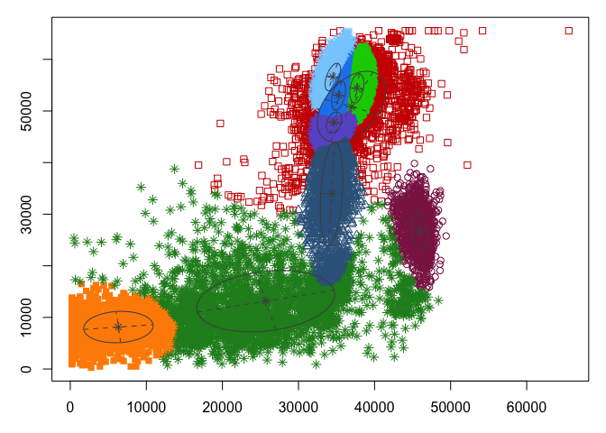<!-- -->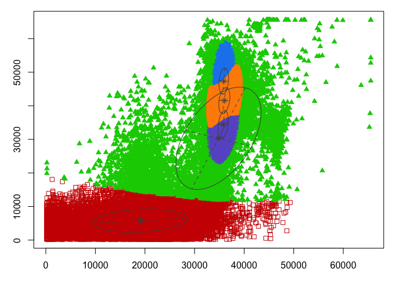<!-- -->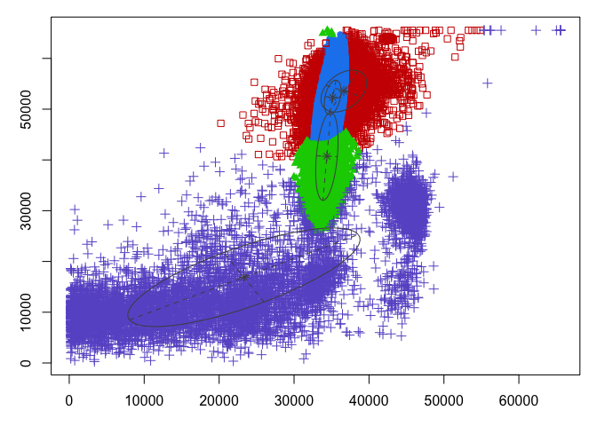<!-- -->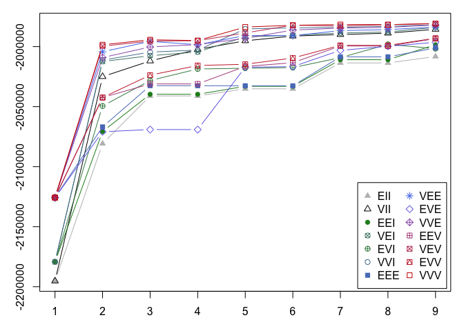<!-- -->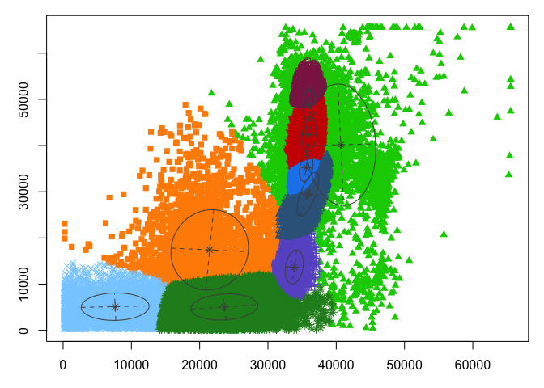<!-- -->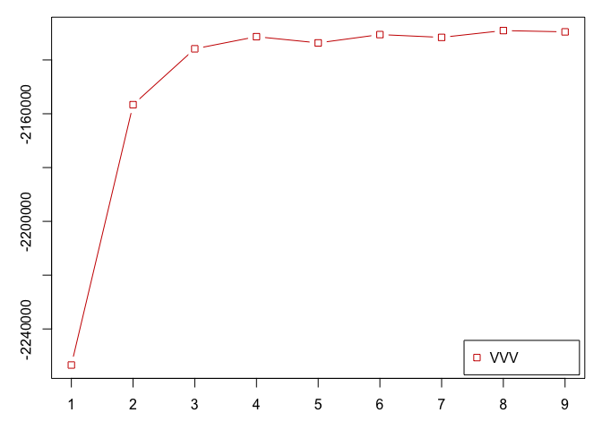<!-- -->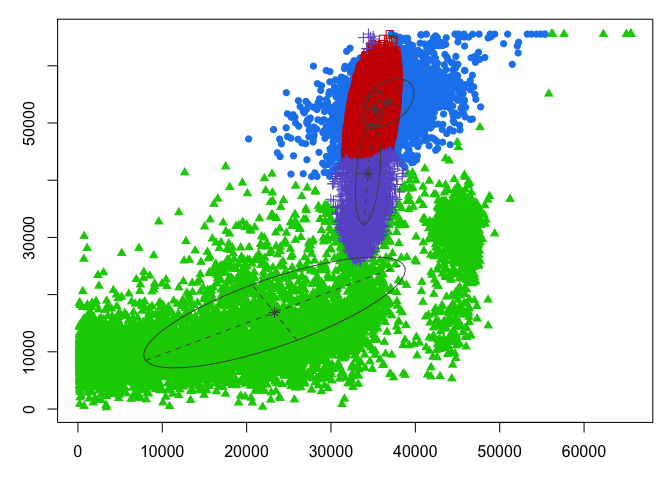<!-- -->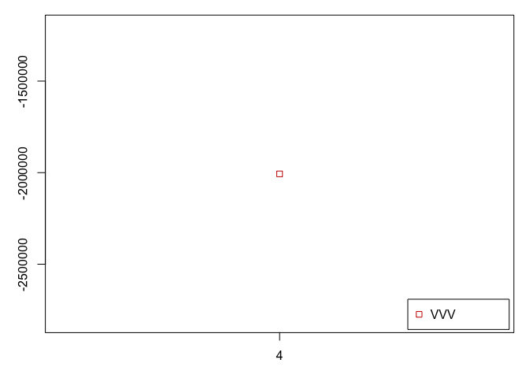<!-- -->

``` r
FDA_PI_GMM_flowemmi <- list()

for (i in 1:5){
  data <- FDA_PI[[i]]@exprs[,c(11,15)]
  data_name <- names(FDA_PI)[i]
  n_cluster <- length(gating_FDA_PI[[i]]@sigma)
  FDA_PI_GMM_flowemmi[[data_name]]<-flowGMM(data,n_cluster)
  
  par(mar = c(3,3,1,1))
  plot(FDA_PI_GMM_flowemmi[[i]]$model,what="classification",main=data_name,xlab="PMT.1",ylab="PMT.3")
}
```

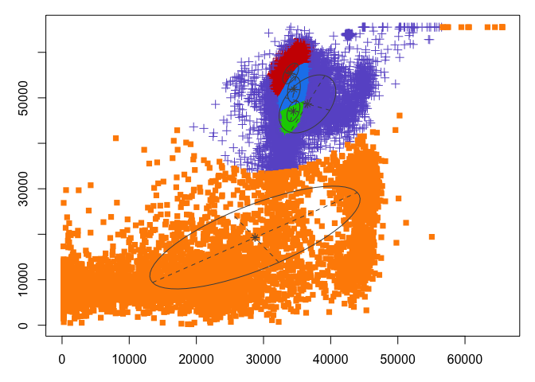<!-- -->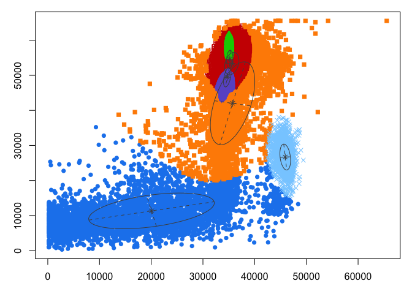<!-- -->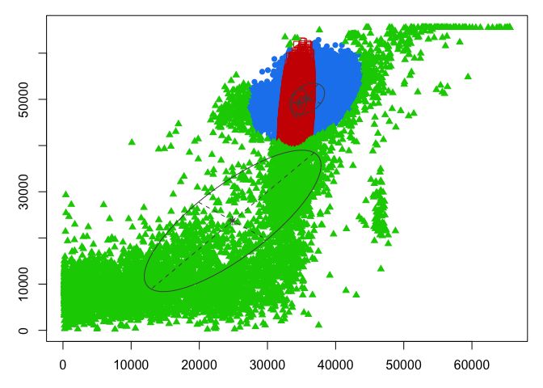<!-- -->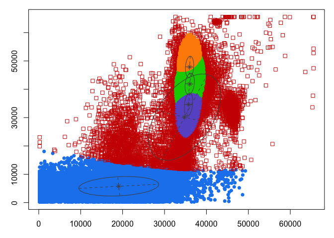<!-- -->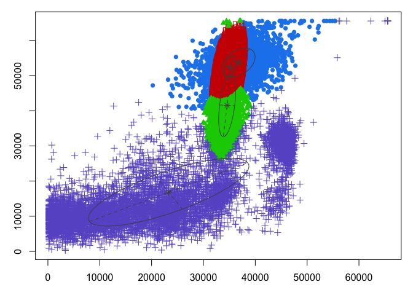<!-- -->

## Files written

These files have been written to the target directory,
`data/04a-GMM for Z-project`:

``` r
projthis::proj_dir_info(path_target())
```

    ## # A tibble: 0 × 4
    ## # ℹ 4 variables: path <fs::path>, type <fct>, size <fs::bytes>,
    ## #   modification_time <dttm>
