04a-GMM for Z-project
================
Compiled at 2023-11-19 18:54:07 UTC

``` r
here::i_am(paste0(params$name, ".Rmd"), uuid = "9d6a84ea-ebe8-4073-bfe1-9e2529a9d667")
```

The purpose of this document is …

``` r
library("conflicted")
library(purrr)
library(dplyr)
library(flowCore)
library(ggplot2)
library(mclust)
```

    ## Package 'mclust' version 6.0.0
    ## Type 'citation("mclust")' for citing this R package in publications.

``` r
library(flowEMMi)
```

    ## For detailed instructions please run browseVignettes('flowEMMi').
    ##   For an overview of available functions please run library(help='flowEMMi')

``` r
library(factoextra)
```

    ## Welcome! Want to learn more? See two factoextra-related books at https://goo.gl/ve3WBa

``` r
library(flowClust)
library(flowViz)
```

    ## Loading required package: lattice

``` r
library(flowMerge)
```

    ## Loading required package: graph

    ## Loading required package: BiocGenerics

    ## 
    ## Attaching package: 'BiocGenerics'

    ## The following object is masked from 'package:flowClust':
    ## 
    ##     Map

    ## The following object is masked from 'package:flowCore':
    ## 
    ##     normalize

    ## The following objects are masked from 'package:dplyr':
    ## 
    ##     combine, intersect, setdiff, union

    ## The following objects are masked from 'package:stats':
    ## 
    ##     IQR, mad, sd, var, xtabs

    ## The following objects are masked from 'package:base':
    ## 
    ##     anyDuplicated, aperm, append, as.data.frame, basename, cbind,
    ##     colnames, dirname, do.call, duplicated, eval, evalq, Filter, Find,
    ##     get, grep, grepl, intersect, is.unsorted, lapply, Map, mapply,
    ##     match, mget, order, paste, pmax, pmax.int, pmin, pmin.int,
    ##     Position, rank, rbind, Reduce, rownames, sapply, setdiff, sort,
    ##     table, tapply, union, unique, unsplit, which.max, which.min

    ## Loading required package: feature

    ## Loading required package: Rgraphviz

    ## Loading required package: grid

    ## Loading required package: foreach

    ## 
    ## Attaching package: 'foreach'

    ## The following objects are masked from 'package:purrr':
    ## 
    ##     accumulate, when

    ## Loading required package: snow

``` r
library(MASS)
library(ggpubr)
library(plot3D)
library(VGAMextra)
```

    ## Loading required package: stats4

    ## Loading required package: VGAM

    ## Loading required package: splines

    ## 
    ## Attaching package: 'VGAM'

    ## The following object is masked from 'package:flowCore':
    ## 
    ##     exponential

    ## 
    ##      =====    VGAMextra 0.0-4    ===== 
    ## 
    ## Additions and extensions of the package VGAM.
    ## For more on VGAMextra, visit
    ##      https://www.stat.auckland.ac.nz/~vmir178/
    ## 
    ## For a short description, fixes/bugs, and new
    ## features type vgamextraNEWS().

``` r
library(mvtnorm)
```

``` r
# create or *empty* the target directory, used to write this file's data: 
projthis::proj_create_dir_target(params$name, clean = TRUE)

# function to get path to target directory: path_target("sample.csv")
path_target <- projthis::proj_path_target(params$name)

# function to get path to previous data: path_source("00-import", "sample.csv")
path_source <- projthis::proj_path_source(params$name)
```

## Import data

``` r
DAPI <- readRDS("~/Desktop/MSc_new_data/new_DAPI.rds")
FDA_PI <- readRDS("~/Desktop/MSc_new_data/new_FDA_PI.rds")
gating_DAPI <- readRDS("~/Desktop/MSc_new_data/gating_DAPI.rds")
gating_FDA_PI <- readRDS("~/Desktop/MSc_new_data/gating_FDA_PI.rds")
```

Generate function body.

``` r
flowGMM <- function(data,n_cluster){
  model1 <- Mclust(data,G=n_cluster,modelNames = "VVV")
  summary(model1)

  clusters1 <- predict(model1)
  result1 <- cbind(data,Cluster=clusters1$classification)
  result1 <- as.data.frame(result1)
  result1$Cluster <- as.factor(result1$Cluster)
  
  result <- list(model=model1,parameter=model1$parameters,class_result=result1)
  return(result)
}
```

# GMM

### Gating

In the first part, we don’t specify the number of clusters, the best
results will be determined by cross validation.

``` r
DAPI_GMM <- list()
DAPI_GMM_flowemmi <- list()

for (i in 1:5){
  data <- DAPI[[i]]@exprs[,c(11,27)]
  data_name <- names(DAPI)[i]
  DAPI_GMM[[data_name]]<-flowGMM(data,NULL)
  
  n_cluster <- length(gating_DAPI[[i]]@sigma)
  DAPI_GMM_flowemmi[[data_name]]<-flowGMM(data,n_cluster)
}
```

### gating plot

``` r
DAPI_GMM_3D <- list()
GMM_plot <- list()

for (i in 1:5){
  data_name <- names(DAPI)[i]
  GMM_plot[[i]] <- fviz_mclust(DAPI_GMM_flex[[i]]$model, "classification", geom = "point",main=data_name)
  GMM_plot[[i+5]] <- fviz_mclust(DAPI_GMM_fix[[i]]$model, "classification", 
                                 geom = "point",main="K = flowEMMI")
}

# 2D plots
ggarrange(plotlist = GMM_plot,ncol=5,nrow=2,common.legend = T,legend = "bottom")
```

<!-- -->

``` r
# 3D plots
for (i in 1:5){
  data1 <- DAPI[[i]]@exprs[,c(11,13,27)]
  data_name <- names(DAPI)[i]
  DAPI_GMM_3D[[data_name]]<-flowGMM(data1,NULL)
  plot(DAPI_GMM_3D[[i]]$model,what="classification",main=data_name)
}
```

<!-- -->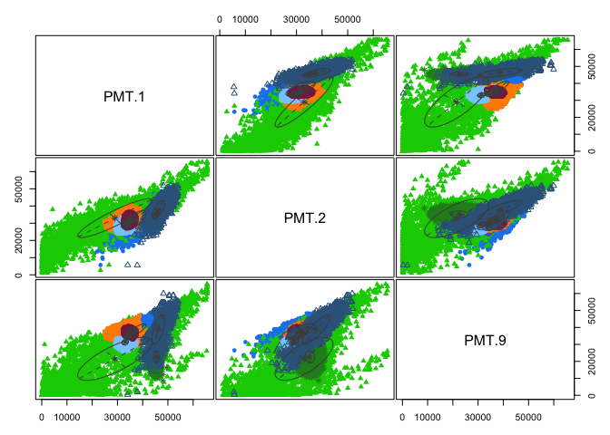<!-- -->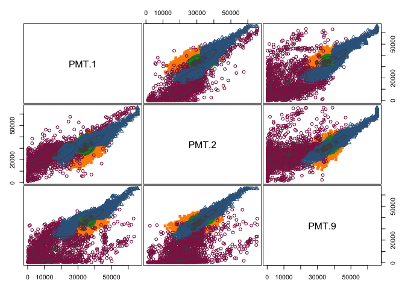<!-- -->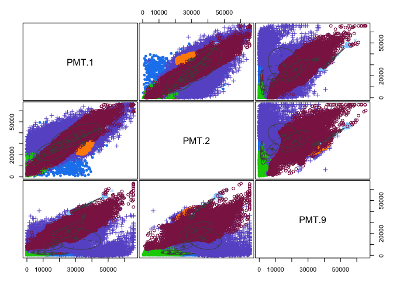<!-- -->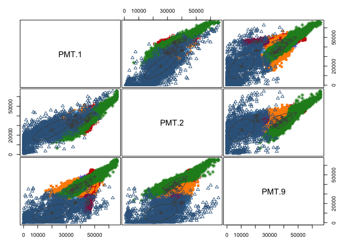<!-- -->

### Meta-clustering

``` r
GMM.merge <- function(gating_list){
  
 all_gate <- gating_DAPI[[1]]
 all_gate@mu <- matrix(NA,nrow=2,ncol=1)
 all_gate@sigma <- list()
 all_gate@clusterProbs <- numeric()

 for (i in 1:5){
    mu <- gating_list[[i]]$parameter$mean
    dim <- dim(gating_list[[i]]$parameter$variance$sigma)[3]
  
    sigma <- list()
    for (j in 1:dim){
      sigma[[j]] <- gating_list[[i]]$parameter$variance$sigma[,,j]
    }
    
    prob <- gating_list[[i]]$parameter$pro
    
    all_gate@mu <- cbind(all_gate@mu,mu)
    all_gate@sigma <- c(all_gate@sigma,sigma)
    all_gate@clusterProbs <- c(all_gate@clusterProbs,prob)
 }
 
 all_gate@mu <- all_gate@mu[,-1]
 
 meta_result <- removeOverlaps(em=all_gate, alpha=0.9
                                  , mergeWhenCenter = FALSE
                                  , mergeWhenTwoCenters = FALSE
                                  , thresholdForDeletion = 0.5
                                  , threshold = 0.9
                                  , shrinkingFunction=shrinkEllipses
                                  , considerWeights=TRUE
                                  , plot = FALSE
                                  , minMinor = 500)
 return(meta_result)
}
```

### meta-gating plots

``` r
location <- c("Inner_zone","Middle_zone","Outer_zone","Surrounding","Whole_colony")
GMM_flex_meta <- GMM.merge(DAPI_GMM_flex)
GMM_fix_meta <- GMM.merge(DAPI_GMM_fix)

meta_plots <- list()

for (i in 1:5){
  data <- DAPI[[i]]
  var <- location[i]
  meta_plots[[i]] <- plotDensityAndEllipses(fcsData = data, ch1="PMT.1", ch2="PMT.9", alpha=0.9,
                            logScale = F, results = GMM_flex_meta,
                            title = paste0("GMM Meta-clust on ",var," with flex. K"), 
                            plotRelevance = T,gridsize = 1000,
                            ellipseDotSize = 0.5, axis_size=10, axisLabeling_size=10,
                            xlab = "Forward Scatter", ylab = "DAPI", font = "Arial")
}
```

<!-- --><!-- --><!-- --><!-- --><!-- -->

## ROC Function

### for points

``` r
GMMroc <- function(data,gating_data,dimension,CI){
  mu <- gating_data$parameter$mean
  dim <- dim(gating_data$parameter$variance$sigma)[3]
  
  sigma <- list()
  for (i in 1:dim){
    sigma[[i]] <- gating_data$parameter$variance$sigma[,,i]
  }
  
  names <- colnames(data)
  
  ncells <- nrow(data)
  n_clusters <- length(sigma)
  
  #generate mahalanobis matrix
  maha_data <- matrix(NA,nrow=ncells,ncol=n_clusters)
  
  for (i in 1:ncells){
    for(j in 1:n_clusters){
      maha_data[i,j] <- mahalanobis(data[i,],mu[,j],sigma[[j]])
    }
  }
  
  maha <- maha_data[,2:n_clusters] %>% as.data.frame()
  
  data1 <- maha
  
  #randomly sample points
  set.seed(123)
  num_points <- 100000
  
  random_points <- runif(num_points*dimension,min=200,max=65535) %>% round(2)
  random_data <- matrix(random_points,ncol=dimension,nrow=num_points)
  
  #maha matrics for random points
  random_maha <- matrix(NA,nrow=num_points,ncol=n_clusters)
  for (i in 1:num_points){
    for(j in 1:n_clusters){
      random_maha[i,j] <- mahalanobis(random_data[i,],mu[,j],sigma[[j]])
    }
  }
  
  random_maha <- as.data.frame(random_maha)
  roc.points <- data.frame()
  
  #performance at diff. alpha
  for (alpha in CI){
    threshold <- qinv.chisq(alpha,df=dimension)
    
    # cell
    for (cell in 1:ncells){
      rv <- data1[cell,1:ncol(data1)-1]
      if(all(rv>threshold)) {data1$Cluster[cell] <- NA}
      else {data1$Cluster[cell] <- which.min(rv)}
    }
  
    result1 <- base::table(data1$Cluster) %>% as.data.frame()
    sum1 <- sum(result1$Freq)
    
    # volume
    for (cell in 1:num_points){
      rv <- random_maha[cell,1:ncol(random_maha)-1]
      if(all(rv>threshold)) {random_maha$Cluster[cell] <- NA}
      else {random_maha$Cluster[cell] <- which.min(rv)}
    }
  
    result2 <- base::table(random_maha$Cluster) %>% as.data.frame()
    sum2 <- sum(result2$Freq)/num_points*(65535-200)^dimension
    
    
    results <- cbind(cell=sum1,volume=sum2) %>% as.data.frame()
    roc.points <- rbind(roc.points,results)
  }
  result <- list(maha.matrix=data1,roc.table=roc.points)
  return(result)
}
```

### for plots

``` r
# plot
plot.roc <- function(roc_result){
  
  plot.points <- data.frame()
  plot.scale <- data.frame()
  plot.scale.points <- data.frame()

  for (i in 1:5){
    data <- roc_result[[i]]
    data[1,] <- c(0,0)
  
  # No Scaling
  data$location <- substr(names(DAPI)[i],1,nchar(names(DAPI)[i])-9) %>% as.factor()
  plot.points <- rbind(plot.points,data)
  
  # Scaled by regional maximum
  max <- data[100,]
  for (j in 1:100){
    data[j,1] <- data[j,1]/max[1,1]
    data[j,2] <- data[j,2]/max[1,2]
  }
  plot.scale <- rbind(plot.scale,data1)
  
  
  # Scaled by the max number among all regions
  plot.scale.points <- plot.points
  max1 <- max(plot.scale.points[,1])
  max2 <- max(plot.scale.points[,2])
  
  for (j in 1:nrow(plot.points)){
    plot.scale.points[j,1]<- plot.scale.points[j,1]/max1
    plot.scale.points[j,2]<- plot.scale.points[j,2]/max2
    }
  }
  
  points <- list(raw.point=plot.points,regional.scaled=plot.scale,all.scaled=plot.scale.points)
  return(points)
  
}
```

### Compute ROC points

Using different gating results

``` r
GMM.roc <- list()

for (i in 1:5){
  data <- DAPI[[i]]@exprs[,c(11,27)]
  data_name <- names(DAPI)[i]
  gating_data <- DAPI_GMM_flowemmi[[i]]
  alpha <- seq(0.01,0.99,0.01)
  GMM.roc[[data_name]] <- GMMroc(data,gating_data,alpha)
}
```

# flowClust

### gating

``` r
DAPI_fC_flex <- list()
DAPI_fC_fixed <- list()

# gating
for (i in 1:5){
  res <- flowClust(DAPI[[i]], varNames = c("PMT.1","PMT.9"), K=1:10)
  data_name <- names(DAPI)[i]
  bic <- criterion(res, "BIC")
  max <- which.max(bic)
  plot(res[[max]], data = DAPI[[i]], main=paste0("Flex. result for ",data_name))
  DAPI_fC_flex[[data_name]] <- res[[max]]
  
  k <- length(gating_DAPI[[i]]@sigma)
  DAPI_fC_fixed[[data_name]] <- res[[k]]
  plot(res[[k]], data = DAPI[[i]], main=paste0("Fixed result for ",data_name))
}
```

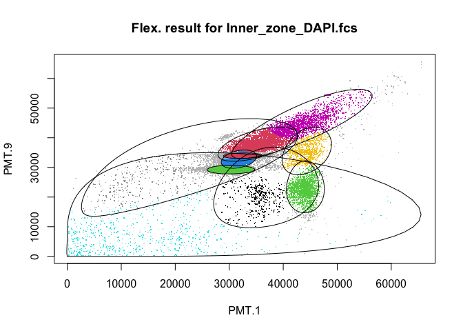<!-- -->

    ## Rule of identifying outliers: 90% quantile

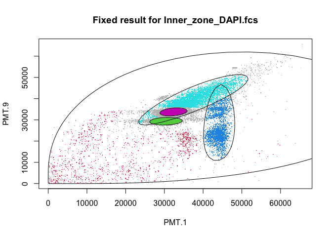<!-- -->

    ## Rule of identifying outliers: 90% quantile

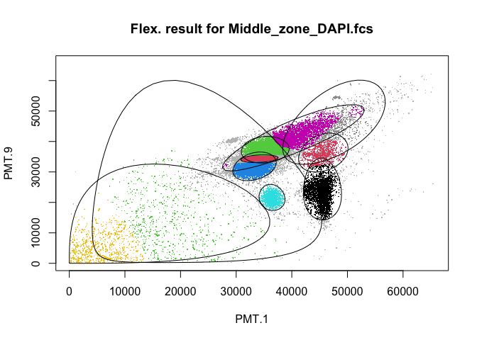<!-- -->

    ## Rule of identifying outliers: 90% quantile

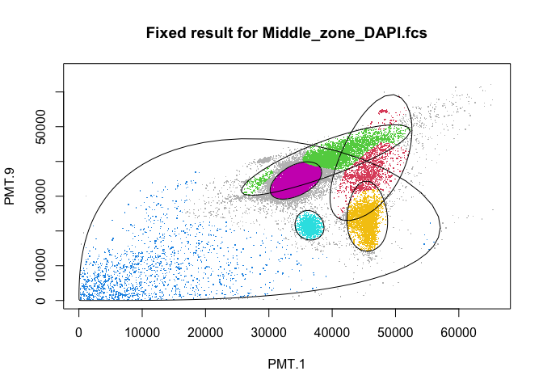<!-- -->

    ## Rule of identifying outliers: 90% quantile

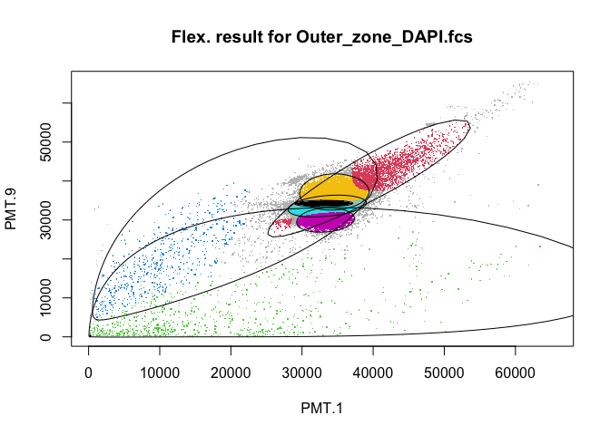<!-- -->

    ## Rule of identifying outliers: 90% quantile

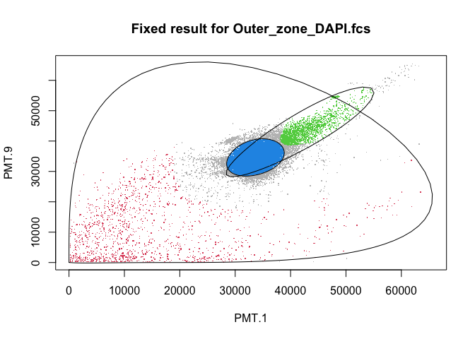<!-- -->

    ## Rule of identifying outliers: 90% quantile

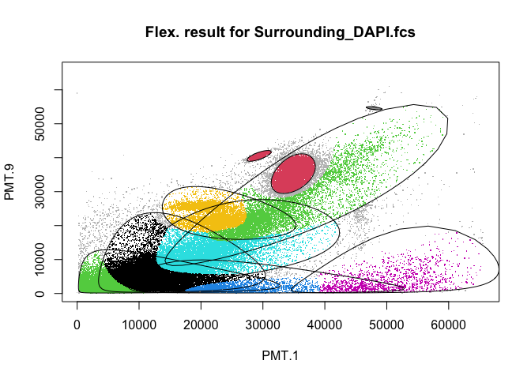<!-- -->

    ## Rule of identifying outliers: 90% quantile

<!-- -->

    ## Rule of identifying outliers: 90% quantile

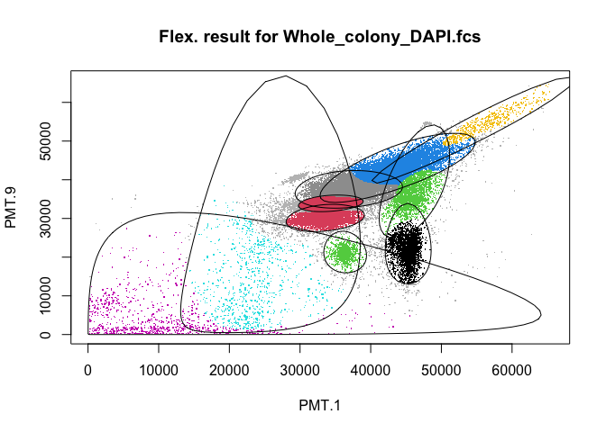<!-- -->

    ## Rule of identifying outliers: 90% quantile

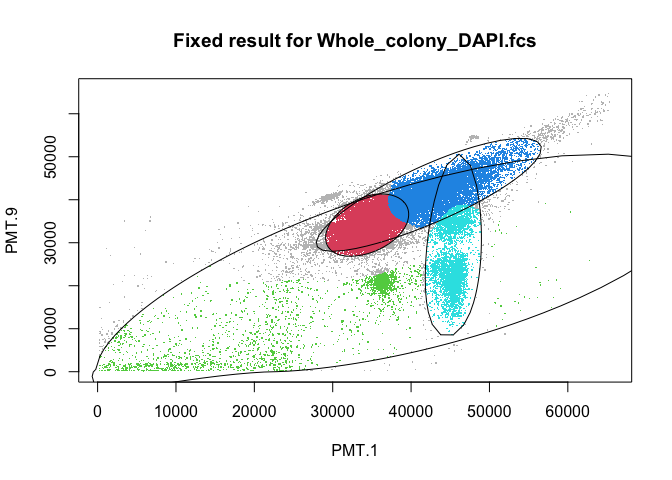<!-- -->

    ## Rule of identifying outliers: 90% quantile

### flowMerge

``` r
DAPI_fC_flex_meta <- list()
DAPI_fC_fixed_meta <- list()

for (i in 1:5){
  data <- DAPI[[i]]
  data_name <- names(DAPI)[i]
  
  flowobj <- flowObj(DAPI_fC_flex[[i]],data)
  merge <- flowMerge::merge(flowobj,metric="mahalanobis")
  a <- fitPiecewiseLinreg(merge)
  
  flowobj2 <- flowObj(DAPI_fC_fixed[[i]],data)
  merge2 <- flowMerge::merge(flowobj2,metric="mahalanobis")
  b <-  fitPiecewiseLinreg(merge2)
  
  DAPI_fC_flex_meta[[data_name]] <- merge[[a]]
  DAPI_fC_fixed_meta[[data_name]] <- merge2[[b]]
}
```

    ## Merged to 9 clusters

    ## Merged to 8 clusters

    ## Merged to 7 clusters

    ## Merged to 6 clusters

    ## Merged to 5 clusters

    ## Merged to 4 clusters

    ## Merged to 3 clusters

    ## Merged to 2 clusters

    ## Merged to 1 clusters

    ## Updating model statistics

    ## Rule of identifying outliers: 90% quantile

    ## Updated model 1

    ## Rule of identifying outliers: 90% quantile

    ## Updated model 2

    ## Rule of identifying outliers: 90% quantile

    ## Updated model 3

    ## Rule of identifying outliers: 90% quantile

    ## Updated model 4

    ## Rule of identifying outliers: 90% quantile

    ## Updated model 5

    ## Rule of identifying outliers: 90% quantile

    ## Updated model 6

    ## Rule of identifying outliers: 90% quantile

    ## Updated model 7

    ## Rule of identifying outliers: 90% quantile

    ## Updated model 8

    ## Rule of identifying outliers: 90% quantile

    ## Updated model 9

    ## Rule of identifying outliers: 90% quantile

    ## Updated model 10

    ## Merged to 4 clusters

    ## Merged to 3 clusters

    ## Merged to 2 clusters

    ## Merged to 1 clusters

    ## Updating model statistics

    ## Rule of identifying outliers: 90% quantile

    ## Updated model 1

    ## Rule of identifying outliers: 90% quantile

    ## Updated model 2

    ## Rule of identifying outliers: 90% quantile

    ## Updated model 3

    ## Rule of identifying outliers: 90% quantile

    ## Updated model 4

    ## Rule of identifying outliers: 90% quantile

    ## Updated model 5

    ## Merged to 9 clusters

    ## Merged to 8 clusters

    ## Merged to 7 clusters

    ## Merged to 6 clusters

    ## Merged to 5 clusters

    ## Merged to 4 clusters

    ## Merged to 3 clusters

    ## Merged to 2 clusters

    ## Merged to 1 clusters

    ## Updating model statistics

    ## Rule of identifying outliers: 90% quantile

    ## Updated model 1

    ## Rule of identifying outliers: 90% quantile

    ## Updated model 2

    ## Rule of identifying outliers: 90% quantile

    ## Updated model 3

    ## Rule of identifying outliers: 90% quantile

    ## Updated model 4

    ## Rule of identifying outliers: 90% quantile

    ## Updated model 5

    ## Rule of identifying outliers: 90% quantile

    ## Updated model 6

    ## Rule of identifying outliers: 90% quantile

    ## Updated model 7

    ## Rule of identifying outliers: 90% quantile

    ## Updated model 8

    ## Rule of identifying outliers: 90% quantile

    ## Updated model 9

    ## Rule of identifying outliers: 90% quantile

    ## Updated model 10

    ## Merged to 5 clusters

    ## Merged to 4 clusters

    ## Merged to 3 clusters

    ## Merged to 2 clusters

    ## Merged to 1 clusters

    ## Updating model statistics

    ## Rule of identifying outliers: 90% quantile

    ## Updated model 1

    ## Rule of identifying outliers: 90% quantile

    ## Updated model 2

    ## Rule of identifying outliers: 90% quantile

    ## Updated model 3

    ## Rule of identifying outliers: 90% quantile

    ## Updated model 4

    ## Rule of identifying outliers: 90% quantile

    ## Updated model 5

    ## Rule of identifying outliers: 90% quantile

    ## Updated model 6

    ## Merged to 7 clusters

    ## Merged to 6 clusters

    ## Merged to 5 clusters

    ## Merged to 4 clusters

    ## Merged to 3 clusters

    ## Merged to 2 clusters

    ## Merged to 1 clusters

    ## Updating model statistics

    ## Rule of identifying outliers: 90% quantile

    ## Updated model 1

    ## Rule of identifying outliers: 90% quantile

    ## Updated model 2

    ## Rule of identifying outliers: 90% quantile

    ## Updated model 3

    ## Rule of identifying outliers: 90% quantile

    ## Updated model 4

    ## Rule of identifying outliers: 90% quantile

    ## Updated model 5

    ## Rule of identifying outliers: 90% quantile

    ## Updated model 6

    ## Rule of identifying outliers: 90% quantile

    ## Updated model 7

    ## Rule of identifying outliers: 90% quantile

    ## Updated model 8

    ## Merged to 2 clusters

    ## Merged to 1 clusters

    ## Updating model statistics

    ## Rule of identifying outliers: 90% quantile

    ## Updated model 1

    ## Rule of identifying outliers: 90% quantile

    ## Updated model 2

    ## Rule of identifying outliers: 90% quantile

    ## Updated model 3

    ## Warning in fitPiecewiseLinreg(merge2): Possible changepoint detected by angle
    ## between line segments

    ## Merged to 9 clusters

    ## Merged to 8 clusters

    ## Merged to 7 clusters

    ## Merged to 6 clusters

    ## Merged to 5 clusters

    ## Merged to 4 clusters

    ## Merged to 3 clusters

    ## Merged to 2 clusters

    ## Merged to 1 clusters

    ## Updating model statistics

    ## Rule of identifying outliers: 90% quantile

    ## Updated model 1

    ## Rule of identifying outliers: 90% quantile

    ## Updated model 2

    ## Rule of identifying outliers: 90% quantile

    ## Updated model 3

    ## Rule of identifying outliers: 90% quantile

    ## Updated model 4

    ## Rule of identifying outliers: 90% quantile

    ## Updated model 5

    ## Rule of identifying outliers: 90% quantile

    ## Updated model 6

    ## Rule of identifying outliers: 90% quantile

    ## Updated model 7

    ## Rule of identifying outliers: 90% quantile

    ## Updated model 8

    ## Rule of identifying outliers: 90% quantile

    ## Updated model 9

    ## Rule of identifying outliers: 90% quantile

    ## Updated model 10

    ## Merged to 6 clusters

    ## Merged to 5 clusters

    ## Merged to 4 clusters

    ## Merged to 3 clusters

    ## Merged to 2 clusters

    ## Merged to 1 clusters

    ## Updating model statistics

    ## Rule of identifying outliers: 90% quantile

    ## Updated model 1

    ## Rule of identifying outliers: 90% quantile

    ## Updated model 2

    ## Rule of identifying outliers: 90% quantile

    ## Updated model 3

    ## Rule of identifying outliers: 90% quantile

    ## Updated model 4

    ## Rule of identifying outliers: 90% quantile

    ## Updated model 5

    ## Rule of identifying outliers: 90% quantile

    ## Updated model 6

    ## Rule of identifying outliers: 90% quantile

    ## Updated model 7

    ## Merged to 9 clusters

    ## Merged to 8 clusters

    ## Merged to 7 clusters

    ## Merged to 6 clusters

    ## Merged to 5 clusters

    ## Merged to 4 clusters

    ## Merged to 3 clusters

    ## Merged to 2 clusters

    ## Merged to 1 clusters

    ## Updating model statistics

    ## Rule of identifying outliers: 90% quantile

    ## Updated model 1

    ## Rule of identifying outliers: 90% quantile

    ## Updated model 2

    ## Rule of identifying outliers: 90% quantile

    ## Updated model 3

    ## Rule of identifying outliers: 90% quantile

    ## Updated model 4

    ## Rule of identifying outliers: 90% quantile

    ## Updated model 5

    ## Rule of identifying outliers: 90% quantile

    ## Updated model 6

    ## Rule of identifying outliers: 90% quantile

    ## Updated model 7

    ## Rule of identifying outliers: 90% quantile

    ## Updated model 8

    ## Rule of identifying outliers: 90% quantile

    ## Updated model 9

    ## Rule of identifying outliers: 90% quantile

    ## Updated model 10

    ## Merged to 3 clusters

    ## Merged to 2 clusters

    ## Merged to 1 clusters

    ## Updating model statistics

    ## Rule of identifying outliers: 90% quantile

    ## Updated model 1

    ## Rule of identifying outliers: 90% quantile

    ## Updated model 2

    ## Rule of identifying outliers: 90% quantile

    ## Updated model 3

    ## Rule of identifying outliers: 90% quantile

    ## Updated model 4

``` r
#plots
for (i in 1:5){
  opt <- DAPI_fC_flex_meta[[i]]
  var <- location[i]
  plot(opt,level=0.9,main=paste0("Mering for flex K\nIn ",var))
}
```

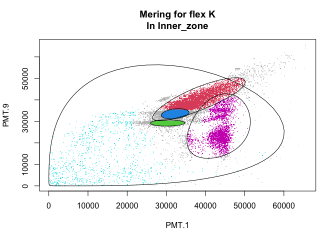<!-- -->

    ## Rule of identifying outliers: 90% quantile

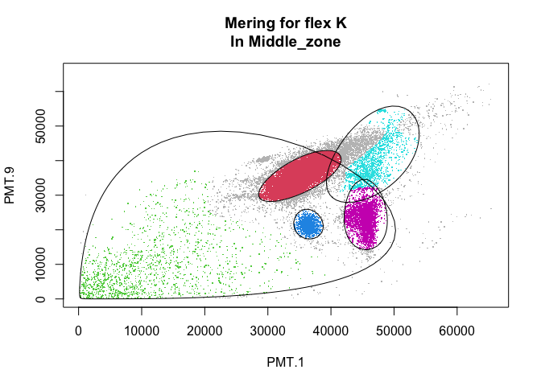<!-- -->

    ## Rule of identifying outliers: 90% quantile

<!-- -->

    ## Rule of identifying outliers: 90% quantile

<!-- -->

    ## Rule of identifying outliers: 90% quantile

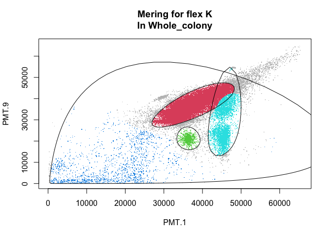<!-- -->

    ## Rule of identifying outliers: 90% quantile

## ROC Function

### for points

``` r
flowClust_roc <- function(data,gating_data,dimension,CI){
  
  # Box-Cox trans
  lambda <- gating_data@lambda
  data <- flowClust::box(data,lambda)
  
  # maha-matrix
  mu <- t(gating_data@mu)
  dim <- dim(gating_data@sigma)[1]
    
  sigma <- list()
  for (i in 1:dim){
    sigma[[i]] <- gating_data@sigma[i,,]
  }
  
  names <- colnames(data)
  
  ncells <- nrow(data)
  n_clusters <- length(sigma)
  
  #generate mahalanobis matrix
  maha_data <- matrix(NA,nrow=ncells,ncol=n_clusters)
  
  for (i in 1:ncells){
    for(j in 1:n_clusters){
      maha_data[i,j] <- mahalanobis(data[i,],mu[,j],sigma[[j]])
    }
  }
  
  data1 <- as.data.frame(maha_data)
  
  #randomly sample points
  set.seed(123)
  num_points <- 100000
  
  random_points <- runif(num_points*dimension,min=200,max=65535)
  random_boxcox <- flowClust::box(random_points,lambda) %>% round(2)
  random_data <- matrix(random_boxcox,ncol=dimension,nrow=num_points)
  
  #maha matrics for random points
  random_maha <- matrix(NA,nrow=num_points,ncol=n_clusters)
  for (i in 1:num_points){
    for(j in 1:n_clusters){
      random_maha[i,j] <- mahalanobis(random_data[i,],mu[,j],sigma[[j]])
    }
  }
  
  random_maha <- as.data.frame(random_maha)
  roc.points <- data.frame()
  
  #performance at diff. alpha
  for (alpha in CI){
    threshold <- dimension*qf(alpha,dimension,4)
    
    # cell
    for (cell in 1:ncells){
      rv <- data1[cell,1:ncol(data1)-1]
      if(all(rv>threshold)) {data1$Cluster[cell] <- NA}
      else {data1$Cluster[cell] <- which.min(rv)}
    }
  
    result1 <- base::table(data1$Cluster) %>% as.data.frame()
    sum1 <- sum(result1$Freq)
    
    # volume
    for (cell in 1:num_points){
      rv <- random_maha[cell,1:ncol(random_maha)-1]
      if(all(rv>threshold)) {random_maha$Cluster[cell] <- NA}
      else {random_maha$Cluster[cell] <- which.min(rv)}
    }
  
    result2 <- base::table(random_maha$Cluster) %>% as.data.frame()
    sum2 <- sum(result2$Freq)/num_points*(65535-200)^dimension
    
    
    results <- cbind(cell=sum1,volume=sum2) %>% as.data.frame()
    roc.points <- rbind(roc.points,results)
  }
    result <- list(maha.matrix=data1,roc.table=roc.points)
  return(result)
}
```

``` r
DAPI_fC_flex_roc <- list()
DAPI_fC_fix_roc <- list()

for (i in 1:5){
  name <- names(DAPI)[i]
  data0 <- DAPI[[name]]@exprs[,c(11,27)]
  gating_data <- DAPI_fC_fix[[name]]
  alpha <- seq(0.01,0.99,by=0.01)
  DAPI_fC_fix_roc[[name]] <- flowClust_roc(data0,gating_data,2,alpha)
}
```

## Files written

These files have been written to the target directory,
`data/04a-GMM for Z-project`:

``` r
projthis::proj_dir_info(path_target())
```

    ## # A tibble: 0 × 4
    ## # ℹ 4 variables: path <fs::path>, type <fct>, size <fs::bytes>,
    ## #   modification_time <dttm>
